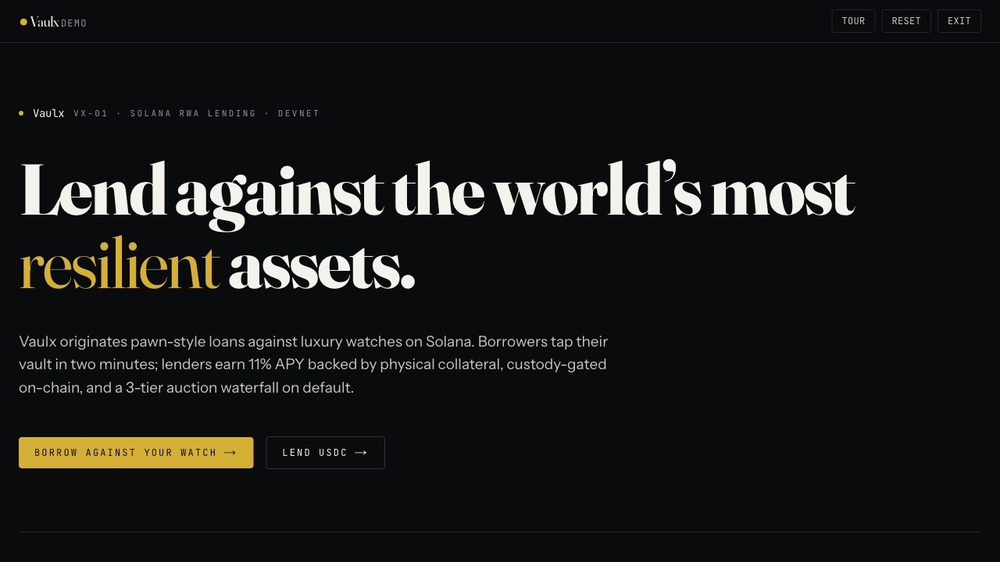
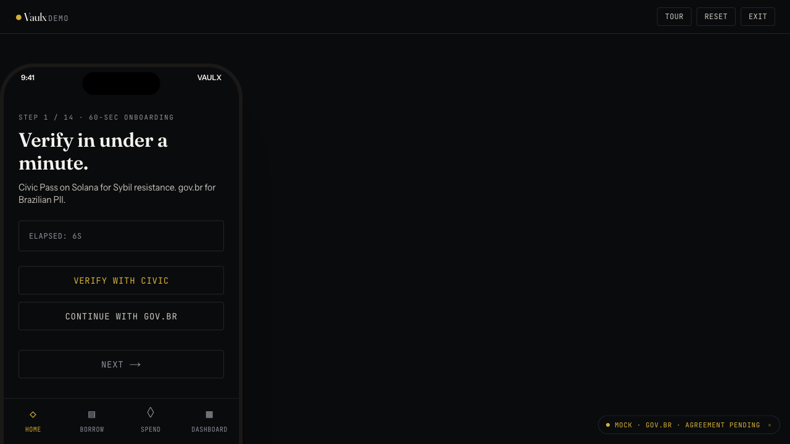
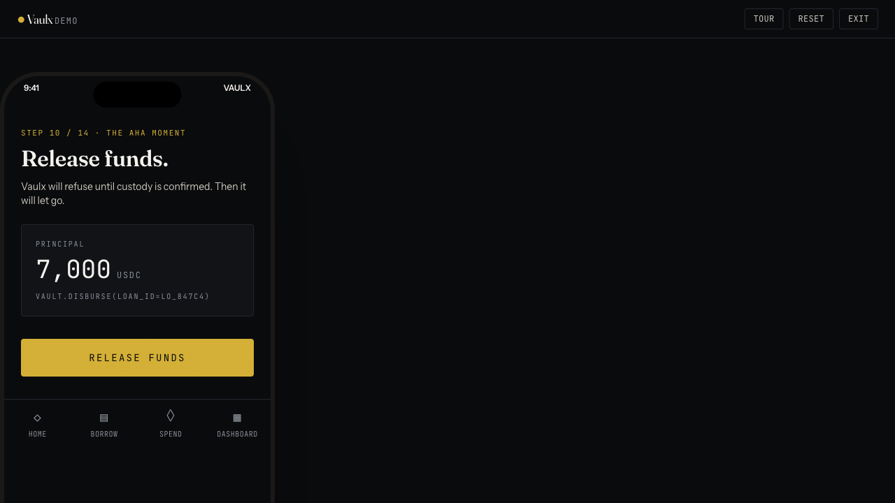
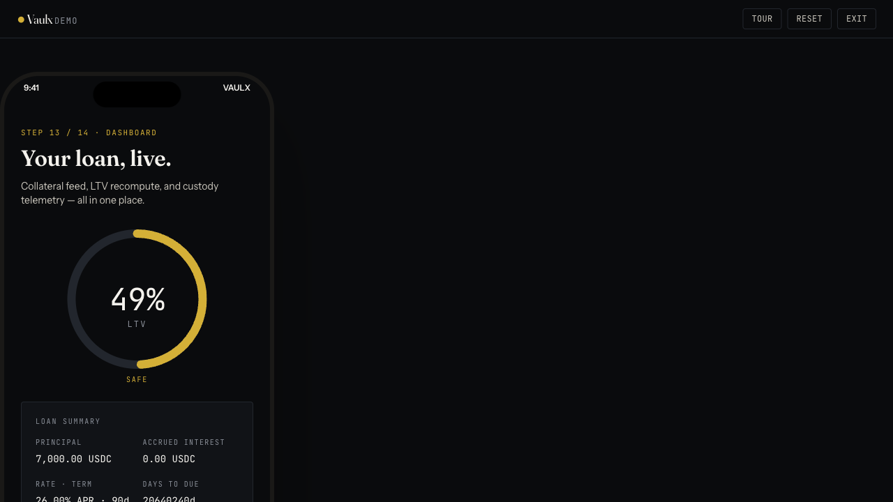
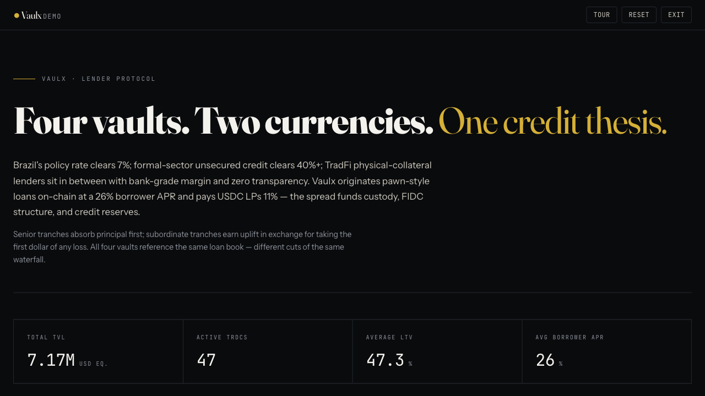
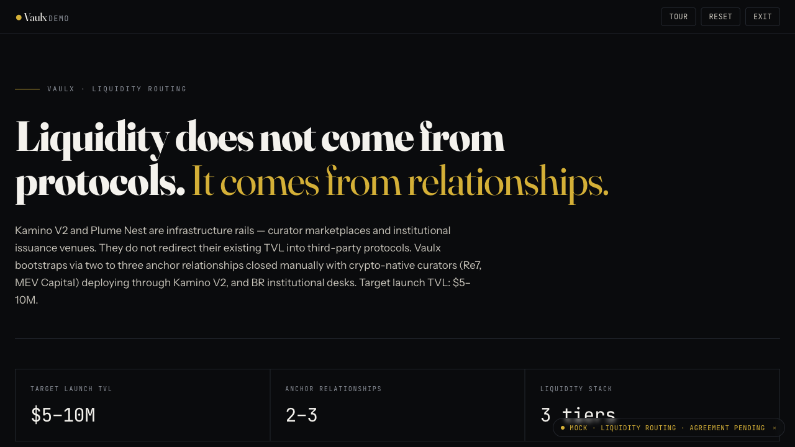
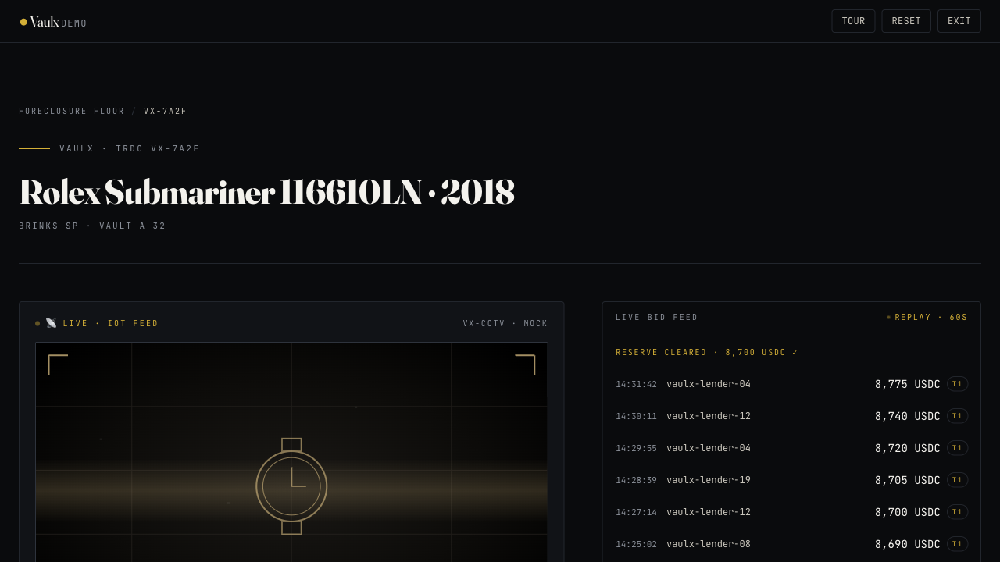
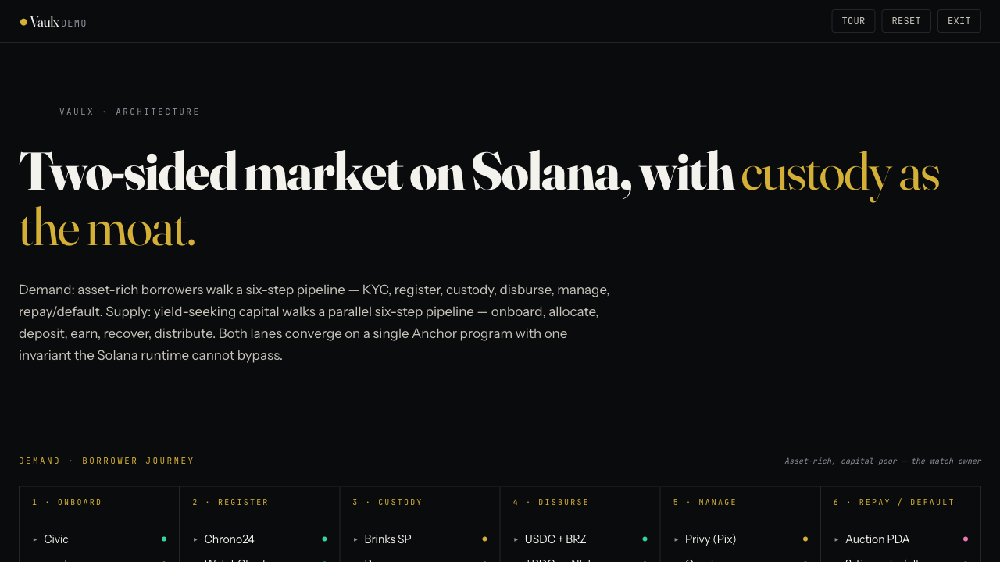
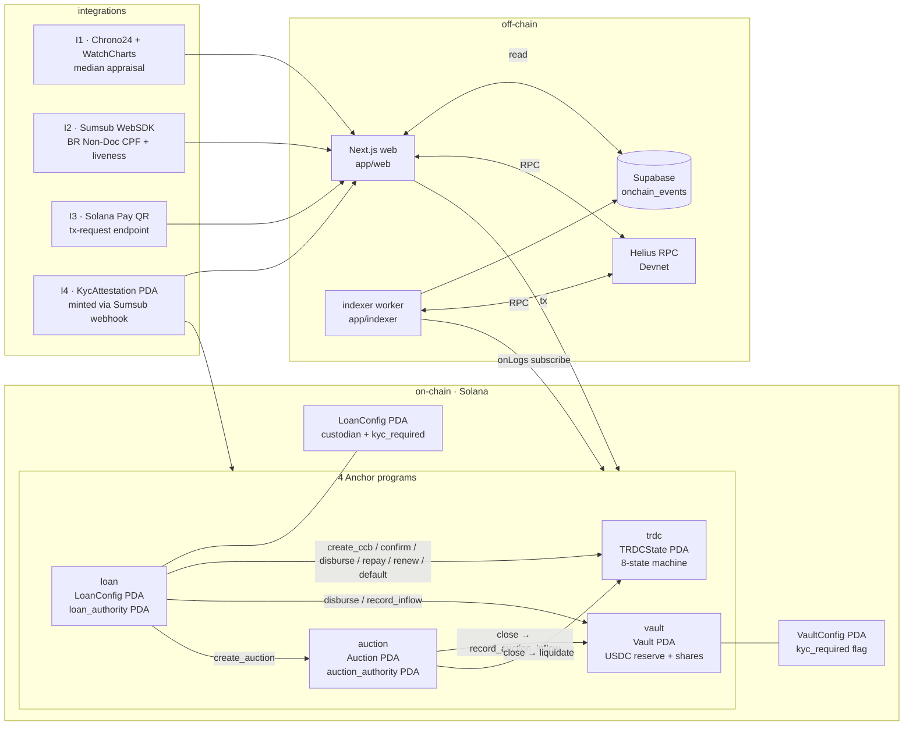

# Vaulx

**Pawn your Submariner. Mint a CCB. Settle in USDC.**

Vaulx is a Brazilian RWA lending protocol on Solana that takes luxury watches as collateral, mints a legally-binding **CCB.B3** (Cédula de Crédito Bancário) per loan, anchors its SHA-256 on-chain, gates money-touching actions with a vendor-neutral on-chain `KycAttestation` PDA (minted server-side after a **Sumsub** WebSDK verification), and uses an open auction primitive for foreclosure. Sign-in is handled by **Crossmint** (auth + smart wallet). Lender liquidity, borrower disbursement, repayment, renewal, and default — all settle in USDC across four Anchor programs. Submission for the **Colosseum Frontier** hackathon, May 2026.

[^kyc]: Civic Auth was dropped 2026-04-28 — the previous Civic Pass / Civic Auth integration is fully removed and replaced by Sumsub WebSDK for KYC and Crossmint Auth for sign-in. The on-chain `KycAttestation` PDA stays vendor-neutral. **Demo default: `vault_config.kyc_required = false`**; the FE `<KycRequiredModal>` lazy-triggers Sumsub at money-touching CTAs (Submit Asset / Disburse / Deposit). See [`docs/plans/2026-04-28-vaulx-civic-drop-sumsub-add-design.md`](docs/plans/2026-04-28-vaulx-civic-drop-sumsub-add-design.md).


## Quick links

- **Live demo:** **[vaulx.vercel.app/demo](https://vaulx.vercel.app/demo)** — guided 14-step Rolex story
- **Demo video:** [`apps/web/public/demo/vaulx-demo.mp4`](apps/web/public/demo/vaulx-demo.mp4) _(record before submission)_
- **Build plan:** [`docs/plans/2026-04-23-vaulx-build-plan.md`](docs/plans/2026-04-23-vaulx-build-plan.md)
- **Design doc:** [`docs/plans/2026-04-23-vaulx-full-stack-build-design.md`](docs/plans/2026-04-23-vaulx-full-stack-build-design.md)
- **Status:** [`STATUS.md`](STATUS.md)
- **Changelog:** [`CHANGELOG.md`](CHANGELOG.md)
- **User actions pending:** [`USER_TODO.md`](USER_TODO.md)

## Live demo

The Vaulx mock app is live at **[vaulx.vercel.app/demo](https://vaulx.vercel.app/demo)**. It's a self-contained tour of the borrower flow, lender flow, default auction, and architecture — session-scoped state in `sessionStorage`, no real on-chain calls except an optional Devnet USDC transfer on `/demo/borrow/funds/wallet`.

### Canonical 14-step Rolex story

Click "Take the guided tour" on the landing page — a React-native overlay walks you through onboarding, custody, the AHA-moment disbursal, and dashboard.

[Take the guided tour →](https://vaulx.vercel.app/demo)

### Borrower flow

- Onboard (Crossmint sign-in + lazy Sumsub KYC): [/demo/borrow/onboard](https://vaulx.vercel.app/demo/borrow/onboard)
- Wallet (Crossmint): [/demo/borrow/wallet](https://vaulx.vercel.app/demo/borrow/wallet)
- AHA — disburse: [/demo/borrow/disburse](https://vaulx.vercel.app/demo/borrow/disburse)
- Active dashboard: [/demo/borrow/dashboard](https://vaulx.vercel.app/demo/borrow/dashboard)

### Lender flow

- 4 vaults: [/demo/lend](https://vaulx.vercel.app/demo/lend)
- Liquidity routing (anchor relationships + 3 tiers): [/demo/lend/liquidity](https://vaulx.vercel.app/demo/lend/liquidity)

### Default auction

- Foreclosure floor: [/demo/auction](https://vaulx.vercel.app/demo/auction)
- Tier-1 → Tier-2 → Tier-3 waterfall: [/demo/auction/VX-7A2F](https://vaulx.vercel.app/demo/auction/VX-7A2F)

### Architecture

- 2-swimlane interactive diagram: [/demo/architecture](https://vaulx.vercel.app/demo/architecture)

### Screenshots

| Landing | Borrower onboard |
|---|---|
|  |  |

| Disburse (the AHA moment) | Active loan dashboard |
|---|---|
|  |  |

| Lender vaults | Liquidity routing |
|---|---|
|  |  |

| Auction detail | Architecture |
|---|---|
|  |  |

Screenshots are captured at 1280×720 from the live deploy. Re-capture with `BASE_URL=https://vaulx.vercel.app pnpm tsx scripts/dev/capture-demo-screenshots.ts`.

## The 9 demo moments

The submission story is nine on-chain moments. Each row maps a moment to the Anchor instruction(s) it fires, the Next.js route a judge clicks through, and the script that exercises it end-to-end against Devnet.

| # | Moment | On-chain (program.ix) | Frontend route | E2E |
|---|---|---|---|---|
| 1 | Lender deposits 100 USDC | `vault.deposit` | [`/lend/vaults/[id]`](apps/web/src/app/lend/vaults/%5Bid%5D/page.tsx) | `pnpm e2e:moment-1` |
| 2 | Borrower mints TRDC against a watch (CCB hashed on-chain) | `loan.create_ccb_trdc` → CPIs `trdc.initialize_trdc_state` + `trdc.mint_trdc_cnft` | [`/borrow/new/{asset,appraisal,terms}`](apps/web/src/app/borrow/new) | `pnpm e2e:moments-2-3-4` |
| 3 | Custodian receives the watch and attests `doc_hash` | `loan.confirm_custody` → CPI `trdc.confirm_custody_transition` | [`/custodian/intake/[trdc]`](apps/web/src/app/custodian/intake/%5Btrdc%5D/page.tsx) | `pnpm e2e:moments-2-3-4` |
| 4 | Borrower disburses principal from the vault | `loan.disburse_from_vault` → CPIs `vault.disburse` + `trdc.transition_to_active` | [`/borrow/loans/[trdc]/disburse`](apps/web/src/app/borrow/loans/%5Btrdc%5D/disburse/page.tsx) | `pnpm e2e:moments-2-3-4` |
| 5 | Borrower pays an installment (and later, full payoff) | `loan.pay_installment` → CPI `vault.record_inflow`; full payoff via `loan.repay_ccb` | [`/borrow/loans/[trdc]/{pay,repay}`](apps/web/src/app/borrow/loans/%5Btrdc%5D) | `pnpm e2e:moments-5-9` |
| 6 | Borrower renews the term and pays accrued + 2% fee | `loan.renew_ccb` → CPI `trdc.transition_renew` + `vault.record_inflow` | [`/borrow/loans/[trdc]/renew`](apps/web/src/app/borrow/loans/%5Btrdc%5D/renew/page.tsx) | `pnpm e2e:moments-5-9` |
| 7 | Default after grace → auction is created and bid on | `loan.execute_af_default` → CPIs `trdc.transition_active_to_overdue` + `transition_overdue_to_defaulted` + `auction.create_auction`; then `auction.place_bid` | [`/lend/auctions/[id]`](apps/web/src/app/lend/auctions/%5Bid%5D/page.tsx) | `pnpm e2e:moments-5-9` |
| 8 | Auction closes, vault recovers capital, TRDC liquidated | `auction.close_auction` → CPIs `vault.record_auction_inflow` + `trdc.transition_defaulted_to_liquidated` | [`/lend/auctions/[id]`](apps/web/src/app/lend/auctions/%5Bid%5D/page.tsx) | `pnpm e2e:moments-5-9` |
| 9 | System snapshot — vault `total_assets` reflects yield + recovery | _(no ix; UI + indexer view)_ | [`/lend`](apps/web/src/app/lend/page.tsx) + [`/lend/auctions`](apps/web/src/app/lend/auctions/page.tsx) | `pnpm e2e:moments-5-9` |

For a click-through judge experience, [`/admin/demo`](apps/web/src/app/admin/demo/page.tsx) collapses moments 1–8 into six big buttons with an _accelerate-time_ toggle that compresses the full lifecycle into roughly 60 seconds.

## Architecture in one diagram

Four programs, two PDAs of operator config, an 8-state TRDC lifecycle, and a thin off-chain index/UI tier. The vendor-neutral on-chain `KycAttestation` PDA (minted server-side after Sumsub webhook) gates the two entry points (`vault.deposit`, `loan.create_ccb_trdc`) when `kyc_required = true`; every other on-chain edge is a typed CPI. **Demo default: `kyc_required = false`, on-chain gate disabled — the FE lazy-fires Sumsub at money-touching CTAs instead.**



**TRDC state lifecycle** (enforced on-chain by [`programs/trdc/src/state.rs`](programs/trdc/src/state.rs)):

```
PendingCustody ─► ActiveInCustody ─► Active ─┬─► Renewed ─┬─► Active
                                              │            └─► Repaid
                                              ├─► Repaid
                                              └─► Overdue ─┬─► Repaid
                                                           └─► Defaulted ─► Liquidated
```

## Run it locally

Three paths depending on how deep you want to go.

### A. Just look at the UI _(zero on-chain, no env keys)_

```bash
pnpm install
pnpm --filter @vaulx/web dev
# open http://localhost:3000
```

The live ticker falls back to 12 seeded events. Lend, borrow, and custodian pages render fully; on-chain actions will fail until the programs are deployed and the env is filled in.

### B. Run all 76 tests _(local Anchor + workspace vitest)_

Requires `rustc 1.85.0`, `solana-cli 1.18.26`, and `anchor-cli 0.30.1`.

```bash
# 45 anchor mocha specs against a local validator
cd /Users/gogy/MyCODE/VAULX
PATH=/Users/gogy/.local/share/solana/install/active_release/bin:$PATH \
  COPYFILE_DISABLE=1 \
  anchor test

# 31 vitest cases across @vaulx/terms (16) + @vaulx/ccb (4) + @vaulx/web (11)
pnpm -w test
```

`COPYFILE_DISABLE=1` keeps macOS resource forks out of the genesis tarball. (Historical note: `anchor test` previously cloned the Civic gateway program from mainnet-beta on validator boot — that dependency was dropped when the on-chain gate moved from gateway-token Borsh decode to a `KycAttestation` PDA owned by the program itself. Civic was dropped entirely on 2026-04-28; KYC now flows through Sumsub.[^kyc])

### C. Full demo cockpit on Devnet

Prerequisites:

- Payer keypair at `~/.config/solana/id.json` with **≥ 20 SOL** for program deploy + tx fees.
- `SUPABASE_SERVICE_ROLE_KEY` in both [`apps/web/.env.local`](apps/web/.env.example) and `apps/indexer/.env.local` so the indexer can write `onchain_events`.
- 4 programs deployed: `anchor deploy --provider.cluster devnet` (~19 SOL).
- `pnpm seed:usdc` to create the demo USDC mint and fund 6 demo wallets.
- `pnpm init:civic --custodian <pubkey>` to write `VaultConfig` + `LoanConfig` PDAs. (Script name retained for legacy reasons — it now writes the operator/custodian config; `kyc_required` defaults to `false` for the demo. Civic was dropped 2026-04-28; the script is vendor-neutral.[^kyc])

Then drive the story:

```bash
# Indexer (in one shell)
pnpm --filter @vaulx/indexer dev

# Web (in another)
pnpm --filter @vaulx/web dev

# Open the cockpit
open http://localhost:3000/admin/demo
```

#### GraphQL endpoint (loan lifecycle)

The indexer also exposes a read-only **GraphQL endpoint** at `http://localhost:4000/graphql` covering the loan lifecycle (`Loan`, `Custody`, `Disbursement`, `Repayment`, `Renewal`, `Liquidation`). Resolvers read from the same `onchain_events` table the WebSocket subscriber writes to — so any loan picked up live shows up in GraphQL too. Set `GRAPHQL_PORT=0` in `apps/indexer/.env.local` to disable.

```bash
# Smoke test
curl -X POST http://localhost:4000/graphql \
  -H "Content-Type: application/json" \
  -d '{"query":"{ loans(limit: 5) { id principal ltvBps openedAt } }"}'
```

> **Why not a Substreams subgraph?** The Graph protocol's Solana support is Substreams-based, not the EVM-style subgraph. A Substreams build needs a Pinax/Streamingfast provider, a Rust/WASM module, and ~1 day of plumbing — overkill for the hackathon demo. We ship the same shape (GraphQL over an event log) on top of the existing Supabase indexer; a Substreams-powered subgraph is deferred until full Graph-Solana GA.

Or run the same flow headless:

```bash
pnpm e2e:moment-1       # Moment 1
pnpm e2e:moments-2-3-4  # Moments 2-4
pnpm e2e:moments-5-9    # Moments 5-9 (two parallel loans, ~4-5 min)
```

Each E2E exits `0` (pass) / `2` (SKIPPED — env not set) / `1` (fail). Mocha wrappers map `2 → this.skip()` so CI stays green.

## Sumsub KYC + Crossmint Auth[^kyc]

Vaulx splits identity into two layers: **Crossmint Auth** is the only sign-in surface; **Sumsub WebSDK** is the only KYC surface, lazy-triggered at money-touching CTAs. The on-chain `KycAttestation` PDA stays vendor-neutral and is minted server-side after Sumsub's webhook validates a successful applicant review.

### Crossmint Auth — single sign-in for crypto + non-crypto users

One CTA — "Sign in to Vaulx" — opens the Crossmint modal. Non-crypto users pick **Google / Apple / email magic link / SMS** and Crossmint auto-provisions a real Solana smart wallet in ~3 seconds (passkey-ready, email recovery). Crypto-natives pick **Phantom / Solflare / Backpack** and connect via `@solana/wallet-adapter`. Both branches resolve to a Solana pubkey; the rest of the app reads it identically. Wired via `@crossmint/client-sdk-react-ui@4.1.5`.

### Sumsub WebSDK — lazy KYC gate at money-touching CTAs

KYC is **not** required at sign-in. Users browse freely. The gate fires only when the user clicks one of three money-touching CTAs:

| Action | Page | CTA |
|---|---|---|
| Submit asset for offline evaluation | `/demo/borrow/register` | "Submit asset" |
| Request loan disbursement | `/demo/borrow/disburse` | "Disburse" |
| Lend USDC into protocol | `/demo/lend` | "Deposit USDC" |

Click → `useKycGate()` checks the on-chain `KycAttestation` PDA for the connected wallet → if missing, mounts `<KycRequiredModal>` → user clicks "Verify with Sumsub" → Sumsub iframe handles **Brazil Non-Doc CPF** (CPF + liveness vs Serpro government database, ~60s, no documents), **ID Connect** (reusable KYC across 200+ partners, ~5s if returning), or global doc-scan internally → completion → backend mints the attestation → modal closes → original mutation resumes.

### On-chain attestation — vendor-neutral `KycAttestation` PDA

Sumsub posts to `/api/sumsub/webhook` with an HMAC-signed payload. The server verifies HMAC against `SUMSUB_WEBHOOK_SECRET`, and on `reviewAnswer === GREEN` calls `vault.issue_kyc_attestation(wallet, jwtHash, attestor=operator)` signed by the operator keypair. The PDA struct is unchanged from the previous design — `{owner, attestedAt, jwtHash}` — so any future swap of KYC vendor requires zero on-chain change.

### Demo default — on-chain gate disabled, FE gate live

`vault_config.kyc_required = false` and `loan_config.kyc_required = false` are the defaults. The on-chain `KycAttestation` constraint is short-circuited when the flag is off, so `anchor test` runs without any Sumsub dependency. The FE `<KycRequiredModal>` is the friendly UX layer that judges experience.

### Production path — flip the on-chain gate

For mainnet, flip `vault_config.kyc_required = true` (and `loan_config.kyc_required = true`) via the existing `set_kyc_required` admin ix to add on-chain enforcement. **No program redeploy** — config is read from on-chain. The FE gate stays as the friendly UX layer on top.

### Runtime coverage

The on-chain gate is exercised by the program owner check at `programs/{vault,loan}/src/lib.rs:106-110` — load-bearing as the only thing preventing cross-program discriminator collision (see Item 1 follow-ups in `USER_TODO.md`).

> **Historical note (2026-04-28):** Civic Pass / Civic Auth was the previous KYC vendor and has been dropped entirely. The on-chain `KycAttestation` PDA + admin ixs (vendor-neutral) are kept; the FE Civic SDK + on-chain `civic.rs` files are removed. See [`docs/plans/2026-04-28-vaulx-civic-drop-sumsub-add-design.md`](docs/plans/2026-04-28-vaulx-civic-drop-sumsub-add-design.md) for the redesign rationale.

## Crossmint smart-wallet onboarding

Email / Google / Apple → Solana smart wallet, no seed phrase, email recovery. Vaulx wires `@crossmint/client-sdk-react-ui@4.1.5` on `/demo/borrow/wallet` so a non-crypto user can land on the demo, sign in with Google, and have a real on-chain Solana pubkey within ~3 seconds — no Phantom install, no seed-phrase ceremony. The `<CrossmintWallet>` component falls back to a clearly-labeled mock when no API key is set, so the rest of the demo flow keeps working zero-config.

**Staging-first.** The Crossmint SDK routes by API-key prefix — `ck_staging_*` keys auto-provision real Solana **Devnet** smart wallets at zero cost with no KYC, signing up at [staging.crossmint.com](https://staging.crossmint.com). Test USDXM is mintable via `wallet.stagingFund(amount)`. Mainnet (production keys, `ck_production_*`) requires a solutions-team call and KYC — not needed for demo. Toggle modes via `NEXT_PUBLIC_CROSSMINT_ENV=staging|production|mock`; see [`apps/web/.env.example`](apps/web/.env.example) for full setup notes and [`USER_TODO.md`](USER_TODO.md) for the Vercel deploy checklist.

## Live QA — `/admin/tests`

Run the Anchor test suite live in the browser via Server-Sent Events:

1. `pnpm --filter @vaulx/web dev`
2. Open `http://localhost:3000/admin/tests`
3. Press **Run tests**.

The page streams stdout/stderr from `anchor test --skip-build` line by line. Exit code `0` means all 45 on-chain tests passed. Aborting the page kills the child process cleanly.

**Local-only.** On Vercel, the function-duration cap (30s Hobby / 300s Pro) cuts the SSE stream before `anchor test` finishes (~3–4 min). Hosted deployments fall back to a recorded `apps/web/public/demo/test-run.mp4`.

**Auth.** If `NEXT_PUBLIC_VAULX_ADMIN_PUBKEY` is set, the route requires a matching `vaulx-admin` cookie or `x-vaulx-admin` header. Leave it unset during the hackathon for judges; tighten before any public exposure.

## Tech stack

- **Programs:** Anchor `0.30.1` · Solana CLI `1.18.26` · rustc `1.85.0`
- **Web:** Next.js `14` App Router · Tailwind · shadcn/ui (`new-york`)
- **Design:** editorial dark-operator system — Fraunces (display) + Instrument Sans (body) + JetBrains Mono (numerals); ink-black `#0A0B0D` / paper-warm `#F4F2ED` / restrained gold `#D4AF37`
- **Client:** TanStack Query · React Hook Form · Zod · sonner
- **On-chain libs:** `@solana/pay` · `@sumsub/websdk` · `@crossmint/client-sdk-react-ui` · `pdf-lib` · `@noble/hashes`
- **Infra:** Supabase (free tier, `us-east-1`) · Helius RPC (Devnet)
- **Testing:** mocha + chai (Anchor) · vitest (workspace)

## Repo layout

```
programs/{trdc,vault,loan,auction}/   # 4 Anchor programs (45 tests)
apps/web/                             # Next.js frontend
apps/indexer/                         # tsx worker → Supabase onchain_events
packages/{types,terms,ccb,idls,anchor-client,supabase}/
scripts/dev/                          # seed + e2e harnesses + IDL copy
tests/                                # mocha specs for the 4 programs
docs/plans/                           # build plan + design doc + per-phase plans
supabase/migrations/                  # onchain_events schema
```

## Build progress

| Phase | Window | Headlines |
|---|---|---|
| Phase 0 — Bootstrap | Apr 23–24 | pnpm + Turborepo, 4 Anchor programs scaffolded, Next.js + Tailwind + shadcn, Supabase wired, GitHub Actions CI |
| Phase 1 — Core programs | Apr 25–28 | TRDC 8-state machine, Vault share accounting, LTV gate, lender FE, indexer worker, Moment 1 E2E. **17/17 → 29/29** anchor tests |
| Phase 2 — Disburse + wizard | Apr 29–May 1 | CPI-only `disburse` gate, `confirm_custody`, real CCB PDF + SHA-256, I1 appraisal aggregator, **on-chain KYC gate via vendor-neutral `KycAttestation` PDA (Sumsub-driven mint after 2026-04-28; Civic-driven before)**[^kyc], I2 gov.br mock, borrower wizard, Moments 2-3-4 E2E. **33/33 → 35/35** anchor tests |
| Phase 3 — Closing loops | May 2–4 | Pay/repay/renew lifecycle + interest math, auction program + permissionless default, borrower loan dashboard, I3 Solana Pay QR, lender auction routes, `/admin/tests` SSE runner, `/admin/demo` cockpit, Moments 5-9 E2E. **45/45** anchor tests, all 9 moments executable |
| Phase 4 — Rehearsal + deploy | May 5–7 | _ready to start — deploy to Devnet, record demo, polish_ |
| Phase 5 — Submission | May 8–9 | _not started_ |

See [`STATUS.md`](STATUS.md) for the full task breakdown and [`CHANGELOG.md`](CHANGELOG.md) for chronology + decisions.

## Acknowledgements

- **shadcn/ui** for the `new-york` registry that anchors the component layer.
- **Sumsub** for the WebSDK that handles Brazil Non-Doc CPF + liveness, ID Connect (reusable KYC), and global doc-scan in one iframe — Vaulx mints the on-chain `KycAttestation` PDA server-side after the Sumsub webhook validates a successful applicant review.
- **Crossmint** for `@crossmint/client-sdk-react-ui` (single sign-in surface for crypto + non-crypto users; auto-provisions Solana smart wallets via Google / Apple / email / SMS).
- **gov.br** for the visual language of the Brazilian federal identity portal — mimicked, not affiliated.
- **Brazilian private-law tradition** — the CCB (Cédula de Crédito Bancário) is real, enforceable, and predates this protocol by decades. Vaulx just hashes it.
- **The Anchor team** for `0.30.1` and the IDL machinery that makes four programs feel like one.

## License

MIT.
