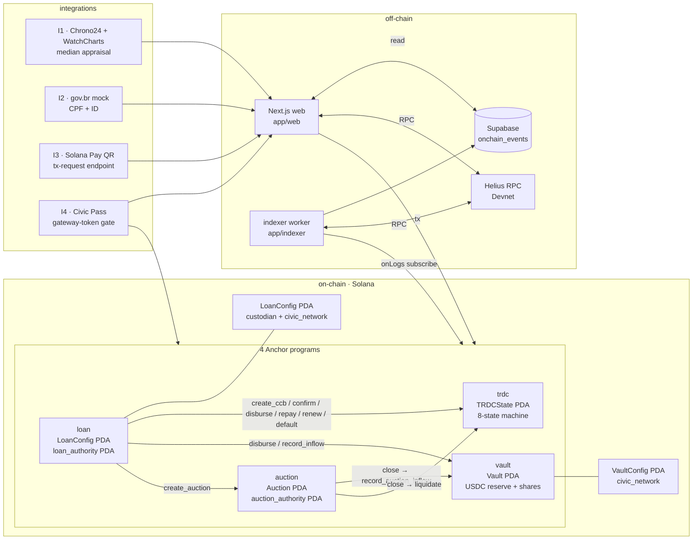

# Vaulx

**Pawn your Submariner. Mint a CCB. Settle in USDC.**

Vaulx is a Brazilian RWA lending protocol on Solana that takes luxury watches as collateral, mints a legally-binding **CCB.B3** (Cédula de Crédito Bancário) per loan, anchors its SHA-256 on-chain, gates every entry point with **Civic Pass**, and uses an open auction primitive for foreclosure. Lender liquidity, borrower disbursement, repayment, renewal, and default — all settle in USDC across four Anchor programs. Submission for the **Colosseum Frontier** hackathon, May 2026.


## Quick links

- **Live demo:** _hosted URL pending Phase 4 deploy_
- **Demo video:** [`apps/web/public/demo/vaulx-demo.mp4`](apps/web/public/demo/vaulx-demo.mp4) _(record before submission)_
- **Build plan:** [`docs/plans/2026-04-23-vaulx-build-plan.md`](docs/plans/2026-04-23-vaulx-build-plan.md)
- **Design doc:** [`docs/plans/2026-04-23-vaulx-full-stack-build-design.md`](docs/plans/2026-04-23-vaulx-full-stack-build-design.md)
- **Status:** [`STATUS.md`](STATUS.md)
- **Changelog:** [`CHANGELOG.md`](CHANGELOG.md)
- **User actions pending:** [`USER_TODO.md`](USER_TODO.md)

## The 9 demo moments

The submission story is nine on-chain moments. Each row maps a moment to the Anchor instruction(s) it fires, the Next.js route a judge clicks through, and the script that exercises it end-to-end against Devnet.

| # | Moment | On-chain (program.ix) | Frontend route | E2E |
|---|---|---|---|---|
| 1 | Lender deposits 100 USDC | `vault.deposit` | [`/lend/vaults/[id]`](apps/web/src/app/lend/vaults/%5Bid%5D/page.tsx) | `pnpm e2e:moment-1` |
| 2 | Borrower mints TRDC against a watch (CCB hashed on-chain) | `loan.create_ccb_trdc` → CPIs `trdc.initialize_trdc_state` + `trdc.mint_trdc_cnft` | [`/borrow/new/{asset,appraisal,terms}`](apps/web/src/app/borrow/new) | `pnpm e2e:moments-2-3-4` |
| 3 | Custodian receives the watch and attests `doc_hash` | `loan.confirm_custody` → CPI `trdc.confirm_custody_transition` | [`/custodian/intake/[trdc]`](apps/web/src/app/custodian/intake/%5Btrdc%5D/page.tsx) | `pnpm e2e:moments-2-3-4` |
| 4 | Borrower disburses principal from the vault | `loan.disburse_from_vault` → CPIs `vault.disburse` + `trdc.transition_to_active` | [`/borrow/loans/[trdc]/disburse`](apps/web/src/app/borrow/loans/%5Btrdc%5D/disburse/page.tsx) | `pnpm e2e:moments-2-3-4` |
| 5 | Borrower pays an installment (and later, full payoff) | `loan.pay_installment` → CPI `vault.record_inflow`; full payoff via `loan.repay_ccb` | [`/borrow/loans/[trdc]/{pay,repay}`](apps/web/src/app/borrow/loans/%5Btrdc%5D) | `pnpm e2e:moments-5-9` |
| 6 | Borrower renews the term and pays accrued + 2% fee | `loan.renew_ccb` → CPI `trdc.transition_renew` + `vault.record_inflow` | [`/borrow/loans/[trdc]/renew`](apps/web/src/app/borrow/loans/%5Btrdc%5D/renew/page.tsx) | `pnpm e2e:moments-5-9` |
| 7 | Default after grace → auction is created and bid on | `loan.execute_af_default` → CPIs `trdc.transition_active_to_overdue` + `transition_overdue_to_defaulted` + `auction.create_auction`; then `auction.place_bid` | [`/lend/auctions/[id]`](apps/web/src/app/lend/auctions/%5Bid%5D/page.tsx) | `pnpm e2e:moments-5-9` |
| 8 | Auction closes, vault recovers capital, TRDC liquidated | `auction.close_auction` → CPIs `vault.record_auction_inflow` + `trdc.transition_defaulted_to_liquidated` | [`/lend/auctions/[id]`](apps/web/src/app/lend/auctions/%5Bid%5D/page.tsx) | `pnpm e2e:moments-5-9` |
| 9 | System snapshot — vault `total_assets` reflects yield + recovery | _(no ix; UI + indexer view)_ | [`/lend`](apps/web/src/app/lend/page.tsx) + [`/lend/auctions`](apps/web/src/app/lend/auctions/page.tsx) | `pnpm e2e:moments-5-9` |

For a click-through judge experience, [`/admin/demo`](apps/web/src/app/admin/demo/page.tsx) collapses moments 1–8 into six big buttons with an _accelerate-time_ toggle that compresses the full lifecycle into roughly 60 seconds.

## Architecture in one diagram

Four programs, two PDAs of operator config, an 8-state TRDC lifecycle, and a thin off-chain index/UI tier. Civic Pass gates the two entry points (`vault.deposit`, `loan.create_ccb_trdc`); every other on-chain edge is a typed CPI.



**TRDC state lifecycle** (enforced on-chain by [`programs/trdc/src/state.rs`](programs/trdc/src/state.rs)):

```
PendingCustody ─► ActiveInCustody ─► Active ─┬─► Renewed ─┬─► Active
                                              │            └─► Repaid
                                              ├─► Repaid
                                              └─► Overdue ─┬─► Repaid
                                                           └─► Defaulted ─► Liquidated
```

## Run it locally

Three paths depending on how deep you want to go.

### A. Just look at the UI _(zero on-chain, no env keys)_

```bash
pnpm install
pnpm --filter @vaulx/web dev
# open http://localhost:3000
```

The live ticker falls back to 12 seeded events. Lend, borrow, and custodian pages render fully; on-chain actions will fail until the programs are deployed and the env is filled in.

### B. Run all 76 tests _(local Anchor + workspace vitest)_

Requires `rustc 1.85.0`, `solana-cli 1.18.26`, and `anchor-cli 0.30.1`.

```bash
# 45 anchor mocha specs against a local validator
cd /Users/gogy/MyCODE/VAULX
PATH=/Users/gogy/.local/share/solana/install/active_release/bin:$PATH \
  COPYFILE_DISABLE=1 \
  anchor test

# 31 vitest cases across @vaulx/terms (16) + @vaulx/ccb (4) + @vaulx/web (11)
pnpm -w test
```

`COPYFILE_DISABLE=1` keeps macOS resource forks out of the genesis tarball. `anchor test` clones the Civic gateway program from mainnet-beta on validator boot (see `Anchor.toml`).

### C. Full demo cockpit on Devnet

Prerequisites:

- Payer keypair at `~/.config/solana/id.json` with **≥ 20 SOL** for program deploy + tx fees.
- `SUPABASE_SERVICE_ROLE_KEY` in both [`apps/web/.env.local`](apps/web/.env.example) and `apps/indexer/.env.local` so the indexer can write `onchain_events`.
- 4 programs deployed: `anchor deploy --provider.cluster devnet` (~19 SOL).
- `pnpm seed:usdc` to create the demo USDC mint and fund 6 demo wallets.
- `pnpm init:civic --custodian <pubkey>` to write `VaultConfig` + `LoanConfig` PDAs.

Then drive the story:

```bash
# Indexer (in one shell)
pnpm --filter @vaulx/indexer dev

# Web (in another)
pnpm --filter @vaulx/web dev

# Open the cockpit
open http://localhost:3000/admin/demo
```

Or run the same flow headless:

```bash
pnpm e2e:moment-1       # Moment 1
pnpm e2e:moments-2-3-4  # Moments 2-4
pnpm e2e:moments-5-9    # Moments 5-9 (two parallel loans, ~4-5 min)
```

Each E2E exits `0` (pass) / `2` (SKIPPED — env not set) / `1` (fail). Mocha wrappers map `2 → this.skip()` so CI stays green.

## Civic Pass KYC

Vaulx enforces KYC at the protocol layer via **Civic Pass** (Solana native gateway tokens). `vault.deposit` and `loan.create_ccb_trdc` require the caller to hold an active gateway token from the configured gatekeeper network — checked by a hand-rolled Borsh decode of the gateway-token account in [`programs/{vault,loan}/src/civic.rs`](programs/loan/src/civic.rs).

### Demo network — CAPTCHA / uniqueness

The hackathon demo uses Civic's free **CAPTCHA / uniqueness network** (`ignREusXmGrscGNUesoU9mxfds9AiYTezUKex2PsZV6`):

- Free, instant issuance via captcha.
- Sybil-resistant (one-wallet-per-human).
- Judges can pass the gate live in ~30 seconds via the "Verify with Civic" button.

Enable for Devnet:

```bash
pnpm init:civic --custodian <custodian-pubkey>
# then in apps/web/.env.local:
# NEXT_PUBLIC_CIVIC_PASS_NETWORK=ignREusXmGrscGNUesoU9mxfds9AiYTezUKex2PsZV6
```

### Production upgrade — full Civic KYC

Subscribe to a paid gatekeeper network (document upload + liveness) at [civic.me](https://civic.me), pass its pubkey to `pnpm init:civic --network <pk> --custodian <pk>`, and rotate `NEXT_PUBLIC_CIVIC_PASS_NETWORK`. **No program redeploy** — the gate reads the network pubkey from on-chain config.

### Disable for development

Leave `civic_network = Pubkey::default()` in `vault_config` / `loan_config` (the default). Useful for `anchor test` without cloning the Civic program.

### Runtime coverage

[`tests/civic-happy-path.spec.ts`](tests/civic-happy-path.spec.ts) issues a real gateway token via `@identity.com/solana-gateway-ts` against a throwaway network, asserts the on-chain Borsh layout matches the parser, then revokes it and asserts the state byte flips `Active(0) → Revoked(2)`.

## Live QA — `/admin/tests`

Run the Anchor test suite live in the browser via Server-Sent Events:

1. `pnpm --filter @vaulx/web dev`
2. Open `http://localhost:3000/admin/tests`
3. Press **Run tests**.

The page streams stdout/stderr from `anchor test --skip-build` line by line. Exit code `0` means all 45 on-chain tests passed. Aborting the page kills the child process cleanly.

**Local-only.** On Vercel, the function-duration cap (30s Hobby / 300s Pro) cuts the SSE stream before `anchor test` finishes (~3–4 min). Hosted deployments fall back to a recorded `apps/web/public/demo/test-run.mp4`.

**Auth.** If `NEXT_PUBLIC_VAULX_ADMIN_PUBKEY` is set, the route requires a matching `vaulx-admin` cookie or `x-vaulx-admin` header. Leave it unset during the hackathon for judges; tighten before any public exposure.

## Tech stack

- **Programs:** Anchor `0.30.1` · Solana CLI `1.18.26` · rustc `1.85.0`
- **Web:** Next.js `14` App Router · Tailwind · shadcn/ui (`new-york`)
- **Design:** editorial dark-operator system — Fraunces (display) + Instrument Sans (body) + JetBrains Mono (numerals); ink-black `#0A0B0D` / paper-warm `#F4F2ED` / restrained gold `#D4AF37`
- **Client:** TanStack Query · React Hook Form · Zod · sonner
- **On-chain libs:** `@solana/pay` · `@civic/solana-gateway-react` · `@identity.com/solana-gateway-ts` · `pdf-lib` · `@noble/hashes`
- **Infra:** Supabase (free tier, `us-east-1`) · Helius RPC (Devnet)
- **Testing:** mocha + chai (Anchor) · vitest (workspace)

## Repo layout

```
programs/{trdc,vault,loan,auction}/   # 4 Anchor programs (45 tests)
apps/web/                             # Next.js frontend
apps/indexer/                         # tsx worker → Supabase onchain_events
packages/{types,terms,ccb,idls,anchor-client,supabase}/
scripts/dev/                          # seed + e2e harnesses + IDL copy
tests/                                # mocha specs for the 4 programs
docs/plans/                           # build plan + design doc + per-phase plans
supabase/migrations/                  # onchain_events schema
```

## Build progress

| Phase | Window | Headlines |
|---|---|---|
| Phase 0 — Bootstrap | Apr 23–24 | pnpm + Turborepo, 4 Anchor programs scaffolded, Next.js + Tailwind + shadcn, Supabase wired, GitHub Actions CI |
| Phase 1 — Core programs | Apr 25–28 | TRDC 8-state machine, Vault share accounting, LTV gate, lender FE, indexer worker, Moment 1 E2E. **17/17 → 29/29** anchor tests |
| Phase 2 — Disburse + wizard | Apr 29–May 1 | CPI-only `disburse` gate, `confirm_custody`, real CCB PDF + SHA-256, I1 appraisal aggregator, **real Civic Pass on-chain gate**, I2 gov.br mock, borrower wizard, Moments 2-3-4 E2E. **33/33 → 35/35** anchor tests |
| Phase 3 — Closing loops | May 2–4 | Pay/repay/renew lifecycle + interest math, auction program + permissionless default, borrower loan dashboard, I3 Solana Pay QR, lender auction routes, `/admin/tests` SSE runner, `/admin/demo` cockpit, Moments 5-9 E2E. **45/45** anchor tests, all 9 moments executable |
| Phase 4 — Rehearsal + deploy | May 5–7 | _ready to start — deploy to Devnet, record demo, polish_ |
| Phase 5 — Submission | May 8–9 | _not started_ |

See [`STATUS.md`](STATUS.md) for the full task breakdown and [`CHANGELOG.md`](CHANGELOG.md) for chronology + decisions.

## Acknowledgements

- **shadcn/ui** for the `new-york` registry that anchors the component layer.
- **Civic** for the open gateway-token spec and the SDK that made the on-chain gate possible.
- **gov.br** for the visual language of the Brazilian federal identity portal — mimicked, not affiliated.
- **Brazilian private-law tradition** — the CCB (Cédula de Crédito Bancário) is real, enforceable, and predates this protocol by decades. Vaulx just hashes it.
- **The Anchor team** for `0.30.1` and the IDL machinery that makes four programs feel like one.

## License

MIT.
