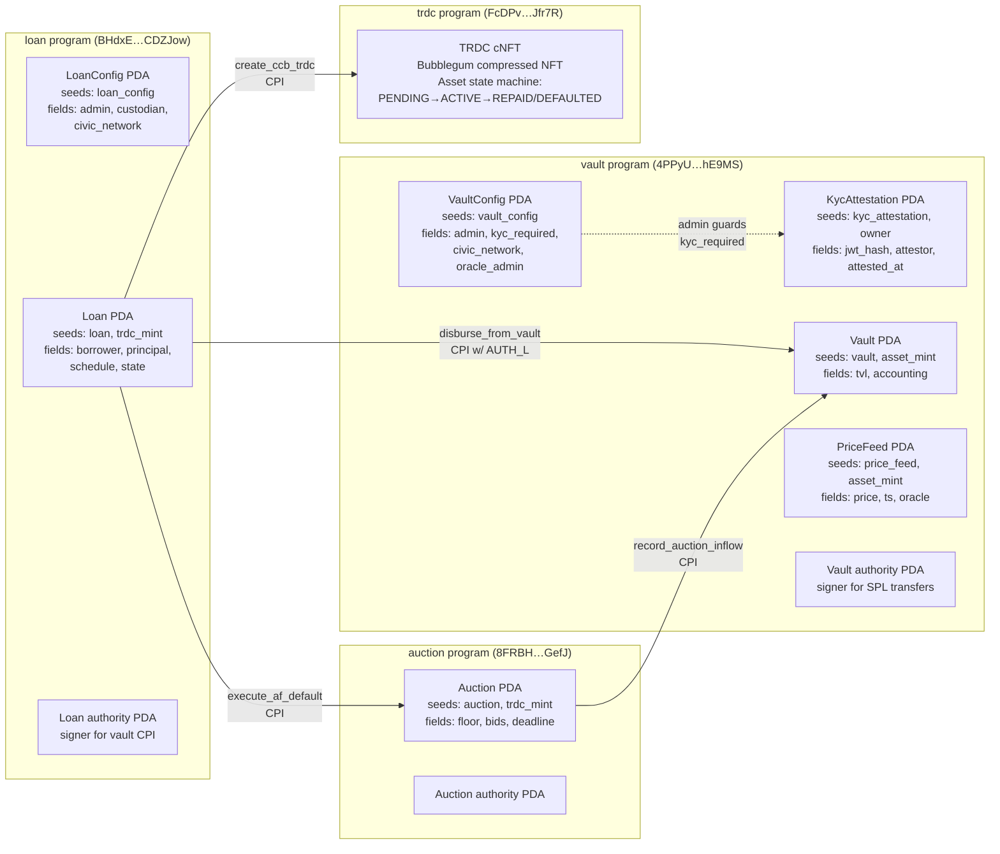
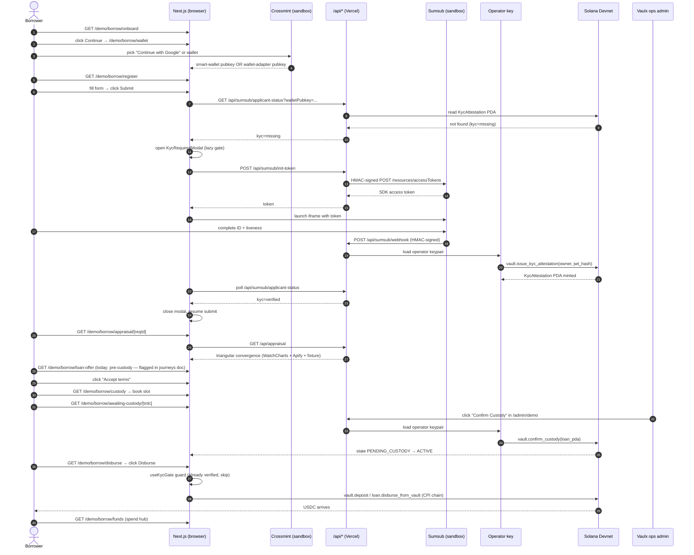
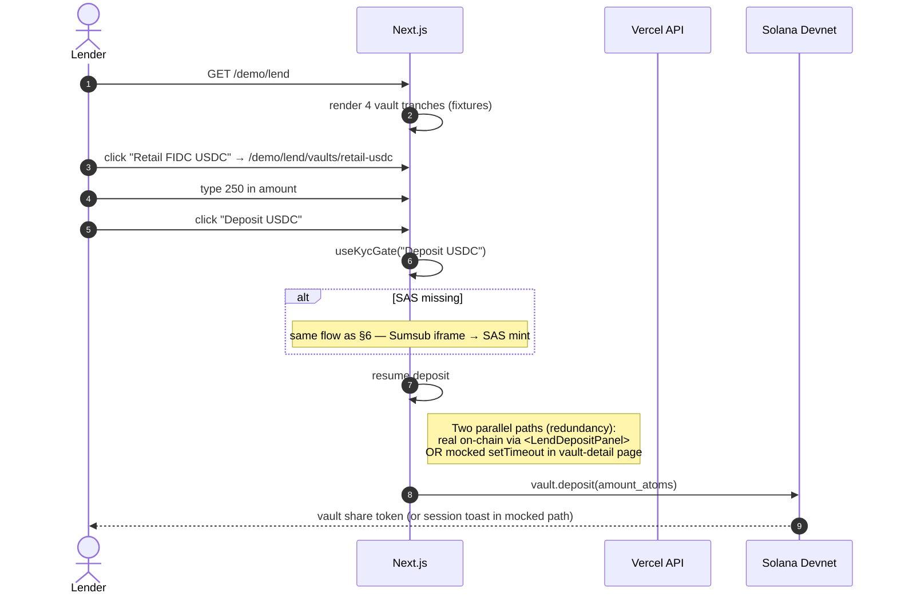
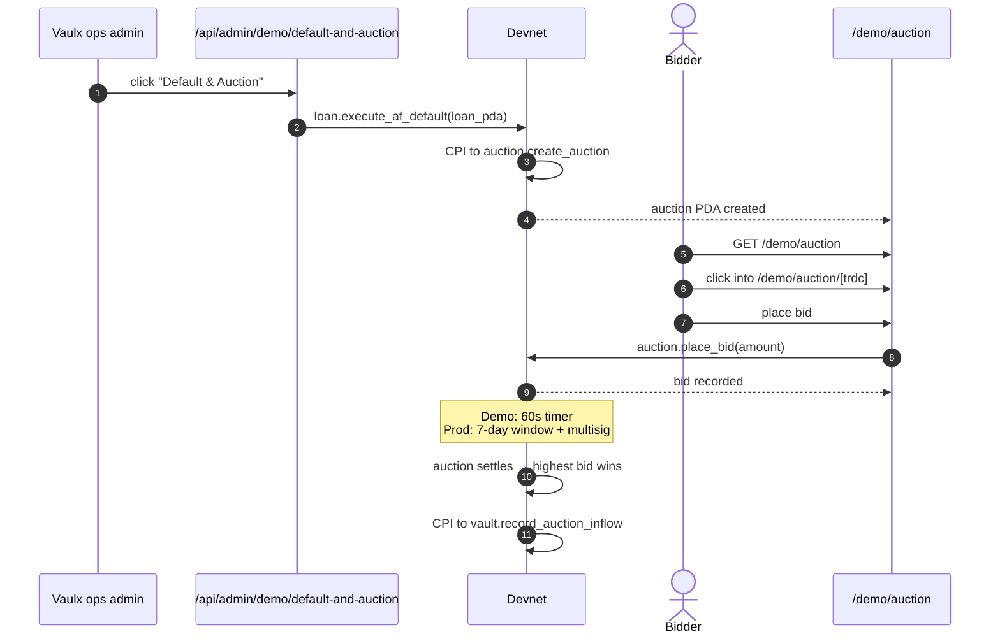

# Vaulx — Current Architecture Snapshot

**As-of:** 2026-04-29 · commit `663e378` · production deploy `https://vaulx.vercel.app`
**Audience:** team meeting · technical review
**Scope:** what's actually deployed today, not what the prod target looks like.
For the production gap analysis, see [`docs/plans/2026-04-29-vaulx-user-journeys-current-vs-ideal.md`](../plans/2026-04-29-vaulx-user-journeys-current-vs-ideal.md).

---

## 1. System overview (one diagram)

```mermaid
graph TB
  subgraph "Browser (Solana wallet, Crossmint, Sumsub iframe)"
    UI[Next.js 14 App Router<br/>apps/web]
    SUMSUB_IFRAME["@sumsub/websdk<br/>(KYC iframe)"]
    XMINT_MODAL["@crossmint/client-sdk-react-ui<br/>(sign-in modal)"]
    WALLET_ADAPTER["@solana/wallet-adapter-react<br/>(Phantom / Solflare)"]
  end

  subgraph "Vercel (Next.js server runtime)"
    API_ROUTES["/api/* route handlers"]
    SUMSUB_HOOK["/api/sumsub/{init-token,webhook,applicant-status}"]
    DEMO_API["/api/admin/demo/*<br/>(devnet ops)"]
    ONCHAIN_HOOKS["/api/onchain-events/*<br/>(custody-confirmed)"]
    APPRAISAL_API["/api/appraisal<br/>(WatchCharts + Apify)"]
  end

  subgraph "Operator key (server-only)"
    OPERATOR["OPERATOR_KEYPAIR_JSON<br/>signs SAS mints + admin ixs"]
  end

  subgraph "Solana Devnet"
    direction TB
    VAULT_PROG["vault program<br/>4PPyUvazjDBvFndGUL2rgKTwZrFbsSP1tk4a2uMhE9MS"]
    LOAN_PROG["loan program<br/>BHdxEKkfsyjERiz5XiUybDLquvoWRtF7r1zDgVCDZJow"]
    AUCTION_PROG["auction program<br/>8FRBHN14CsA2y21hMeJJ2oxbEXNRXicVKMEDHRGyGefj"]
    TRDC_PROG["trdc program<br/>FcDPvRaixjAz7LeC64h9xkXPzvHT7dusbNmg83eJfr7R"]
    SQUADS["Squads V4 multisig<br/>(program upgrade authority)"]
  end

  subgraph "External services"
    SUMSUB_API["api.sumsub.com<br/>(KYC sandbox)"]
    XMINT_API["staging.crossmint.com<br/>(auth + smart wallets)"]
    HELIUS["Helius RPC<br/>(Devnet)"]
    WC["api.watchcharts.com"]
    APIFY["api.apify.com<br/>(Chrono24 actor)"]
    SUPABASE["Supabase<br/>(env wired, light usage)"]
  end

  UI --> API_ROUTES
  UI --> SUMSUB_IFRAME
  UI --> XMINT_MODAL
  UI --> WALLET_ADAPTER

  SUMSUB_IFRAME -.->|iframe postMessage| SUMSUB_API
  XMINT_MODAL -.->|OAuth + REST| XMINT_API
  WALLET_ADAPTER -.->|signTransaction| HELIUS

  SUMSUB_API -->|webhook<br/>HMAC-signed| SUMSUB_HOOK
  SUMSUB_HOOK --> OPERATOR
  DEMO_API --> OPERATOR
  ONCHAIN_HOOKS --> OPERATOR
  OPERATOR -->|RPC| HELIUS
  HELIUS --> VAULT_PROG
  HELIUS --> LOAN_PROG
  HELIUS --> AUCTION_PROG
  HELIUS --> TRDC_PROG

  SQUADS -.->|holds upgrade<br/>authority for| VAULT_PROG
  SQUADS -.->|holds upgrade<br/>authority for| LOAN_PROG
  SQUADS -.->|holds upgrade<br/>authority for| AUCTION_PROG
  SQUADS -.->|holds upgrade<br/>authority for| TRDC_PROG

  VAULT_PROG <-->|CPI<br/>(disburse_from_vault)| LOAN_PROG
  LOAN_PROG <-->|CPI<br/>(create cNFT)| TRDC_PROG
  LOAN_PROG <-->|CPI<br/>(execute default)| AUCTION_PROG
  AUCTION_PROG <-->|CPI<br/>(record auction inflow)| VAULT_PROG

  APPRAISAL_API --> WC
  APPRAISAL_API --> APIFY
  API_ROUTES -.-> SUPABASE
```

**Reading this diagram in 30 seconds**:

- **Browser** runs Next.js + 3 distinct external SDKs (Sumsub iframe, Crossmint modal, wallet-adapter for Phantom/Solflare).
- **Vercel** hosts Next.js. API routes proxy 3 Sumsub endpoints, demo ops endpoints, on-chain event webhooks, and an appraisal aggregator.
- **Operator key** is the server-side signer for: SAS attestation mints (after Sumsub GREEN), demo admin ixs, custody confirmations.
- **Solana Devnet** has 4 programs talking to each other via CPI. Squads V4 multisig owns upgrade authority on all four.

---

## 2. Stack inventory

| Layer | Tech | Version | Status |
|---|---|---|---|
| Frontend framework | Next.js | 14.2.15 (App Router) | live |
| UI runtime | React | 18.3.1 | live |
| Wallet adapter | `@solana/wallet-adapter-react` | 0.15.35 | live (Phantom + Solflare) |
| Smart-wallet auth | `@crossmint/client-sdk-react-ui` | 4.1.5 (sandbox) | live |
| KYC iframe | `@sumsub/websdk` | 2.6.2 (sandbox) | live |
| On-chain client | `@coral-xyz/anchor` | 0.30.1 | live |
| Solana cluster | Devnet via Helius RPC | — | live |
| Hosting | Vercel | — | live (`vaulx.vercel.app`) |
| Database | Supabase | env wired | minimal usage today |
| Asset appraisal | WatchCharts API + Apify Chrono24 actor | — | live (with fallback fixtures) |
| Multisig | Squads V4 | — | upgrade authority only; ops still single-key |
| E2E tests | Playwright | 1.48.2 | 27 passing on prod URL |
| Unit tests (FE) | Vitest | — | 52 passing |
| On-chain tests | Anchor / Mocha | — | 69 passing, 2 pending, 2 failing (pre-existing) |

---

## 3. Repository layout

```
vaulx/
├── apps/
│   ├── web/                Next.js (the user-facing app)
│   │   ├── src/app/        App Router routes (51 page.tsx)
│   │   ├── src/lib/        sumsub/, govbr/(legacy), chain/, admin/
│   │   ├── src/components/ vaulx/, providers/, ui/
│   │   ├── e2e/            Playwright tests (27 specs)
│   │   └── public/
│   └── indexer/            Solana indexer (subgraph-style)
├── packages/
│   ├── anchor-client/      typed Anchor facades (vault, loan, auction, trdc)
│   ├── idls/               IDL JSON for all 4 programs
│   ├── ccb/                CCB document templates
│   ├── terms/              loan-terms math
│   ├── supabase/           Supabase typed client
│   └── types/              shared TS types
├── programs/
│   ├── vault/              Solana program: deposit/withdraw, KYC PDA, oracle
│   ├── loan/               Solana program: TRDC mint, repay, renew, default
│   ├── auction/            Solana program: bid + settlement
│   └── trdc/               Bubblegum cNFT mint program
├── tests/                  Anchor integration tests (69 passing)
└── docs/
    ├── architecture/       this doc
    └── plans/              brainstorming + journey + implementation plans
```

---

## 4. On-chain program & PDA layout



### Vault program instructions

`initialize_vault_config` · `initialize_vault` · `deposit` · `withdraw` · `disburse` · `disburse_from_vault` (CPI from loan) · `record_inflow` · `record_auction_inflow` · `confirm_custody` · `issue_kyc_attestation` · `close_kyc_attestation` · `set_kyc_required` · `publish_price` · `set_oracle_admin` · `test_donate_assets` · `ping`

### Loan program instructions

`initialize_loan_config` · `create_ccb_trdc` (mints TRDC + creates Loan PDA) · `pay_installment` · `repay_ccb` · `renew_ccb` · `execute_af_default` (extrajudicial default → triggers auction)

---

## 5. Borrower flow — sequence (current demo, end-to-end)



**What's real on-chain**: KYC attestation mint, custody confirm, disburse, funds-wallet send.
**What's mocked**: persistent backend for asset records, custody slots, dashboard amortization, Pix/card off-ramps.

---

## 6. KYC gate sequence (the most novel piece)

This is the lazy-KYC pattern shipped today. Fires only at money-touching CTAs (Submit asset / Disburse / Deposit). On-chain `kyc_required` stays `false` for demo speed; the gate is enforced FE-side.

```mermaid
sequenceDiagram
  autonumber
  participant U as User
  participant FE as React (useKycGate)
  participant API as Vercel API
  participant SS as Sumsub Sandbox
  participant OP as Operator key
  participant CH as Devnet vault program

  U->>FE: click "Deposit USDC" (or Disburse / Submit)
  FE->>API: GET /api/sumsub/applicant-status
  API->>CH: read KycAttestation PDA
  alt PDA exists
    CH-->>API: verified, attested_at, jwt_hash[..8]
    API-->>FE: kyc=verified
    FE->>FE: run guarded mutation immediately
  else PDA missing
    CH-->>API: not found
    API-->>FE: kyc=missing
    FE->>FE: open <KycRequiredModal>, defer mutation
    FE->>API: POST /api/sumsub/init-token {walletPubkey}
    API->>SS: HMAC POST /resources/accessTokens
    SS-->>API: token
    API-->>FE: token
    FE->>SS: launch iframe (Sumsub WebSDK)
    U->>SS: complete ID/liveness
    SS->>API: POST /api/sumsub/webhook<br/>(applicantReviewed + GREEN)
    API->>API: verify HMAC against SUMSUB_WEBHOOK_SECRET
    API->>OP: load operator key
    OP->>CH: vault.issue_kyc_attestation(owner, jwt_hash)
    CH-->>API: tx signed; PDA minted
    FE->>API: poll status (every 2s, max 30s)
    API-->>FE: kyc=verified
    FE->>FE: close modal, resume deferred mutation
  end
```

**Files involved**:
- `apps/web/src/lib/use-kyc-gate.tsx` — the hook
- `apps/web/src/components/vaulx/{kyc-required-modal,sumsub-verify}.tsx` — UI
- `apps/web/src/lib/sumsub/{client,webhook,attestation}.ts` — server lib
- `apps/web/src/app/api/sumsub/{init-token,webhook,applicant-status}/route.ts` — routes
- `programs/vault/src/lib.rs` `issue_kyc_attestation` ix
- `programs/vault/src/attestation.rs` `KycAttestation` PDA struct

---

## 7. Lender flow — sequence



---

## 8. Auction flow — sequence



---

## 9. Demo route tree (the canonical flow)

```
/                                            (marketing landing)
├── /demo                                    (demo entry hub)
│   ├── /demo/architecture                   (architecture pitch slide)
│   ├── /demo/borrow/                        (BORROWER FLOW)
│   │   ├── onboard                          intro
│   │   ├── wallet                           Crossmint sign-in
│   │   ├── register                         asset form (KYC gate fires here)
│   │   ├── appraisal/[reqId]                triangular convergence
│   │   ├── loan-offer/[reqId]               ⚠ wrong moment in flow (rewrite planned)
│   │   ├── custody                          custodian booking
│   │   ├── awaiting-custody/[trdc]          wait state
│   │   ├── disburse                         money-touching CTA (KYC gate)
│   │   ├── funds                            spend hub
│   │   │   ├── card                         (mock, no BIN sponsor)
│   │   │   ├── pix                          (mock, no Dock/Celcoin)
│   │   │   └── wallet                       real Solana send
│   │   ├── dashboard                        thin loan list
│   │   ├── renew                            renewal flow
│   │   ├── repay                            repayment flow
│   │   └── verify-id*                       ☠ DEAD (Civic/gov.br dropped)
│   ├── /demo/lend/                          (LENDER FLOW)
│   │   ├── (index)                          4 vault rows + <LendDepositPanel>
│   │   ├── vaults/[id]                      detail (mocked deposit path)
│   │   ├── onboard                          LP application
│   │   └── liquidity                        strategy explainer
│   ├── /demo/auction/                       (BIDDER FLOW)
│   │   ├── (index)                          auction list
│   │   └── [trdc]                           bidding screen
│   └── /demo/dev/bezel                      ☠ "Hello bezel" stub (DELETE)
├── /admin/                                  (INTERNAL OPS)
│   ├── demo                                 cockpit (7 ops buttons)
│   └── tests                                live SSE Anchor test runner
├── /custodian/                              (LEGACY — fallback only)
│   ├── intake/[trdc]
│   └── done/[trdc]
├── /borrow/*                                LEGACY tree (16 routes — delete candidates)
└── /lend/*                                  LEGACY tree (5 routes — mostly redirects already)
```

Symbols: ⚠ = behavior bug · ☠ = dead code · all unmarked = live and load-bearing.

---

## 10. Environment variables

### Vercel production

```
# Solana / RPC
NEXT_PUBLIC_RPC_URL              Helius Devnet endpoint
NEXT_PUBLIC_CLUSTER              "devnet"
NEXT_PUBLIC_USDC_MINT            demo USDC mint
HELIUS_API_KEY                   server-only

# Operator key (server-only signer)
OPERATOR_KEYPAIR_JSON            64-byte JSON array; signs SAS mints + admin ixs

# Sumsub (KYC, lowercase per current code)
sumsub_token                     sbx:* App Token
sumsub_secret                    HMAC secret
sumsub_webhook_secret            webhook payload HMAC secret
NEXT_PUBLIC_SUMSUB_LEVEL_NAME    "basic-kyc-level"

# Crossmint
NEXT_PUBLIC_CROSSMINT_API_KEY    ck_staging_*
NEXT_PUBLIC_CROSSMINT_ENV        "staging"
CROSSMINT_SERVER_API_KEY         server-only

# Supabase
NEXT_PUBLIC_SUPABASE_URL
NEXT_PUBLIC_SUPABASE_ANON_KEY
SUPABASE_SERVICE_ROLE_KEY        server-only
```

---

## 11. What's REAL vs what's MOCKED

| Capability | Real | Mocked |
|---|:-:|:-:|
| Crossmint sign-in (email path) | ✅ | |
| Crossmint sign-in (Google popup) | ⚠ | tested but flaky in some browsers |
| Phantom / Solflare via wallet-adapter | ✅ | |
| Sumsub WebSDK iframe + sandbox | ✅ | |
| Sumsub webhook → on-chain SAS mint | ✅ | |
| `KycAttestation` PDA on Devnet | ✅ | |
| Asset-form persistence | | ✅ localStorage only |
| Triangular appraisal | partial | online API real; offline specialist hardcoded |
| Loan-offer / CCB | | ✅ no SCD signature |
| Custodian booking | | ✅ slot fixtures |
| Custody confirm | ✅ via admin button | real custodian webhook absent |
| TRDC cNFT mint | ✅ Bubblegum | |
| Vault deposit (lend) | ✅ via `<LendDepositPanel>` | the `/demo/lend/vaults/[id]` page is parallel mock |
| Disburse (borrow) | ✅ on-chain CPI | |
| Funds spend: wallet send | ✅ | |
| Funds spend: card / pix | | ✅ shells only |
| Auction default trigger | ✅ admin button | timer is 60s vs 7d |
| Auction bidding | partial | 60s window; no whitelist |
| Risk Officer trilateral review | | ❌ does not exist |
| Online + offline appraiser workspaces | | ❌ do not exist |
| Per-loan installment payment UI | | ❌ does not exist (legacy `/borrow/loans/[trdc]/pay` only) |
| Squads multisig (upgrade authority) | ✅ | admin ixs still single-key |
| Squads multisig (admin ix signing) | | ❌ |

---

## 12. Test coverage state

| Suite | Count | Status |
|---|---|---|
| Anchor / Mocha (`tests/*.spec.ts`) | 69 + 2 pending + 2 failing | failing tests are pre-existing, not regressions |
| Vitest unit tests (FE) | 52 passing | covers Sumsub client, webhook, attestation, useKycGate |
| Playwright E2E (`apps/web/e2e/`) | 27 passing | runs against `https://vaulx.vercel.app` |
| Build (`pnpm --filter @vaulx/web build`) | ✅ green | |

---

## 13. Key gaps to production

This is the executive summary; full analysis is in [`docs/plans/2026-04-29-vaulx-user-journeys-current-vs-ideal.md`](../plans/2026-04-29-vaulx-user-journeys-current-vs-ideal.md) (v2).

1. **Borrower flow is missing offline-evaluation stage** — terms today are committed at `/demo/borrow/loan-offer/[reqId]` BEFORE custody. Production needs: indicative terms pre-custody → physical inspection by offline appraiser → Risk Officer trilateral review → final terms (which can differ).
2. **No appraiser workspaces** — both online (24h SLA) and offline (48h SLA) appraisers need `/appraiser/*` UIs. Both must be fully blinded via case codes.
3. **No Risk Officer review surface** — `/admin/evaluations/*` does not exist; trilateral convergence is currently hand-waved.
4. **No per-loan detail / installment payment** — returning-borrower experience is thin; legacy `/borrow/loans/[trdc]/pay` exists but is unreachable from demo nav.
5. **SCD has no integration** — currently `<CcbDocument>` renders mock copy. Production target: API-client integration (no portal).
6. **Custodian has no real webhook** — works via Vaulx admin button on demo. Production target: HMAC-signed webhook from custodian's inventory system.
7. **Squads multisig not used for admin ixs** — only program upgrade authority is multisig; day-to-day admin actions sign with operator key.
8. **Lender vaults too granular** — 4 fixture rows (institutional/retail × USDC/BRL); proposed simplification to 2 (USDC + Local).
9. **Crossmint sign-in only on borrower side** — lender / appraiser surfaces use `<WalletMultiButton>` only. Need `<UnifiedConnectButton>` everywhere.
10. **Verify-id quad-tree is dead** — 8 routes left over from Civic/gov.br removal. Safe to delete.

---

## 14. Pre-hackathon build list (snapshot — ordered phases)

From the v2 journeys doc §8:

- **Phase A** — foundations: `<UnifiedConnectButton>`, `appraisal_case` data model, case-code generator, photo EXIF stripper, admin basic-auth gate
- **Phase B** — `/appraiser/online` + `/appraiser/online/[caseCode]` + `/appraiser/offline` + `/appraiser/offline/[caseCode]`
- **Phase C** — `/admin/evaluations` + `/admin/evaluations/[reqId]` (Risk Officer)
- **Phase D** — borrower flow rewrite: indicative-terms / final-terms / return-asset / per-loan / pay
- **Phase E** — vault simplification (4 → 2) [PENDING USER VERDICT]
- **Phase F** — execute Cut List (16 routes + lib/govbr + types cleanup)
- **Phase G** — custodian webhook contract documentation

11 new routes + 1 unified component + 4 backend pieces in total.

---

## 15. Talking points for the meeting

1. **What we shipped today** — Civic Auth dropped (8 routes dead), Sumsub WebSDK + lazy KYC gate (3 routes wired), 4 phases on `main`, 27 Playwright tests on prod URL.
2. **What we discovered** — borrower flow has a structural ordering bug; Risk Officer review is a load-bearing missing piece; Appraiser is two distinct personas, not one.
3. **What we propose** — 11 new pre-hackathon routes (per §14); 16 legacy routes deleted; vault simplification 4 → 2 to confirm.
4. **What's NOT changing** — the on-chain layer (4 programs + their PDAs + CPIs); Squads upgrade authority; Crossmint + Sumsub partnerships.
5. **Open product calls** — vault simplification, SCD architecture (API-client vs portal), re-eval-on-decline policy.

---

**End of snapshot.** Last updated 2026-04-29. Ground truth: commit `663e378`, deploy `vaulx-4s66xi4xz` aliased to `vaulx.vercel.app`.
