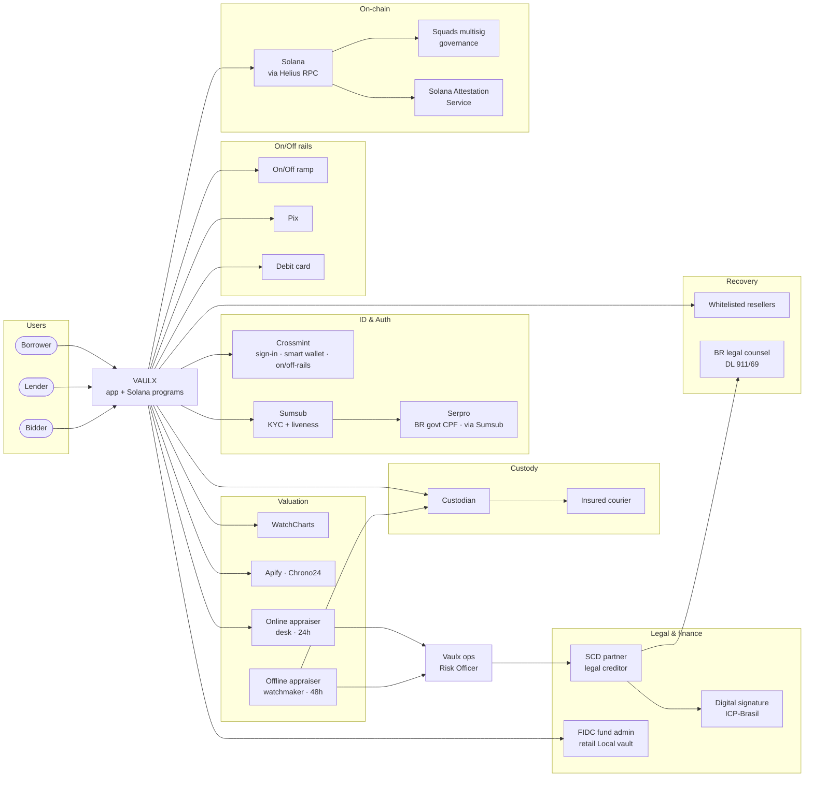
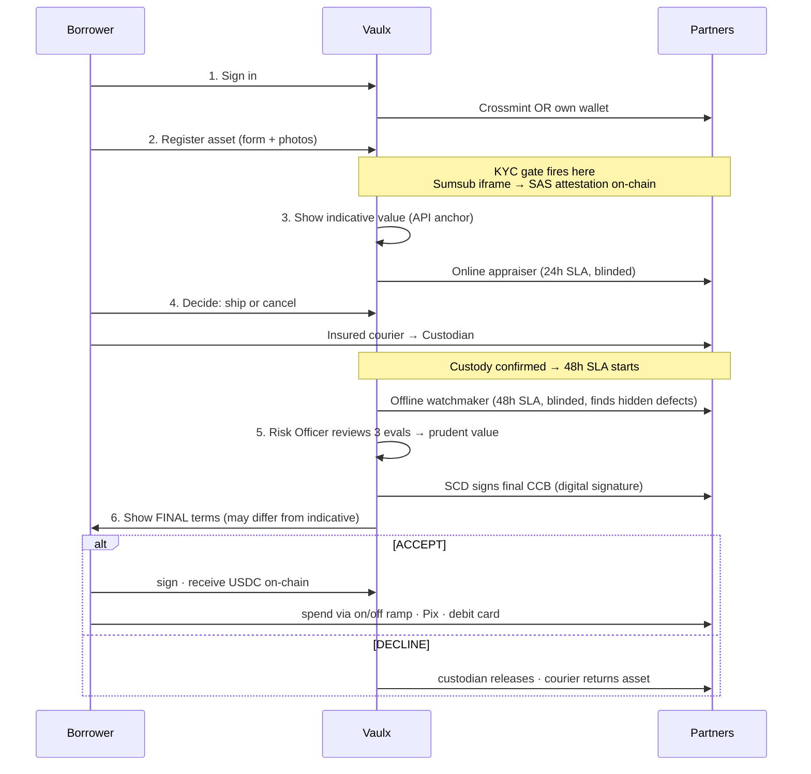
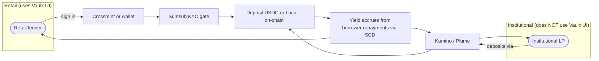
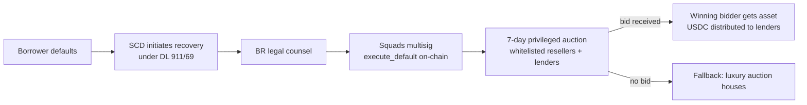

# Vaulx — Business Flow & Partners

**Date:** 2026-04-29 · **Audience:** business / partnerships team meeting
**Companion:** technical view at [`2026-04-29-vaulx-architecture-snapshot.md`](./2026-04-29-vaulx-architecture-snapshot.md)

---

## 1. The big picture

**60-second read:**
- 3 user types enter Vaulx.
- 7 partner clusters surround it: ID & Auth, Valuation, Custody, Legal & finance, On/Off rails, On-chain, Recovery.
- Most partner integrations are server-to-server APIs. Only Crossmint and Sumsub have user-facing surfaces.

---

## 2. Partner inventory

### What's live today (we use these in the demo)

| Partner | Role |
|---|---|
| **Crossmint** | sign-in (Google/Apple/email/SMS) + smart-wallet provisioning + on/off-rails |
| **Sumsub** | KYC (ID + liveness + BR Non-Doc CPF flow) |
| **Serpro** | BR government CPF database (via Sumsub) |
| **Solana Attestation Service** | reusable on-chain KYC credential |
| **Helius RPC** | Solana network access |
| **Squads V4** | multisig (program upgrade authority today; admin signing in prod) |
| **WatchCharts** | online watch-price anchor |
| **Apify · Chrono24** | secondary price anchor |
| **Vercel** | hosting |
| **Supabase** | DB (light usage today; production target for asset records and appraiser cases) |

### Roles still needed (no name committed yet)

| Role | Examples in market |
|---|---|
| **Custodian** | Cofre Brasil, Brinks, Prosegur (any insured BR vault provider) |
| **Insured courier** | local logistics with insured high-value handling |
| **Online appraiser network** | desk-based watch specialists; we hire the pool |
| **Offline appraiser network** | watchmakers stationed near the custodian vault |
| **SCD partner** | regulated BR sociedade de crédito direto (legal creditor of record) |
| **Digital signature provider** | any ICP-Brasil-accredited e-sig provider |
| **FIDC fund admin** | regulated BR fund administrator (for retail Local vault) |
| **On/off ramps** | Pix + debit card rails (multiple providers possible; Crossmint covers part of this) |
| **Institutional liquidity routing** | Kamino, Plume (DeFi aggregators — institutionals deposit via these, not via Vaulx UI) |
| **Whitelisted reseller network** | ~20 watch resellers with on-chain whitelist for primary auctions |
| **BR legal counsel** | retained for DL 911/69 extrajudicial recovery paperwork |
| **Notification channels** | WhatsApp Business + transactional email (provider TBD) |

---

## 3. Borrower journey

### Step-by-step partner table

| Step | What happens | Partner |
|---|---|---|
| 1. Sign in | smart wallet provisioned OR Phantom connects | **Crossmint** |
| 2. KYC | first money-touching CTA fires Sumsub iframe; SAS attestation minted on-chain | **Sumsub** + **Serpro** + **SAS** |
| 3a. Indicative value | online API anchor (1 of 3) | **WatchCharts** + **Apify** |
| 3b. Online appraisal | desk specialist submits within 24h, blinded by case code | **Online appraiser pool** |
| 4. Ship to vault | insured courier → custodian intake → on-chain custody confirm | **Custodian** + **Courier** |
| 5a. Offline appraisal | watchmaker physical inspection within 48h, can take own photos/videos | **Offline appraiser pool** |
| 5b. Risk Officer review | Vaulx ops reviews trilateral, assigns prudent value within bounded override | (internal Vaulx) |
| 5c. CCB signed | SCD becomes legal creditor; ICP-Brasil binds digital signature | **SCD** + **digital signature provider** |
| 6. Final terms | borrower sees prudent eval; accepts or declines | (Vaulx UI) |
| 7a. Accept → disburse | USDC on-chain | **Helius RPC** |
| 7b. Decline → return | custodian releases; courier returns | **Custodian** + **Courier** |
| 8. Spend | USDC → fiat | **On/off rails** (Pix · debit card) |
| 9. Renew / Repay | CCB amendment + on-chain ix | **SCD** + **Helius** |

---

## 4. Lender journey

| Step | Partner |
|---|---|
| Sign in | **Crossmint** (retail) · own wallet (any) |
| KYC at first deposit | **Sumsub** + on-chain **SAS** |
| Deposit USDC vault | **Helius RPC** (on-chain) |
| Deposit Local (BRL) vault | **FIDC fund admin** (retail FIDC wrapper, post-legal-readiness) |
| Yield distribution | borrower repayments routed via **SCD** → on-chain inflow |
| Withdraw | on-chain (subject to utilisation cap) |
| Institutional path | route via **Kamino / Plume**; no Vaulx UI |

---

## 5. Default & recovery

When a borrower stops paying, the lenders need to recover capital from the asset.

| Step | Partner |
|---|---|
| Recovery initiation | **SCD** + **BR legal counsel** |
| On-chain default execution | **Squads multisig** |
| Primary auction (7 days) | **Whitelisted reseller network** + existing **lenders** of the vault |
| Fallback auction | luxury houses (e.g. Sotheby's, Christie's — agreement TBD) |

---

## 6. Critical-path partnerships

If we have to pick the **5 most important partnerships** before mainnet:

| Rank | Role | Why critical |
|---|---|---|
| 1 | **SCD partner** | Legal creditor of record. Without it, no compliant CCB can be issued. |
| 2 | **Custodian** | Without insured physical custody, lenders won't fund. |
| 3 | **Online + offline appraiser network** | Two distinct human-review pools. Without them, the trilateral collapses to API-only and risk pricing breaks. |
| 4 | **Digital signature provider** (ICP-Brasil) | CCB needs legally binding signature. |
| 5 | **On/off rails** (Pix + debit card) | Brazilian borrowers need BRL, not USDC. Crossmint covers part of this; remaining Pix/debit-card rails to be confirmed. |

The other roles (FIDC fund admin, institutional Kamino/Plume routing, reseller network, fallback houses, notification channels) are important but not blocking the first mainnet borrower.

---

## 7. Status: hackathon vs mainnet

### For the hackathon (May 10) — what's already done vs still needed

**Done:**
Sign-in (Crossmint sandbox), KYC (Sumsub sandbox), online price anchor (WatchCharts + Apify), on-chain disburse, custody confirm via admin button, auction trigger, 4 Solana programs deployed, 27 Playwright e2e tests passing on prod.

**Still needed (engineering, pre-hackathon):**
Two-stage borrower flow rewrite, online + offline appraiser workspaces, Risk Officer review screen, per-loan dashboard + installment payment, Crossmint on lender side, admin basic-auth, deletion of 16 legacy routes.

### For mainnet — partnerships to land (rough timing)

| Role | Realistic ETA |
|---|---|
| SCD partner | 1–2 months |
| Custodian agreement | 1–2 months |
| Appraiser network (online + offline) | 1 month |
| Digital signature provider | 2–4 weeks |
| On/off rails (Pix + debit card) | 1–2 months |
| BR legal counsel | 2–4 weeks |
| FIDC fund admin (retail Local) | 3–6 months |
| Whitelisted reseller network | 1–2 months |

**Realistic mainnet target**: ~3-4 months post-hackathon, gated on top-5 critical-path partnerships.

---

## 8. Talking points

1. **9 partners are live or sandbox today**: Crossmint, Sumsub (+ Serpro), WatchCharts, Apify, Helius, Squads, Solana SAS, Vercel, Supabase.
2. **5 partnership categories are critical-path** before mainnet: SCD · Custodian · Appraiser network · Digital signature · On/off rails. The rest can come after first borrower.
3. **Most integrations are invisible APIs.** Users only see Crossmint and Sumsub directly. SCD, custodian, appraisers, signature provider, payment rails — all server-to-server.
4. **The trilateral appraisal + Risk Officer review is our anti-fraud architecture.** Two blinded human appraisers + bounded human override. This is what separates Vaulx from naive DeFi (single oracle gets gamed).
5. **Institutional liquidity is OUT of v1 Vaulx UI.** No KYB onboarding screens. Institutionals deposit via Kamino / Plume aggregators.
6. **Mainnet ETA: 3–4 months post-hackathon**, gated mostly on SCD + Custodian partnerships landing in parallel.

---

**End.** Companion docs: technical [`architecture-snapshot`](./2026-04-29-vaulx-architecture-snapshot.md) · journey [`current-vs-ideal`](../plans/2026-04-29-vaulx-user-journeys-current-vs-ideal.md).
