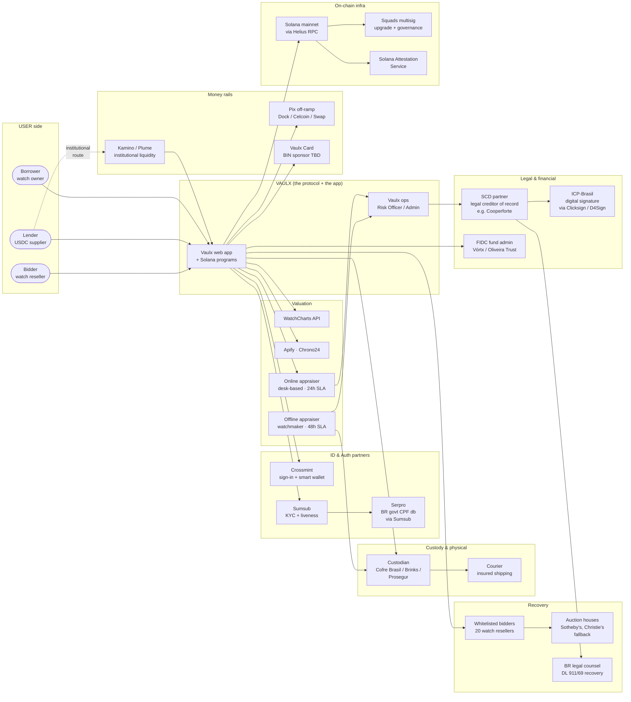
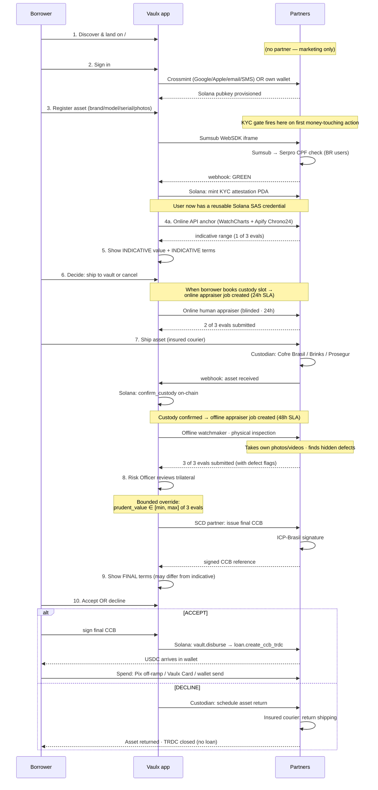
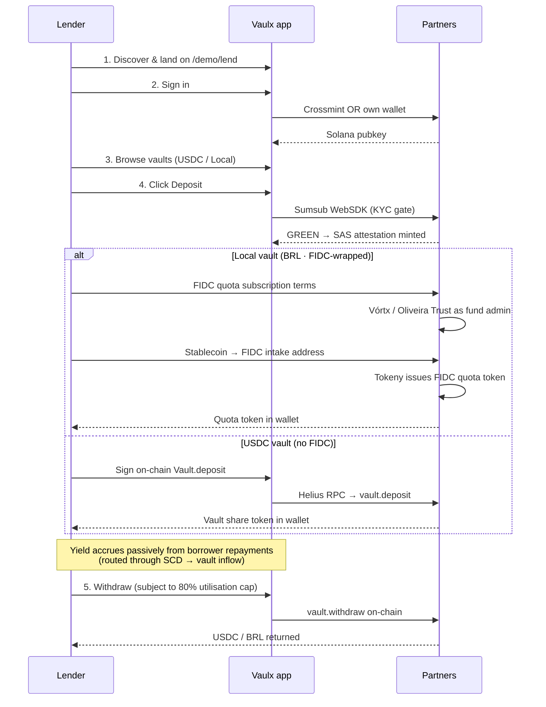
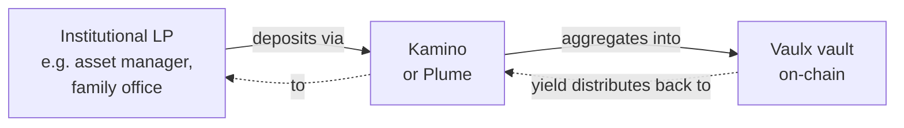
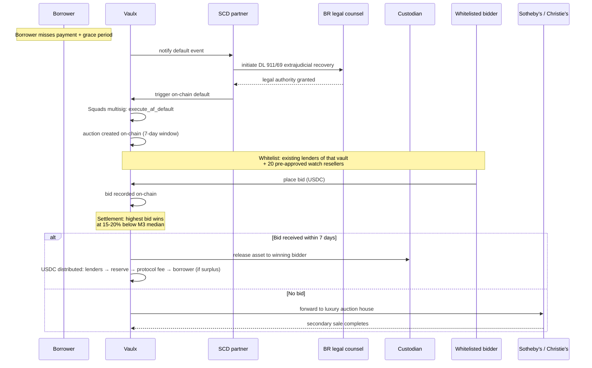
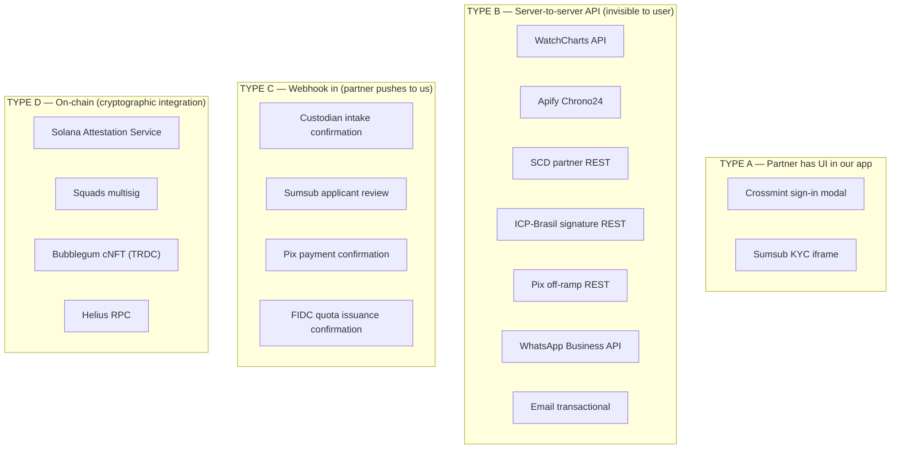

# Vaulx — Business Flow & Partner Integrations

**Date:** 2026-04-29
**Audience:** team meeting · business / partnerships / strategy
**Purpose:** show what the user experiences, what happens behind the scenes, and which partner is needed at each step. End-to-end.
**Companion:** technical snapshot at [`2026-04-29-vaulx-architecture-snapshot.md`](./2026-04-29-vaulx-architecture-snapshot.md).

---

## 1. The big picture (one diagram)

**Reading this in 60 seconds:**

- **3 user types** enter the app (borrower, lender, bidder).
- **Vaulx** sits in the middle, surrounded by **6 partner clusters**: ID/Auth, Valuation, Custody, Legal/Finance, Money rails, On-chain infra, Recovery.
- Most partner integrations are **server-to-server APIs**, not UIs (so the user always feels like they're using one app).
- The only partners with their own user-facing surface are: Crossmint (sign-in modal), Sumsub (KYC iframe).

---

## 2. Partner inventory by integration status

| Partner | Role | Status | Integration type |
|---|---|---|---|
| **Crossmint** | Sign-in (Google/Apple/email/SMS) + smart-wallet provisioning | ✅ Live (sandbox) | iframe + REST |
| **Sumsub** | KYC: ID + liveness + Brazil Non-Doc CPF | ✅ Live (sandbox) | iframe + webhook |
| **Serpro** | BR govt CPF verification | ✅ Live via Sumsub | Sumsub-managed |
| **Solana Attestation Service** | On-chain reusable KYC credential | ✅ Live | on-chain PDA |
| **Helius RPC** | Solana Devnet/mainnet RPC | ✅ Live | REST |
| **Squads V4** | Multisig upgrade authority + future admin signing | ✅ Live (upgrade only) | on-chain PDA |
| **WatchCharts API** | Online watch-price anchor | ✅ Live | REST |
| **Apify · Chrono24** | Secondary online price anchor | ✅ Live | REST (fallback fixture) |
| **Vercel** | Hosting + serverless | ✅ Live | platform |
| **Supabase** | DB (asset records, appraiser cases, payouts) | 🟡 Env wired, light usage | client SDK |
| **Online appraisers** | Desk-based human valuation | ❌ Not hired yet | will need workspace + SLA contract |
| **Offline appraisers / watchmakers** | Physical inspection at vault | ❌ Not hired yet | will need workspace + SLA contract |
| **Custodian: Cofre Brasil** (or Brinks / Prosegur) | Physical vault + intake/release | ❌ No integration | webhook + per-custodian signing key |
| **Insured courier** | Asset shipping | ❌ TBD partner | API or PDF labels |
| **SCD partner** (Cooperforte / FidoCred / similar) | Legal creditor of record · CCB issuance · default trigger | ❌ No integration | REST API (no UI) |
| **ICP-Brasil signature** (Clicksign / D4Sign) | Digital CCB signature | ❌ No integration | REST API |
| **FIDC fund admin** (Vórtx / Oliveira Trust) | Retail FIDC quota wrapper | ❌ No integration | manual paperwork + REST |
| **Tokeny** (or Solana ERC-3643-like) | Identity-bound token for FIDC quotas | ❌ No integration | SDK |
| **Pix off-ramp** (Dock / Celcoin / Swap) | USDC ↔ BRL Pix conversion | ❌ No integration | REST |
| **Vaulx Card BIN sponsor** | Visa/Mastercard BIN for "spend USDC like cash" | ❌ Sponsor not signed | API + KYB |
| **Kamino / Plume** | Institutional USDC liquidity routing | ❌ No integration | DeFi vault wrapper |
| **WhatsApp Business + transactional email** | Renewal nudges, status updates | ❌ No integration | REST |
| **Whitelisted reseller network** | Primary auction bidders | ❌ Not curated | wallet whitelist on-chain |
| **Sotheby's / Christie's** | Fallback luxury auction houses | ❌ No agreement | manual + API |
| **BR legal counsel** | DL 911/69 extrajudicial recovery paperwork | ❌ Not retained | manual |

**Live + sandbox partners**: 9
**Partners needed before mainnet**: 16

---

## 3. Borrower journey — end to end

The full happy-path borrower journey, with every partner touch flagged.

### Borrower step-by-step partner table

| # | User step | What happens behind the scenes | Partner(s) needed | Status today |
|---|---|---|---|---|
| 1 | Land on `/` | Marketing static page | — | ✅ live |
| 2 | Sign in | Crossmint provisions smart wallet OR Phantom/Solflare connects | **Crossmint** + wallet adapters | ✅ sandbox |
| 3 | Submit asset form | Form persisted (today: localStorage; prod: Supabase) | (Supabase prod) | 🟡 light |
| 4 | KYC gate fires (first money-touching action) | Sumsub iframe → ID + liveness → webhook → on-chain SAS mint signed by Vaulx operator | **Sumsub** (+ Serpro via Sumsub for BR) | ✅ sandbox |
| 5 | See indicative value | API anchor: WatchCharts + Chrono24 returns price range | **WatchCharts** + **Apify** | ✅ live |
| 5b | Online appraiser submits | Blinded case-coded job assigned to a human watch specialist; 24h SLA | **Online appraiser** (contracted desk worker) | ❌ not hired |
| 6 | Borrower decides to ship | App generates shipping label | **Insured courier** (TBD) | ❌ no partner |
| 7 | Asset arrives at vault | Custodian scans, photographs, fires webhook | **Custodian** (Cofre Brasil / Brinks / Prosegur) | ❌ no integration |
| 7b | Offline appraiser inspects | Physical inspection at vault; can take own photos/videos; finds hidden defects; 48h SLA | **Offline appraiser / watchmaker** | ❌ not hired |
| 8 | Risk Officer reviews 3 evals | Internal Vaulx ops decides convergence + prudent value | (internal Vaulx hire) | ❌ no UI yet |
| 8b | CCB legally issued | SCD signs CCB; ICP-Brasil binds digital signature | **SCD partner** + **ICP-Brasil** | ❌ no partner |
| 9 | Final terms shown | Borrower sees prudent eval $Y vs indicative $X | (Vaulx UI) | ❌ flow needs rewrite |
| 10a | Borrower accepts | On-chain disburse runs; USDC lands in wallet | **Helius RPC** | ✅ Devnet only |
| 10b | Borrower declines | Custodian release; courier return | **Custodian** + **courier** | ❌ no integration |
| 11 | Spend USDC | Pix conversion → BRL OR card swipe OR direct wallet send | **Pix partner** (Dock/Celcoin) + **Vaulx Card BIN sponsor** | ❌ shells only |
| 12 | Day-60 nudge | WhatsApp / email reminder to renew | **WhatsApp Business** + email transactional | ❌ no integration |
| 13 | Pay installment / renew / repay | On-chain ix; SCD co-signs CCB amendment | **SCD** + **Solana** | ❌ no SCD; ✅ Solana |
| 14 | (Default path — see §5) | Trigger SCD recovery + on-chain auction | **SCD** + **legal counsel** + **bidder network** | ❌ all missing |

---

## 4. Lender journey — end to end

### Retail lender (USDC or Local/BRL via FIDC wrapper)

### Institutional lender — DOES NOT use Vaulx UI

**Why no Vaulx UI for institutional?** The app today doesn't support KYB / business accounts. Institutionals use their own custody (Fireblocks, Anchorage) and discover Vaulx vaults through DeFi aggregators. Building a B2B onboarding UI in Vaulx is post-launch.

### Lender step-by-step partner table

| # | User step | Behind the scenes | Partner | Status |
|---|---|---|---|---|
| 1 | Land on `/demo/lend` | static UI | — | ✅ live |
| 2 | Sign in | Crossmint or wallet | **Crossmint** | ✅ borrower side only — needs wiring on lender side |
| 3 | KYC at first deposit | Sumsub flow | **Sumsub** | ✅ sandbox |
| 4 | Deposit USDC vault | On-chain `vault.deposit` | **Helius RPC** | ✅ Devnet |
| 4b | Deposit Local (BRL) vault | FIDC quota subscription → fund admin → Tokeny mint | **Vórtx** / **Oliveira Trust** + **Tokeny** | ❌ no integration |
| 5 | Yield accrual | From borrower repayments routed via SCD → on-chain inflow | **SCD** | ❌ |
| 6 | Withdraw | On-chain `vault.withdraw`; queued if utilisation > 80% | **Helius RPC** | ❌ utilisation cap not implemented |
| 7 | Tax reporting | Statement export | **Brazilian tax-doc partner** (TBD) | ❌ |

---

## 5. Default & recovery journey

When a borrower fails to pay, the asset is seized and auctioned. This is the lender's safety net.

### Recovery partner table

| # | Step | Partner | Status |
|---|---|---|---|
| 1 | Default detection | (Vaulx cron + on-chain `mark_overdue`) | ❌ cron not built |
| 2 | Legal recovery initiation | **SCD partner** + **BR legal counsel** | ❌ no partner |
| 3 | On-chain default execution | **Squads multisig** | ✅ multisig live; ix not yet wired |
| 4 | Auction window (7 days) | (Vaulx auction program) | 🟡 60s demo timer; needs prod-grade timing |
| 5 | Whitelisted bidders | **20 watch resellers** | ❌ network not curated |
| 6 | Fallback house auction | **Sotheby's / Christie's** | ❌ no agreement |
| 7 | Settlement & distribution | (on-chain CPI) | 🟡 partial |

---

## 6. Integration types — how each partner plugs in

Partners integrate in three different shapes. The shape matters for engineering effort and user experience.

**Engineering effort by type**:
- Type A (iframe/SDK) — 1-2 weeks per partner
- Type B (REST API) — 1-3 weeks per partner
- Type C (webhook) — 1 week per partner (we define the contract; partner posts to us)
- Type D (on-chain) — already in place

---

## 7. Critical-path partnerships

If we had to pick the **5 partnerships most critical** to ship a real Brazilian product (in order):

| Rank | Partner | Why critical | Blocks |
|---|---|---|---|
| 1 | **SCD partner** (Cooperforte, FidoCred, etc.) | Without an SCD as legal creditor of record, no real CCB can be issued. We can't lend to Brazilians legally. | Every loan in BR |
| 2 | **Custodian** (Cofre Brasil / Brinks / Prosegur) | Without physical custody, no asset is secured. Lenders won't fund. | Every loan |
| 3 | **Online + offline appraisers** | Without humans-in-the-loop, the trilateral collapses to API-only. Risk pricing breaks. | Every loan |
| 4 | **ICP-Brasil signature** (Clicksign / D4Sign) | CCB needs a legally binding signature. Without it, CCB has no enforceability. | Every loan in BR |
| 5 | **Pix off-ramp** (Dock / Celcoin / Swap) | Brazilian borrowers need BRL, not USDC. Without Pix conversion, the user experience breaks at "spend". | Borrower spend UX |

The other 11 needed-partners are important but not blocking. Vaulx Card, FIDC wrapper, Kamino routing, auction houses — all can come post-MVP.

---

## 8. What changes hands at each step

This is the question the legal team will ask: **who owns what, when?**

| Step | Asset | Money | Legal status |
|---|---|---|---|
| Sign-in | — | — | borrower has account |
| KYC | borrower's identity data → Sumsub → Vaulx (hash) | — | borrower KYC'd; on-chain attestation reusable |
| Asset register | borrower's photos → Vaulx storage | — | no commitment yet |
| Indicative terms | — | — | non-binding indicative |
| Ship to vault | borrower's watch → courier → custodian | (insurance premium paid by Vaulx) | custodian holds physical possession; ownership still borrower's |
| Custody confirmed | watch in Vaulx-controlled vault | — | possession transferred; **TRDC cNFT minted** representing the asset claim |
| Offline eval + Risk Officer review | watch in vault | — | trilateral evaluation complete |
| Final CCB signed | watch in vault | (no money flow yet) | **fiduciary alienation** under DL 911/69 — SCD becomes creditor; borrower's title transferred to SCD as security |
| Disburse | watch in vault | USDC: Vaulx vault → borrower wallet | loan active; SCD owns CCB; lender provides USDC |
| Repay (full) | watch in vault | USDC: borrower → SCD → Vaulx vault → lenders | **fiduciary alienation released**; title returns to borrower |
| Renew | watch in vault | USDC: borrower → vault (interest only) | CCB amended; principal extended |
| Repay → asset release | watch → courier → borrower | — | borrower full ownership restored |
| Default (no payment) | watch in vault | — | SCD initiates DL 911/69; possession claim ripens |
| Auction | watch sold to bidder | USDC: bidder → vault → distribute | bidder takes title; lenders recover principal; protocol takes 5% |

---

## 9. Status summary — where we are vs. where we need to be

### Hackathon demo (May 10) — what's needed

| Item | Status | Owner |
|---|---|---|
| Sign-in (Crossmint sandbox) | ✅ done | shipped |
| KYC (Sumsub sandbox) | ✅ done | shipped |
| Triangular appraisal (online sources) | ✅ done | shipped (with fallback fixtures) |
| Online appraiser workspace | ❌ build needed | engineering |
| Offline appraiser workspace | ❌ build needed | engineering |
| Risk Officer review screen | ❌ build needed | engineering |
| Custody booking | 🟡 fixtures | engineering |
| Custody confirm (admin button) | ✅ done (devnet) | shipped |
| Disburse on-chain | ✅ done (Devnet) | shipped |
| Per-loan dashboard + installment pay | ❌ build needed | engineering |
| Auction trigger | ✅ done (admin button) | shipped |
| Auction bidding UI | 🟡 partial (60s timer) | engineering |
| Lender flow + Crossmint | 🟡 lacks Crossmint surface | engineering |
| Demo polish + deletion of legacy 16 routes | ❌ awaiting verdict | engineering |

### Mainnet readiness — partnerships needed (post-hackathon)

| Partner | Earliest realistic ETA |
|---|---|
| SCD partner contract signed | 1-2 months |
| Custodian agreement (Cofre Brasil / Brinks) | 1-2 months |
| Online + offline appraiser network curated | 1 month |
| ICP-Brasil signature integration | 2-4 weeks |
| Pix off-ramp partner contract | 1-2 months |
| FIDC fund admin onboarded (for retail Local vault) | 3-6 months |
| Vaulx Card BIN sponsor | 3-6 months |
| Whitelisted reseller network (20 resellers) | 1-2 months |
| Sotheby's / Christie's fallback agreement | 2-4 months |
| Brazilian legal counsel (DL 911/69) | 2-4 weeks |

**Realistic mainnet target**: ~3-4 months after hackathon, contingent on SCD + Custodian + Pix partnerships landing in parallel.

---

## 10. Talking points for the meeting

1. **Today, Vaulx has 9 working partners** (Crossmint, Sumsub via Serpro, WatchCharts, Apify, Helius, Squads, Solana SAS, Vercel, Supabase). All sandbox-tier or live-tier where applicable.
2. **16 partners still needed** before mainnet, but only 5 are critical-path: SCD, Custodian, Appraisers (×2 personas), ICP-Brasil signature, Pix off-ramp.
3. **Most partner integrations are server-to-server APIs** — the user only sees Crossmint and Sumsub UIs; everything else is invisible.
4. **The trilateral appraisal + Risk Officer review is a load-bearing trust mechanism** — it's where Vaulx differentiates from naive DeFi (which uses one oracle, gets gamed). Two distinct human appraisers, blinded, with bounded human override is our anti-fraud architecture.
5. **What's NOT in scope for v1**: institutional B2B onboarding (route via Kamino/Plume instead), retail FIDC wrapper (legal-readiness phase), Vaulx Card.
6. **Realistic path to mainnet is 3-4 months** post-hackathon, gated mostly on SCD + Custodian partnerships landing.

---

**End of business flow snapshot.** Companion docs:
- Technical architecture: [`2026-04-29-vaulx-architecture-snapshot.md`](./2026-04-29-vaulx-architecture-snapshot.md)
- Per-persona journey + gap analysis: [`../plans/2026-04-29-vaulx-user-journeys-current-vs-ideal.md`](../plans/2026-04-29-vaulx-user-journeys-current-vs-ideal.md)
