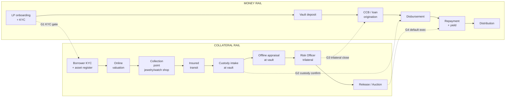
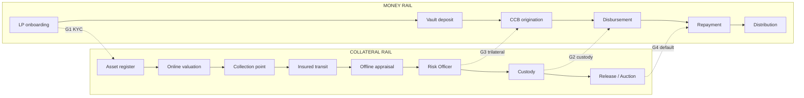
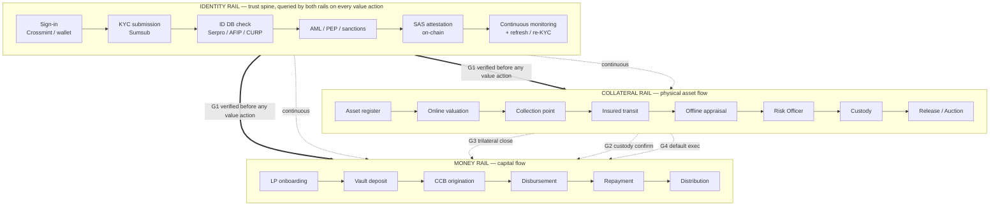

# Vaulx — Composable Blocks Architecture & Brazil Adapter

**Date:** 2026-04-29 · **Audience:** ops · leadership · partnerships · pitch
**Status:** **CANONICAL ARCHITECTURE TRUTH.** All other architecture / journey / plan / business-flow docs are implementations of this matrix.
**Companions (framed as derivatives of this doc):**
[`architecture-snapshot`](./2026-04-29-vaulx-architecture-snapshot.md) (technical · GLOBAL-block engineering view) ·
[`business-flow-and-partners`](./2026-04-29-vaulx-business-flow-and-partners.md) (partnerships · LOCAL + HYBRID-block view) ·
journeys [`current-vs-ideal`](../plans/2026-04-29-vaulx-user-journeys-current-vs-ideal.md) (per-persona walks of the L2 product layer) ·
γ plan [`gamma-scope-implementation-plan`](../plans/2026-04-29-vaulx-gamma-scope-implementation-plan.md) (engineering plan that closes the GLOBAL-block gap)

---

## 1. Executive view

**Thesis.** Vaulx is built as a set of composable blocks. The protocol, product, and most of the trust layer are GLOBAL — they ship once and stay the same in every market. The legal, physical-operations, and fiat-rails layers are LOCAL — they are swapped per geography behind a stable interface. A new geography is not a rewrite; it is a filled-in **adapter manifest**.

**Design principle: keep the architecture lean.** Add a redundant counterparty only when the primary one is proven inadequate. The block catalog names *capabilities*; the adapter manifest names *who provides them today* — typically one provider per capability per market.

**Key parameters.**

- **Loan minimum:** ±**$5,000** USD-equivalent. The trilateral discipline (online + offline + Risk Officer) applies to every loan above this floor.
- **Currency mix at launch (BR):** USDC + BRL parallel vaults (per meeting consensus).
- **Substrate:** Solana for the protocol layer · fiat rails per market for off-ramp.

**The math (this catalog).**

| Tag | Count | What it means |
|---|---|---|
| GLOBAL | 17 blocks | ship once · never replaced |
| LOCAL | 18 blocks | replaced per market via the adapter manifest |
| HYBRID | 8 blocks | global interface, per-market counterparty |

**The two rails and four gates.**

```
MONEY RAIL ─────[G1]──[G3]──[G2]──[G4]──── COLLATERAL RAIL
              KYC  trilat  custody  default
```

- **G1 — KYC gate.** Identity must be verified before any value action.
- **G2 — Custody confirm.** Asset must be physically secured before disbursement.
- **G3 — Trilateral close.** Online appraisal + offline appraisal + Risk Officer must converge before final terms.
- **G4 — Default trigger.** On-chain default executes only after legal recovery is initiated.

**Critical-path 5 (the blocks that gate mainnet).**

| # | Block | Layer | Why critical |
|---|---|---|---|
| 1 | SCD partner | L4 | Legal creditor of record. Without it, no compliant CCB. |
| 2 | Custodian | L5 | No insured custody → no LP funding. |
| 3 | Appraiser network (online + offline) | L5 | The trilateral collapses without two distinct human pools. |
| 4 | Digital signature (ICP-Brasil) | L4 | CCB needs legally binding signature. |
| 5 | On/off rails | L6 | BR borrowers spend BRL, not USDC. Crossmint is primary. |

**Brazil status today (one line per critical-path block).**

| # | Block | Status | ETA |
|---|---|---|---|
| 1 | SCD partner | SHORTLIST · Mercado Bitcoin (Daniel) ~3% all-in indicated | 2–4 months realistic (verbal not contractual) |
| 2 | Custodian | SHORTLIST · Brinks · Prosegur · Lumis · Securo | 1–2 months to first signed |
| 3 | Appraiser network | TBD · authorized Rolex retailers being qualified | 1 month |
| 4 | Digital signature | TBD · any ICP-Brasil-accredited provider | 2–4 weeks |
| 5 | On/off rails | PARTIAL · Crossmint (sandbox live, production tier pending) | 1–2 months |

**New-geography process (3 steps).**

1. Copy [`Appendix B`](#appendix-b--adapter-checklist-template) → name the file `…-<country>-adapter.md`.
2. Fill each LOCAL and HYBRID slot with: counterparty name, status, ETA, cost.
3. Diff against [`Appendix A`](#appendix-a--brazil-adapter-manifest) (Brazil) — anything left blank is a blocker for that market.

**What this doc is not.** Not an incorporation plan. Not a fundraising deck. Not a pricing model. Those are referenced from §7 but live in their own docs.

---

## 2. The model: 2 rails × 6 layers

Vaulx's business runs on **two parallel rails** that originate from different counterparties, run on different SLAs, and meet at four well-defined handoff gates. Each rail passes through six functional layers. A geography swap = replacing the **LOCAL** cells in some of those layers. **L1 (Protocol) and L2 (Product) are never swapped — that is the architectural bet.**

### 2.1 The two rails

- **Money rail** — capital flows from liquidity providers → through legal/credit wrappers → to the borrower's wallet → and back as repayments + yield. Counterparties: LPs, SCD, FIDC, on/off-ramps. Substrate: Solana + fiat.
- **Collateral rail** — the physical asset flows from borrower → collection point → courier → offline appraiser → custodian, and back on repayment (or to auction on default). Counterparties: collection retailers, insured couriers, appraiser pools, custodians, resellers. Substrate: physical world + insurance contracts.

### 2.2 The four handoff gates

The rails synchronize only at these gates. Everything else runs independently.

| Gate | What synchronizes | Failure mode if it desyncs |
|---|---|---|
| **G1 — KYC gate** | Identity verified before any money or asset action | Ungated mutation; regulatory exposure |
| **G2 — Custody confirm** | Asset physically secured before disbursement | Money out without collateral in |
| **G3 — Trilateral close** | Both appraisals + Risk Officer sign off before final terms | Mispriced loan; fraud window |
| **G4 — Default trigger** | On-chain default executes only after legal recovery is initiated | Liquidation without legal cover |

### 2.3 The six layers

Each rail passes through these six layers. The layer determines the *kind* of substitution allowed.

| # | Layer | What lives here | Default tag |
|---|---|---|---|
| **L1** | Protocol | Solana programs, PDAs, attestations, multisig, state machines | GLOBAL |
| **L2** | Product | App, journeys, KYC gate UX, dashboards, notification schema | GLOBAL (thin LOCAL i18n) |
| **L3** | Identity & trust | KYC SDK, national ID DB hooks, AML/PEP/sanctions, attestation | HYBRID |
| **L4** | Legal & compliance | Credit license, loan instrument, fund wrapper, signature, tax reporting | LOCAL |
| **L5** | Physical operations | Collection, transit, appraisal, custody (insurance bundled) | LOCAL |
| **L6** | Liquidity & rails | LP routing, on/off-ramps, distribution partners, reseller network | LOCAL or HYBRID |

### 2.4 The tagging legend

| Tag | Meaning | Implication for a new geography |
|---|---|---|
| **GLOBAL** | Same component in every market | Ships once. Never replaced. |
| **LOCAL** | Replaced per market | Adapter manifest names the specific counterparty. |
| **HYBRID** | Same logic everywhere, different counterparty per market | Global interface + local instance. Usually a contract template signed with a per-market party. |

**Rule of thumb.** Anything that touches **regulated entities, physical movement, fiat rails, or jurisdictional law** tends LOCAL. Anything that lives **on-chain, in code, or behind a globally-licensed SDK** tends GLOBAL. The HYBRID tag flags the load-bearing in-between — the cells most likely to surprise on a new market.

### 2.5 The model in one picture



> **Critical sequence note.** The asset is **never shipped to the offline appraiser**. The asset path is `borrower → collection point → insured courier → custodian vault`. The offline appraiser **travels to the vault** and inspects on-site. Possession-of-asset stays narrowly held by the custodian; no extra physical-handoff fraud window.

### 2.6 How to read a block

Every block in §3–§5 follows the same shape. That uniformity is what makes the catalog substitutable.

```
Name · Rail (M / C / shared) · Layer (L1..L6) · Tag (GLOBAL / LOCAL / HYBRID)

Purpose       — what this block does in the system
Counterparty  — who provides it (type, not necessarily a name)
Inputs        — what it consumes from upstream
Outputs       — what it hands to downstream
SLA           — time / quality bound
Liability     — who carries the risk if it fails
Cost driver   — what makes the price go up
Substitution  — what a new geography needs from a replacement
Failure modes — how this can break
Status (BR)   — where Brazil stands today
```

Adapter #2 (Argentina, Mexico, …) updates **only the bottom half** of each LOCAL or HYBRID block. The top half is universal.

---

## 3. The matrix

All blocks, organized by rail and layer. One line per block. Three groupings: **Shared** (cross-rail), **Money rail**, **Collateral rail**.

### 3.1 Shared / cross-rail blocks (13)

| # | Block | Layer | Tag | One-liner |
|---|---|---|---|---|
| S1 | Squads V4 multisig | L1 | GLOBAL | Program upgrade authority + admin-ix signing |
| S2 | Solana Attestation Service | L1 | GLOBAL | Reusable on-chain KYC credential |
| S3 | KycAttestation PDA | L1 | GLOBAL | Per-wallet KYC PDA storing jwt_hash + attestor |
| S4 | App shell + journey routing | L2 | GLOBAL | Next.js app, route tree, auth providers |
| S5 | KYC gate (G1) UX | L2 | GLOBAL | `useKycGate` hook + `KycRequiredModal` |
| S6 | i18n / localization shell | L2 | LOCAL | Currency formatting, legal copy, language pack |
| S7 | Sumsub WebSDK | L3 | GLOBAL | Globally-licensed iframe + webhook contract |
| S8 | National ID DB hook | L3 | LOCAL | Serpro (BR), AFIP (AR), CURP (MX), … behind Sumsub |
| S9 | AML / PEP / sanctions monitoring | L3 | HYBRID | Sumsub global product, watchlists per jurisdiction |
| S10 | Legal entity / incorporation | L4 | HYBRID | Holding entity (BVI, HK, …) + per-market subsidiary |
| S11 | Tax reporting | L4 | LOCAL | IR for BR FIDC, equivalents elsewhere |
| S12 | Crossmint sign-in + smart wallet + ramps | L6 | HYBRID | Single primary fiat-rail provider; sign-in + smart wallet + on/off-ramp + card |
| S13 | Notification channels | L6 | HYBRID | Email global; WhatsApp BR; SMS varies |

### 3.2 Money-rail blocks (11)

| # | Block | Layer | Tag | One-liner |
|---|---|---|---|---|
| M1 | Vault program | L1 | GLOBAL | Deposit/withdraw/disburse, accounting, oracle, KYC PDA admin |
| M2 | Loan program | L1 | GLOBAL | CCB lifecycle, repay/renew/default, CPI to vault + auction |
| M3 | Lender deposit panel + dashboard | L2 | GLOBAL | `<LendDepositPanel>` + vault-tranche UI |
| M4 | Borrower per-loan + repay UI | L2 | GLOBAL | Per-loan dashboard, installment payment, renewal |
| M5 | Credit-issuing license | L4 | LOCAL | SCD in BR; equivalents per market — gates loan origination |
| M6 | Loan instrument (legal doc) | L4 | LOCAL | CCB in BR; *mutuo* in AR; equivalent contract per market |
| M7 | Fund wrapper | L4 | LOCAL | FIDC in BR (retail) — wrapper for compliant LP exposure |
| M8 | Digital signature | L4 | LOCAL | ICP-Brasil in BR; eIDAS in EU; AdES variants per market |
| M9 | Institutional liquidity routing | L6 | GLOBAL | Kamino, Loopscale — Solana-native aggregators |
| M10 | Retail liquidity wrapper | L6 | LOCAL | Per-market FIDC-as-a-service or equivalent retail vehicle |
| M11 | F&F bootstrap liquidity | L6 | LOCAL | Pre-license seed via friends/family per market |

> Off-ramp + card capability folds into **S12 Crossmint** in the current architecture. If a future market requires a redundant rail, split it out then.

### 3.3 Collateral-rail blocks (17)

Insurance is bundled into the counterparty providing the physical service: storage insurance lives inside **C15 Custodian**, transit insurance lives inside **C10 Insured courier**. No separate insurance blocks at this stage.

| # | Block | Layer | Tag | One-liner |
|---|---|---|---|---|
| C1 | TRDC cNFT + state machine | L1 | GLOBAL | Bubblegum cNFT representing the asset; PENDING→ACTIVE→REPAID/DEFAULTED |
| C2 | Auction program | L1 | GLOBAL | Privileged 7-day window + bid/settle ix |
| C3 | Asset registration form | L2 | GLOBAL | Form, photo upload, EXIF strip, case-code generator |
| C4 | Online appraiser workspace | L2 | GLOBAL | `/appraiser/online` UI, blinded by case code |
| C5 | Offline appraiser workspace | L2 | GLOBAL | `/appraiser/offline` UI, photo/video capture, defects log |
| C6 | Risk Officer review screen | L2 | GLOBAL | `/admin/evaluations` trilateral convergence UI |
| C7 | Online price anchor | L3 | HYBRID | WatchCharts + Apify Chrono24 — global API, local price drift in parallel-import markets |
| C8 | Asset authenticity DB | L3 | HYBRID | Brand serial-number checks (Rolex, Patek, …) — brand-global, market-availability local |
| C9 | Collection point | L5 | LOCAL | Offline-partner shop (jewelry / watch retailer / authorized specialist) where borrower drops the asset; collection point hands the sealed package to the insured courier. Comp model: exclusivity in default auctions for that brand/category. |
| C10 | Insured courier | L5 | LOCAL | High-value logistics from collection to vault, including transit insurance |
| C11 | Online appraiser pool | L5 | LOCAL | Desk specialists, 24h SLA, blinded |
| C12 | Offline appraiser pool | L5 | LOCAL | Watchmaker / specialist near the vault, 48h SLA, blinded |
| C13 | Risk Officer team | L5 | HYBRID | Global policy + per-market operators / advisors |
| C14 | Custodian | L5 | LOCAL | Insured BR vault provider — Brinks · Prosegur · Lumis · Securo candidates; storage insurance bundled |
| C15 | Whitelisted reseller network | L6 | HYBRID | Global on-chain whitelist; local membership |
| C16 | Fallback luxury auction houses | L6 | LOCAL | Sotheby's-BR / Christie's-BR contracts; per-market entity |
| C17 | Legal recovery counsel | L6 | LOCAL | DL 911/69 in BR; extrajudicial recovery counterpart per market |

**Catalog totals.** 13 + 11 + 17 = **41 blocks** · 17 GLOBAL · 18 LOCAL · 8 HYBRID. (Block IDs are stable identifiers and may not be sequentially numbered after simplifications.)

---

## 4. Block specs — critical-path 5

The five blocks that gate mainnet. Each carries the full spec shape from §2.6.

### 4.1 SCD partner (M5)

**Rail · Layer · Tag.** Money · L4 · LOCAL.
**Purpose.** Be the **legal creditor of record** so that a compliant loan can be issued to a Brazilian borrower. Vaulx the protocol does not hold the credit license; the SCD does.
**Counterparty.** Sociedade de Crédito Direto (BR) — a regulated fintech-credit entity. Equivalents in other markets: SOFOM (MX), EFC (CO), Kreditinstitut subset (EU).
**Inputs.** Final loan terms (principal, rate, schedule, LTV) · borrower KYC packet · CCB body · custody confirmation · digital signature handle.
**Outputs.** Signed CCB · regulator filing · receivable on the SCD's books that the FIDC can purchase.
**SLA.** CCB issuance within 24h of trilateral close · default packet within 5 business days of trigger.
**Liability.** SCD is the legal lender. Vaulx the protocol orchestrates; SCD bears credit-issuance compliance.
**Cost driver.** Take rate (typically 2–3% all-in) · per-CCB issuance fee · regulatory filings.
**Substitution criteria for a new geography.** (i) holds the right to issue consumer/commercial credit; (ii) accepts a loan instrument equivalent to a CCB; (iii) accepts a digital signature provider compatible with our flow; (iv) accepts API integration (no human portal); (v) accepts FIDC-style or equivalent receivables-purchase wrapper.
**Failure modes.** Partner loses license · pricing renegotiated post-volume · slow CCB issuance starves disbursement · refuses to integrate via API and demands portal data entry.
**Status (BR).** SHORTLIST. Daniel @ Mercado Bitcoin verbally indicated a packaged structure (SCD + custody + agents) at ~3% all-in; team-level guidance is to keep our take to 2.5% max. No contract. Felipe to attempt an alternative warm path. Realistic ETA to signed: **2–4 months**, not the 1–2 in the prior business-flow doc.

### 4.2 Custodian (C14)

**Rail · Layer · Tag.** Collateral · L5 · LOCAL.
**Purpose.** Hold the physical asset in an **insured vault** for the full life of the loan. The legal creditor (SCD) and the lenders depend on this single line of defense. Storage insurance is bundled into this contract.
**Counterparty.** Insured BR vault provider with experience handling high-value goods.
**Inputs.** Sealed package from courier · case-code-tagged manifest · offline appraisal report.
**Outputs.** Signed intake receipt → on-chain `confirm_custody` event · monthly storage bill · release-on-repay or release-to-auction event.
**SLA.** Intake within 24h of arrival · release within 48h of repayment confirmation · 30-day breach notification.
**Liability.** Custodian bears storage risk. Their insurance underwrites loss/theft inside the vault.
**Cost driver.** Per-item monthly fee · insurance-tier multiplier on declared value · ad-hoc release/intake fees.
**Substitution criteria for a new geography.** (i) insured to a level that covers our LTV-implied book; (ii) accepts case-code-only manifests (no PII to custodian); (iii) accepts on-chain webhook for intake/release; (iv) operationally compatible with our offline-appraiser stationing model.
**Failure modes.** Insurance cap below per-item declared value · slow intake creates G2 backlog · custodian refuses webhooks · reputational risk if a high-profile asset is lost.
**Status (BR).** SHORTLIST. Brinks (preferred for the global brand recognition; already integrated with BitGo for tokenized gold per the meeting), Prosegur, Lumis, Securo. Marcelo + Rodrigo opening conversations this week. Strategy: approach 3–5 in parallel, optimize for the global-brand signal first, settle on the operationally-best second. Realistic ETA: **1–2 months** to first signed.

### 4.3 Appraiser network — online + offline (C11 + C12)

**Rail · Layer · Tag.** Collateral · L5 · LOCAL (the pool) · GLOBAL (the workspace UI in L2).
**Purpose.** Provide **two independent human price opinions** that, combined with the API anchor, form the trilateral input to the Risk Officer. The two pools must remain operationally separate to keep fraud cost high.
**Counterparty.** Two distinct BR populations:
  · *Online* — desk-based watch/luxury specialists hired into a freelance/contracted pool.
  · *Offline* — watchmakers / certified specialists stationed near the custodian vault, hired into a separate pool.
**Inputs.** Case code + asset metadata + photos (online) · case code + physical asset + capture rights (offline). Both fully blinded — no borrower PII, no loan terms.
**Outputs.** Online opinion within 24h · offline report within 48h with own photos/videos and defect log · both signed against the case code.
**SLA.** Online 24h, offline 48h. Trilateral cannot close until both submitted.
**Liability.** Appraisers bear professional-opinion liability. Vaulx bears process integrity (separation of pools, blinding, case-code discipline). The Risk Officer (C13) bears the prudent-value override.
**Cost driver.** Per-case fee · per-month retainer for offline specialists tied to vault throughput · onboarding cost to qualify each appraiser.
**Substitution criteria for a new geography.** (i) the two pools must be hireable as distinct populations (not the same firm wearing two hats); (ii) acceptable certification standards exist for the asset class; (iii) language coverage for the workspace UI; (iv) the offline pool must be locatable within practical reach of the chosen custodian's vault.
**Failure modes.** Pool overlap (same person on both pools) → trilateral collapses to bilateral · low-volume markets cannot sustain a 48h SLA · authorized retailers refuse to admit external appraisers (open question per the meeting).
**Status (BR).** TBD. The meeting assigned George to verify whether authorized Rolex retailers permit external appraisers on premises, and Felipe to engage retailers on a commission/exclusivity model. Probable initial form: 5–10 online specialists hired remotely + 2–3 offline specialists co-located with the chosen custodian. Realistic ETA: **1 month** to a usable pool.

### 4.4 Digital signature — ICP-Brasil (M8)

**Rail · Layer · Tag.** Money · L4 · LOCAL.
**Purpose.** Bind the borrower's signature to the CCB with **legal force** equivalent to a wet signature in Brazil. Without this the CCB is challengeable.
**Counterparty.** Any ICP-Brasil-accredited e-signature provider with API.
**Inputs.** Final CCB body · borrower identity (already verified at G1) · signature request initiated by SCD or by Vaulx-on-behalf-of-SCD.
**Outputs.** Signed PDF + signature certificate · timestamp · audit trail.
**SLA.** Signature flow completes within minutes of borrower acceptance of final terms.
**Liability.** Signature provider underwrites legal validity. SCD bears legal-instrument validity. Vaulx ensures the signature is the right document at the right gate.
**Cost driver.** Per-signature fee · per-certificate fee · API call volume.
**Substitution criteria for a new geography.** (i) accredited under the local digital-signature framework (eIDAS for EU, Adobe Approved Trust List for US/CA, AdES variants elsewhere); (ii) API integration; (iii) accepts PDF + JSON request shape compatible with our SCD's CCB format.
**Failure modes.** Provider downtime stalls origination · accreditation revoked · borrower's certificate type mismatched with provider.
**Status (BR).** TBD. Multiple ICP-Brasil providers exist (DocuSign with ICP-Brasil module, Clicksign, D4Sign, others). Decision deferred until SCD partner is named — the SCD's existing integration determines our default. Realistic ETA: **2–4 weeks** once SCD is named.

### 4.5 On/off rails — Crossmint (S12)

**Rail · Layer · Tag.** Money · L6 · HYBRID. Lives under the Shared bucket as **S12** because the same provider also covers sign-in + smart wallet — the simplest possible architecture.
**Purpose.** Let the borrower (a) onboard with sign-in + smart wallet, (b) convert disbursed USDC into spendable BRL, (c) optionally spend via debit card. One provider for the full fiat-on-rails pathway keeps integration surface small.
**Counterparty.** Crossmint — global SDK with regional ramp coverage. Per-market coverage tier may need upgrading for production.
**Inputs.** Sign-in identity (email / Google / Apple / wallet) · disbursed USDC balance · borrower verified identity.
**Outputs.** Smart-wallet pubkey · BRL credited to a Pix key · BRL spending via debit card.
**SLA.** Sign-in instant · Pix instant (sub-minute) · card transactions real-time.
**Liability.** Crossmint bears the on/off-ramp + KYC-tier compliance on its side. Vaulx bears the on-chain → off-chain bridge integrity.
**Cost driver.** Per-transaction fee (bps) · monthly platform fee per tier · KYC volume.
**Substitution criteria for a new geography.** (i) Crossmint covers the local instant-rail equivalent (SPEI in MX, SEPA Instant in EU, …) at acceptable fees; (ii) if not, a local provider is added **only for that market** and only for the missing capability — sign-in + smart wallet stay on Crossmint.
**Failure modes.** Coverage gap in a specific market → forces a local addition · fee tier worsens at volume · provider downtime stalls disbursement spend (mitigated by the borrower's underlying USDC balance remaining on-chain).
**Status (BR).** PARTIAL. Sandbox live; production tier + per-market ramp validation pending. **No redundant provider planned until proven necessary.** Realistic ETA: **1–2 months** to production tier.

---

## 5. Block specs — the rest

Abbreviated specs for the remaining blocks. Each carries: Tag · Counterparty type · Status (BR). Pure GLOBAL infra blocks carry only a one-liner — they don't vary per market.

### 5.1 Shared

- **S1 Squads V4 multisig** — GLOBAL. *Status: live (upgrade authority); admin-ix migration pending.*
- **S2 Solana Attestation Service** — GLOBAL. *Status: live on Devnet.*
- **S3 KycAttestation PDA** — GLOBAL. *Status: live.*
- **S4 App shell + journey routing** — GLOBAL. *Status: live; 16 legacy routes scheduled for deletion.*
- **S5 KYC gate (G1) UX** — GLOBAL. *Status: live.*
- **S6 i18n / localization shell** — LOCAL. Counterparty: in-house translators + legal copy reviewer per market. *Status: not yet implemented; pt-BR hardcoded.*
- **S7 Sumsub WebSDK** — GLOBAL. *Status: live (sandbox).*
- **S8 National ID DB hook** — LOCAL. Counterparty: government data-source integrated through Sumsub (Serpro for BR). *Status: live (Serpro Non-Doc CPF).*
- **S9 AML / PEP / sanctions monitoring** — HYBRID. Counterparty: Sumsub continuous monitoring + per-market watchlists. *Status: not yet wired; required by SCD partner.*
- **S10 Legal entity / incorporation** — HYBRID. Counterparty: corporate registry per chosen jurisdiction (BVI ~$24k for protocol entity per the meeting; Hong Kong as alternative). *Status: TBD; not blocking partner conversations.*
- **S11 Tax reporting** — LOCAL. Counterparty: tax accountant + reporting platform (IR for BR FIDC yields). *Status: TBD; surfaces only after FIDC live.*
- **S13 Notification channels** — HYBRID. Counterparty: WhatsApp Business (BR-dominant) + transactional email provider (TBD). *Status: not yet wired.*

### 5.2 Money rail (non-critical-path)

- **M1 Vault program** — GLOBAL. *Status: live on Devnet.*
- **M2 Loan program** — GLOBAL. *Status: live on Devnet.*
- **M3 Lender deposit panel + dashboard** — GLOBAL. *Status: partial — vault simplification 4→2 pending.*
- **M4 Borrower per-loan + repay UI** — GLOBAL. *Status: ❌ does not exist; legacy route only.*
- **M6 Loan instrument (CCB)** — LOCAL. Counterparty: template tied to SCD's preferred form. *Status: TBD; follows SCD partner.*
- **M7 Fund wrapper (FIDC)** — LOCAL. Counterparty: regulated BR fund administrator (FIDC-as-a-service). *Status: TBD; ETA 3–6 months — not blocking first borrower.*
- **M9 Institutional liquidity routing** — GLOBAL. Counterparty: Kamino, Loopscale (Solana-native aggregators). *Status: not yet wired; conversation-stage.*
- **M10 Retail liquidity wrapper** — LOCAL. Counterparty: same FIDC vehicle as M7 from the LP angle. *Status: TBD.*
- **M11 F&F bootstrap liquidity** — LOCAL. Counterparty: friends/family/Web3 funds; pre-FIDC. *Status: per the meeting, the first-money path while regulation closes.*

### 5.3 Collateral rail (non-critical-path)

- **C1 TRDC cNFT + state machine** — GLOBAL. *Status: live.*
- **C2 Auction program** — GLOBAL. *Status: live; demo timer 60s vs prod 7-day.*
- **C3 Asset registration form** — GLOBAL. *Status: live; localStorage-only persistence (asset records DB pending in Supabase).*
- **C4 Online appraiser workspace** — GLOBAL. *Status: ❌ does not exist; planned in Phase B.*
- **C5 Offline appraiser workspace** — GLOBAL. *Status: ❌ does not exist; planned in Phase B.*
- **C6 Risk Officer review screen** — GLOBAL. *Status: ❌ does not exist; planned in Phase C.*
- **C7 Online price anchor** — HYBRID. Counterparty: WatchCharts + Apify Chrono24. *Status: live; local price-drift correction not yet implemented.*
- **C8 Asset authenticity DB** — HYBRID. Counterparty: brand serial-number databases + manual cross-check. *Status: not yet wired; manual today.*
- **C9 Collection point** — LOCAL. Counterparty: authorized retailer / specialist shop willing to accept the asset under our manifest. *Status: TBD; comp model open (exclusivity vs commission).*
- **C10 Insured courier** — LOCAL. Counterparty: high-value local logistics provider; transit insurance bundled. *Status: SHORTLIST aligned with custodian (often the same company offers both).*
- **C13 Risk Officer team** — HYBRID. Counterparty: in-house Vaulx ops + per-market advisor. *Status: 1 internal officer assumed today; scaling model pending.*
- **C15 Whitelisted reseller network** — HYBRID. Counterparty: ~20 per-market resellers maintained on an on-chain whitelist. *Status: TBD; comp model = exclusivity in defaulted-asset auctions.*
- **C16 Fallback luxury auction houses** — LOCAL. Counterparty: Sotheby's / Christie's BR entity (or peer). *Status: TBD; not blocking.*
- **C17 Legal recovery counsel** — LOCAL. Counterparty: BR law firm with consumer-credit / DL 911/69 experience. *Status: TBD; ETA 2–4 weeks once needed.*

---

## 6. Critical review

What is too optimistic, what is missing from the existing architecture, what is over-engineered.

### 6.1 Too optimistic

1. **SCD partnership ETA.** Prior docs say 1–2 months. Even with a warm intro from MB/Daniel, regulated counterparties typically need 3–6 months for legal review + onboarding. The 3% all-in is a verbal indication, not a contract. **Recalibrate: 2–4 months realistic.**
2. **Risk Officer as a single internal role** *(later-stage concern, not pre-launch).* Works fine for BR launch with one internal officer. Scales by geography #3 to "global Risk Officer policy + local Risk Officer operators". Auth model in `/admin/evaluations/*` should support multiple officers from day one (just one in BR), so the eventual scaling doesn't require schema changes.
3. **Mainnet ETA.** Current estimate is 3–4 months post-hackathon, gated on top-5. If SCD slips to 4 months and we discover S9 (AML monitoring) is required by the SCD before they sign, the path stretches. **Recalibrate: 4–6 months realistic.**

### 6.2 Missing from the existing architecture

4. **AML / PEP / sanctions ongoing monitoring (S9).** Sumsub today is KYC-at-onboarding. Continuous monitoring (transaction screening, PEP refresh, sanctions delta) is required by any SCD partner. Not in the prior docs.
5. **Tax reporting (S11).** BR FIDC has IR reporting on yields. Not in the prior docs.
6. **Dispute / appeal path** *(nice-to-have, post-launch)*. What happens when a borrower contests the trilateral valuation? No appeal block today. Likely shape: a bounded appeal that triggers a second offline appraisal at borrower cost. **Not required for first mainnet borrower; design when first contested case lands in production.**
7. **Collection point (C9).** Implied by the meeting (specialists as collection points, separated from appraisal to mitigate fraud). Not yet in the prior docs as a distinct block. The collection point is an **offline partner shop** (jewelry / watch retailer) where the borrower drops the asset. The shop hands the sealed package to the insured courier; the courier delivers to the custodian's vault. The asset is **never sent to the offline appraiser** — the appraiser travels to the vault. Correct physical-ops role chain: **borrower → collection point → courier → custodian (vault) ← offline appraiser visits.**
8. **Retailer / specialist comp model (C9, C15).** Felipe proposed exclusivity in defaulted-asset auctions as the comp model. That needs to be a defined block — pricing, term, cap, conflict-of-interest rules.

### 6.3 Possibly over-engineered

9. **4 lender vault tranches → 2.** Already on the simplification list — collapse to USDC vault + Local vault (BRL).
10. **Tamper-proof transit box.** The meeting correctly rejected this as too complex; the courier's bundled civil-liability insurance is the cleaner mitigation. Already in C10.

> **Struck:** the proposed "fast-path tier" (online-only valuation + capped LTV for $5k–$20k loans) — **rejected.** There is no fast path. Trilateral discipline applies to every loan above the $5k floor, regardless of size. If the offline-appraisal cost is meaningful relative to small principals, it gets priced into the rate, not waived.

---

## 7. Open product calls

Decisions still owed. Each is a one-liner with owner.

| # | Decision | Owner |
|---|---|---|
| 1 | Vault simplification 4 → 2 (USDC + Local) | George |
| 2 | SCD architecture: API-client only, or also a portal fallback? | George + Marcelo |
| 3 | Re-eval-on-decline policy *(post-launch design)*: if borrower declines final terms, can they re-request without re-appraising? | Risk officer (TBD) |
| 4 | Risk Officer scaling model *(post-launch design)*: one global team vs per-market operators | George + Felipe |
| 5 | Retailer comp model: exclusivity in default auctions, commission per loan, or both? | Felipe |
| 6 | Currency mix: USDC-only, BRL-only, or both at launch? (meeting consensus: both) | George + Felipe |
| 7 | Incorporation: BVI ($24k, fast) vs Hong Kong (stronger banking, slower) vs both | George + Marcelo |
| 8 | Bootstrap sequencing: F&F-funded loans before FIDC live, or wait for FIDC? | George + Marcelo |
| 9 | Reseller membership: 20 retailers all-in-one, or tiered (founding 5 + grow)? | Felipe |
| 10 | Authorized retailer access: do Rolex retailers admit external appraisers on-site? Are they willing to act as collection points? (open from meeting) | George (verify) |

---

## Appendix A — Brazil adapter manifest

The set of values that turns the global catalog into the Brazil instance. One row per LOCAL or HYBRID block.

**Status legend.** `COMMITTED` = signed contract. `SHORTLIST` = active conversation, multiple candidates. `TBD` = not yet started.

### A.1 Shared

| Block | Status | Counterparty (BR) | Notes | ETA |
|---|---|---|---|---|
| S6 i18n / localization shell | TBD | in-house | pt-BR hardcoded today | with Phase D |
| S8 National ID DB hook | COMMITTED | Serpro (via Sumsub) | live in sandbox | live |
| S9 AML / PEP / sanctions | TBD | Sumsub continuous + BR watchlists | required by SCD; not yet wired | 1 month |
| S10 Legal entity | TBD | BVI or HK (protocol entity); BR ops via partner | research per meeting | post-hackathon |
| S11 Tax reporting | TBD | tax accountant + IR filing | depends on FIDC | with FIDC live |
| S12 Crossmint (sign-in + wallet + ramps) | PARTIAL | Crossmint | sandbox live; production tier + per-market ramp validation pending; no redundant provider planned | 1–2 months |
| S13 Notification channels | TBD | WhatsApp Business + email provider TBD | WhatsApp dominant in BR | 1 month |

### A.2 Money rail

| Block | Status | Counterparty (BR) | Notes | ETA |
|---|---|---|---|---|
| M5 Credit license (SCD) | SHORTLIST | Mercado Bitcoin (Daniel) ~3% all-in indicated; alternative path Felipe | verbal not contractual | 2–4 months |
| M6 Loan instrument (CCB) | TBD | template tied to SCD's preferred form | follows M5 | with M5 |
| M7 Fund wrapper (FIDC) | TBD | FIDC-as-a-service admin | BTG / XP / others mentioned by Daniel as distribution post-structure | 3–6 months |
| M8 Digital signature | TBD | ICP-Brasil-accredited (DocuSign-BR · Clicksign · D4Sign) | follows SCD's existing integration | 2–4 weeks after M5 |
| M10 Retail liquidity wrapper | TBD | same FIDC as M7 from LP angle | follows M7 | with M7 |
| M11 F&F bootstrap | SHORTLIST | F&F + Web3 funds | the first-money path per the meeting | 1–2 months |

### A.3 Collateral rail

| Block | Status | Counterparty (BR) | Notes | ETA |
|---|---|---|---|---|
| C7 Online price anchor | LIVE | WatchCharts + Apify Chrono24 | global APIs; BR price-drift correction not yet implemented | enhancement |
| C8 Asset authenticity DB | TBD | Rolex / Patek serial check methods | manual today | research |
| C9 Collection point | TBD | authorized Rolex retailers (5–10) | comp model open: exclusivity vs commission · verify retailer policy on external appraisers (open from meeting) | 1–2 months |
| C10 Insured courier | SHORTLIST | likely bundled with custodian (Brinks etc.) | transit insurance bundled into the courier contract | 1–2 months |
| C11 Online appraiser pool | TBD | 5–10 watch specialists, freelance/contract | hire pool directly | 1 month |
| C12 Offline appraiser pool | TBD | 2–3 watchmakers near vault | hired separately from C11 to keep duties separate | 1 month |
| C13 Risk Officer team | SHORTLIST | 1 internal Vaulx officer at launch + BR advisor TBD | scaling model open | 1 month |
| C14 Custodian | SHORTLIST | Brinks · Prosegur · Lumis · Securo | Brinks preferred for global brand recognition; storage insurance bundled | 1–2 months |
| C15 Whitelisted reseller network | TBD | ~20 BR Rolex/luxury resellers | comp = exclusivity in default auctions | 1–2 months |
| C16 Fallback auction houses | TBD | Sotheby's-BR or Christie's-BR or peer | not blocking | post-mainnet |
| C17 Legal recovery counsel | TBD | BR law firm with DL 911/69 experience | Casa Solana SP for warm intros (Marcelo) | 2–4 weeks once needed |

### A.4 Critical-path summary for Brazil

| # | Block | Status | ETA | Blocker |
|---|---|---|---|---|
| 1 | SCD partner | SHORTLIST | 2–4 months | partner choice + AML wiring |
| 2 | Custodian | SHORTLIST | 1–2 months | counterparty selection |
| 3 | Appraiser network | TBD | 1 month | retailer access policy + hire |
| 4 | Digital signature | TBD | 2–4 weeks after #1 | follows SCD |
| 5 | On/off rails (Crossmint) | PARTIAL | 1–2 months | production tier + ramp validation |

**Realistic mainnet ETA for BR.** **4–6 months post-hackathon**, vs the 3–4 in the prior docs. Recalibrated per §6.

---

## Appendix B — Adapter checklist template

Copy this section into a new file (`docs/architecture/2026-XX-XX-vaulx-<country>-adapter.md`) and fill each row. A row left blank is a launch blocker for that geography.

```
Country: _______
Currency: _______ (parallel-vault required if ≠ USDC)
Loan minimum: _______ (default ±$5k USD-equivalent unless economics justify a different floor)
Lead operator: _______
Target launch date: _______
```

### B.1 Shared

| Block | Counterparty (this country) | Status | Notes | ETA |
|---|---|---|---|---|
| S6 i18n / localization shell | | | language + currency + legal copy | |
| S8 National ID DB hook | | | name the gov DB (AFIP, CURP, …) | |
| S9 AML / PEP / sanctions | | | local watchlist subscriptions | |
| S11 Tax reporting | | | local fund-yield reporting regime | |
| S12 Crossmint (sign-in + wallet + ramps) | | | confirm Crossmint covers local instant-rail; only add a local provider if it does not | |
| S13 Notification channels | | | dominant channel per market | |

### B.2 Money rail

| Block | Counterparty (this country) | Status | Notes | ETA |
|---|---|---|---|---|
| M5 Credit license | | | name license type (SCD, SOFOM, EFC, …) | |
| M6 Loan instrument | | | name local doc (CCB, mutuo, …) | |
| M7 Fund wrapper | | | name local fund vehicle | |
| M8 Digital signature | | | local accreditation framework | |
| M10 Retail liquidity wrapper | | | | |
| M11 F&F bootstrap | | | | |

### B.3 Collateral rail

| Block | Counterparty (this country) | Status | Notes | ETA |
|---|---|---|---|---|
| C9 Collection point | | | retailer/specialist shop network | |
| C10 Insured courier | | | high-value logistics; transit insurance bundled | |
| C11 Online appraiser pool | | | freelance/contracted | |
| C12 Offline appraiser pool | | | co-located with custodian | |
| C13 Risk Officer team | | | local advisor name | |
| C14 Custodian | | | insured vault provider; storage insurance bundled | |
| C15 Whitelisted reseller network | | | curated per market | |
| C16 Fallback auction houses | | | local entity | |
| C17 Legal recovery counsel | | | local law firm | |

---

## Appendix C — Block spec template

Copy-paste shape for any block when expanding it from §3/§5 into a full spec like the §4 ones.

```
### <Block ID> <Block name>

**Rail · Layer · Tag.** <Money | Collateral | Shared> · L<n> · <GLOBAL | LOCAL | HYBRID>.
**Purpose.** <one-sentence why this block exists>
**Counterparty.** <type, not necessarily a name>
**Inputs.** <what this block consumes>
**Outputs.** <what this block produces>
**SLA.** <time / quality bound>
**Liability.** <who carries the risk>
**Cost driver.** <what makes the price go up>
**Substitution criteria for a new geography.** <(i)…(ii)…(iii)…>
**Failure modes.** <how this can break>
**Status (BR).** <COMMITTED | SHORTLIST | TBD · counterparty name(s) · notes · ETA>
```

---

## Appendix D — Alternative framing: 3 rails (Identity as a first-class spine)

The current doc uses a **2-rail** model (Money + Collateral) with identity blocks scattered across L3 of both rails (S7 Sumsub · S8 ID DB hook · S9 AML · S2 SAS · S3 KycAttestation · S12 Crossmint sign-in). This appendix preserves an alternative framing — promoting Identity to its own rail — and the trigger that should cause us to switch.

### D.1 The two diagrams side by side

**2-rail (current).** Identity is buried in L3. G1 is a sync line between Money and Collateral.



**3-rail (alternative).** Identity is its own pipeline. Both value rails *query* it. G1 becomes "Identity rail has reached state ≥ ATTESTED" instead of a cross-rail sync. Continuous AML/PEP refresh has a natural home (I6) instead of being retrofitted into L3 cells.



### D.2 What changes between the two framings

| Aspect | 2-rail (current) | 3-rail (alternative) |
|---|---|---|
| Number of rails | 2 | 3 |
| Where identity blocks live | L3 of both rails | Their own rail with their own state machine |
| G1 (KYC gate) | Sync line between Money and Collateral | Threshold state of the Identity rail consumed by both |
| Continuous AML / re-KYC | Awkward — retrofitted into L3 | Natural — the Identity rail has a continuous-time stage (I6) |
| Block count in matrix | Same blocks | Same blocks, regrouped under a third rail header |
| Adapter manifest | Identity counterparties scattered across S-blocks | Identity counterparties clustered — easier per-geography swap |
| Pitch story | "2 rails + a trust layer in each" | "3 rails: money, asset, identity" |

### D.3 When each framing wins

**2-rail wins (today).**
- Identity is mostly handled by Crossmint + Sumsub at sign-in plus a one-shot SAS mint.
- Continuous monitoring (S9) is not yet wired.
- Engineering layout treats identity as protocol-layer (S2, S3) + SDK-layer (S7) — not pipeline-shaped.
- Lower editing burden across this doc and downstream artifacts.

**3-rail wins (later).**
- When **S9 AML / PEP / sanctions continuous monitoring** is actually wired — AML doesn't fit as an L3 cell because it isn't one-shot, it's a running process.
- When a new geography swap forces a *cluster* of identity counterparties to change (national ID DB hook + AML watchlist + e-sig accreditation framework) — the swap is one rail's worth of edits, not scattered.
- When pitching to a non-technical audience — three rails read more naturally than "two rails + a trust layer".

### D.4 Trigger to promote

**Promote 2-rail → 3-rail when S9 (AML continuous monitoring) lands as a real workstream.** That is the block that breaks the L3-cell framing and earns Identity its own header. Until then, the third rail is a pitch-deck nicety, not an architecture necessity.

When the trigger fires, the migration is:
1. Add `Identity rail` header to §3 and reclassify S2 · S3 · S7 · S8 · S9 · S12 (sign-in portion) under it.
2. Replace the §2.5 diagram with the 3-rail version above.
3. Re-tag G1 in §2.2 from a sync gate to an Identity-rail threshold state.
4. Group identity counterparties together in §A and §B (separate sub-tables).
5. Block IDs stay stable; only the rail header changes.

---

## Document changelog

- **2026-04-29 (initial):** matrix v1 published in worktree.
- **2026-04-29 (evening, merged to main):** corrections per product review:
  - **C9 collection-point semantics fixed**: collection points are offline partner shops (jewelry / watch retailers); asset is **never shipped to the offline appraiser**; offline appraiser visits the vault. §2.5 diagram updated; §6.7 sequence corrected; C9 row in §3.3 elaborated; sequence-note callout added.
  - **§6.9 fast-path tier struck.** No fast path. Trilateral applies to every loan above $5k floor. Open-call #5 removed; remaining open calls renumbered to 1-10.
  - **§6.6 dispute / appeal path** marked nice-to-have, post-launch — design when first contested case arrives in production.
  - **§6.1 #2 Risk Officer scaling** marked later-stage concern; auth model in `/admin/evaluations/*` should support multiple officers from day one (just one in BR initially).
  - **Open-call #10** widened to also ask whether authorized retailers are willing to act as collection points (related to comp-model #5).
  - **Doc status**: now CANONICAL ARCHITECTURE TRUTH. Companions reframed as derivatives. γ plan and journey doc will be updated to cross-reference.

**End.**
