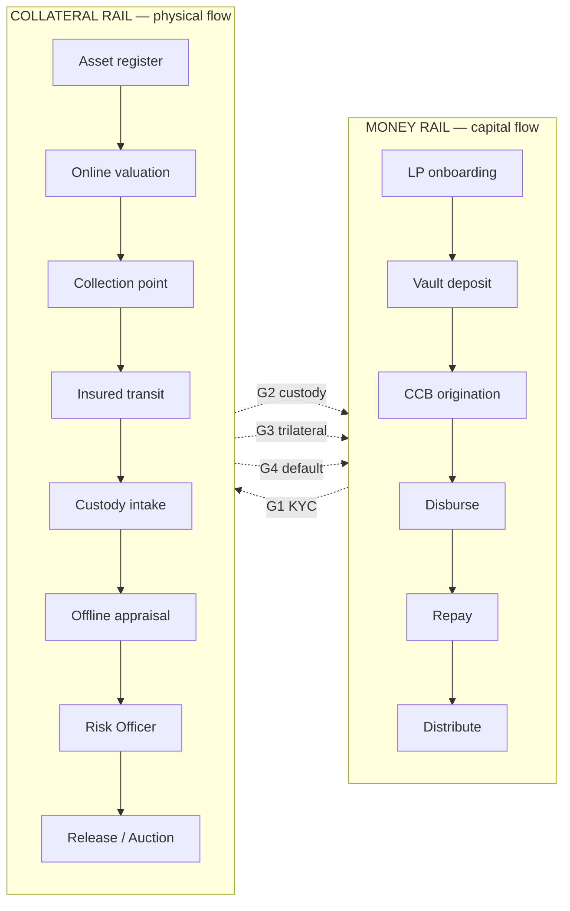

# Vaulx Team Architecture Dashboard — Proposal

**Date:** 2026-04-29
**Audience:** team meeting · George + Marcelo + Felipe + Edson + future hires
**Status:** PROPOSAL — pending sign-off before implementation
**Canon:** [`composable-blocks`](./2026-04-29-vaulx-composable-blocks.md) — the dashboard is a visual surface for the matrix.

---

## 1. The brief in one paragraph

The team needs a single screen that shows **the whole picture** of Vaulx's architecture: every one of the 41 blocks in the composable-blocks matrix, color-coded by status, grouped by rail × layer, drillable into full spec, with a per-geography lens. Big puzzle pieces (rails) made of medium puzzle pieces (layers) made of small puzzle pieces (blocks). Each piece tells you at a glance: live or pending, who's accountable, what's the next action, where it sits in the model.

This is **not a build dashboard** (status of code commits, test runs, deploys — those live elsewhere). This is an **architecture cockpit** — what's the model, what's wired, what's missing, what's pending which counterparty.

---

## 2. The core abstraction — three nested puzzle scales

```
RAIL  (Money | Collateral | Identity*)
  └── LAYER  (L1 Protocol → L6 Liquidity & rails)
        └── BLOCK  (the 41 blocks: S1, M1, C9, etc.)
              └── (drill-in to full spec)
```

\* Identity rail is hidden by default. Toggleable per the [`composable-blocks Appendix D`](./2026-04-29-vaulx-composable-blocks.md) trigger logic — surfaces when continuous AML monitoring (S9) lands.

The puzzle metaphor maps cleanly:
- **Big puzzle pieces** = rails (3 max)
- **Medium puzzle pieces** = layers within a rail (6 per rail = 18 cells max)
- **Small puzzle pieces** = blocks within a layer (1-4 per cell typically)

A geography (Brazil, Argentina, Mexico) is an **overlay** that fills in the LOCAL and HYBRID cells with named counterparties.

---

## 3. Status taxonomy (color coding)

Every block carries one of these status values. Color is consistent across all dashboard views.

| Status | Color | Meaning |
|---|---|---|
| 🟢 **LIVE** | emerald `#10b981` | shipped + working in production tier (or sandbox-equivalent for Devnet blocks) |
| 🟡 **PARTIAL** | amber `#f59e0b` | wired but incomplete (e.g. sandbox-only, missing piece, mocked data) |
| 🔵 **BUILD** | blue `#3b82f6` | engineering in progress for current sprint (γ scope) |
| 🟠 **SHORTLIST** | orange `#f97316` | partnership / counterparty actively in talks; multiple candidates |
| 🔴 **TBD** | red `#ef4444` | identified but not yet started |
| ⚪ **DEFERRED** | gray `#6b7280` | post-launch / nice-to-have / not blocking first borrower |

Plus a sixth metadata indicator (visual pattern, not color):

| Tag | Visual | Meaning |
|---|---|---|
| **GLOBAL** | solid fill | ships once · never replaced |
| **LOCAL** | diagonal stripes | swapped per market via adapter manifest |
| **HYBRID** | dotted outline | global interface · local counterparty |

So a block tile carries: **(color = status) × (pattern = tag)**. Two dimensions, instantly readable.

---

## 4. Three views (one URL, toggleable)

Different team members care about different things. One dashboard, three tabs.

### View 1 — Flow (default · rail diagram)

**Audience:** the whole team during a walkthrough; anyone explaining "how Vaulx works".



**Interactive behaviors:**
- Each pipeline stage is a clickable node colored by **aggregate status of its child blocks** (most-pessimistic wins — if any child is TBD, parent reads TBD).
- Hover stage → tooltip listing child blocks + their individual statuses.
- Click stage → expands inline to show child blocks as small tiles.
- Click block tile → opens detail drawer (View 4 below).
- Toggle: "show Identity rail" surfaces a third subgraph above (per [`Appendix D`](./2026-04-29-vaulx-composable-blocks.md)).
- Toggle: "show gates" hides/shows G1–G4 dotted lines for clarity.
- Geography selector at top: BR (default) · AR · MX (templates · greyed if not started).

**Why default:** matches the team's mental model from the meeting (rails + gates), reads in 10 seconds, focused on the operational flow not the spec details.

### View 2 — Matrix (rail × layer grid)

**Audience:** partnerships team — what's signed, what's pending, where are the gaps.

A grid laid out by rail (columns) × layer (rows). Each cell contains 1+ block tiles.

```
              Shared              Money rail              Collateral rail
       ┌──────────────────┬────────────────────────┬────────────────────────┐
   L1  │  S1 S2 S3        │  M1 M2                 │  C1 C2                 │  Protocol
       ├──────────────────┼────────────────────────┼────────────────────────┤
   L2  │  S4 S5 S6        │  M3 M4                 │  C3 C4 C5 C6           │  Product
       ├──────────────────┼────────────────────────┼────────────────────────┤
   L3  │  S7 S8 S9        │                        │  C7 C8                 │  Identity & trust
       ├──────────────────┼────────────────────────┼────────────────────────┤
   L4  │  S10 S11         │  M5 M6 M7 M8           │                        │  Legal & compliance
       ├──────────────────┼────────────────────────┼────────────────────────┤
   L5  │                  │                        │  C9 C10 C11 C12 C13 C14│  Physical operations
       ├──────────────────┼────────────────────────┼────────────────────────┤
   L6  │  S12 S13         │  M9 M10 M11            │  C15 C16 C17           │  Liquidity & rails
       └──────────────────┴────────────────────────┴────────────────────────┘
```

Each tile shows: block ID + 1-line name + status color + tag pattern.

**Interactive behaviors:**
- Filter dropdown: by tag (GLOBAL / LOCAL / HYBRID) · by status · by rail.
- Search bar: free-text against block name + counterparty name.
- Click tile → detail drawer (same as View 1).
- Sort toggle: by status (LIVE first | TBD first) for triage views.

**Why useful:** at one glance you see "L4 Money rail is mostly red" → SCD partnership work is the bottleneck. Or "L1 is mostly green" → protocol is solid. Forces honest visibility.

### View 3 — Adapter (geography comparison)

**Audience:** future expansion planning — first conversation when considering market #2.

Two-column layout: BR (filled in) vs another country (template).

| Block | BR (live or in talks) | Argentina (template) | Mexico (template) |
|---|---|---|---|
| S8 National ID DB | 🟢 Serpro | ⚪ AFIP — not started | ⚪ CURP — not started |
| M5 Credit license | 🟠 SCD shortlist | ⚪ EFC equivalent | ⚪ SOFOM equivalent |
| C14 Custodian | 🟠 Brinks shortlist | ⚪ — | ⚪ — |
| ... | ... | ... | ... |

**Interactive behaviors:**
- "Add country" → spawns a new column populated from [`Appendix B`](./2026-04-29-vaulx-composable-blocks.md) template.
- Per-country progress bar: "Brazil adapter 45% complete" (= % of LOCAL/HYBRID cells with non-TBD status).
- Inline editing: click a cell → enter counterparty + status + ETA → saves to registry.
- Export: download adapter manifest as markdown (matches Appendix B format).

**Why useful:** when Marcelo says "what would Argentina take?" — open this view, click "Add country", you immediately see exactly which blocks need filling and what BR did to fill each one.

### View 4 — Block detail drawer (consistent across all 3 views)

Slides in from the right when a block tile is clicked.

```
┌─ Block detail ──────────────────────────────────────── [×] ┐
│                                                            │
│   M5 · Credit license (SCD)                                │
│   Money rail · L4 · LOCAL                                  │
│   🟠 SHORTLIST · Mercado Bitcoin (Daniel)                  │
│                                                            │
│   ── Spec ─────────────────────────────────────────────    │
│   Purpose:    Be the legal creditor of record so a         │
│               compliant loan can be issued in Brazil.      │
│   Counterparty: Sociedade de Crédito Direto (SCD)          │
│   Inputs:     final loan terms · borrower KYC packet ·     │
│               CCB body · custody confirmation · digital    │
│               signature handle                             │
│   Outputs:    signed CCB · regulator filing · receivable   │
│   SLA:        CCB issuance ≤ 24h of trilateral close       │
│   Liability:  SCD legal lender · Vaulx orchestrates        │
│   Cost:       2-3% all-in · per-CCB fee · regulatory       │
│                                                            │
│   ── Brazil status ────────────────────────────────────    │
│   Status:     🟠 SHORTLIST                                 │
│   Counterparty: Mercado Bitcoin (Daniel @ MB) ~3% all-in   │
│   ETA:        2-4 months realistic                         │
│   Next action: Felipe to attempt alt warm path             │
│   Owner:      George + Marcelo                             │
│                                                            │
│   ── Linked ──────────────────────────────────────────     │
│   • Open call #2 (SCD architecture: API or portal?)        │
│   • Block M6 (loan instrument — depends on this)           │
│   • Block M8 (digital signature — depends on this)         │
│                                                            │
│   ── Substitution criteria (for new geography) ────────    │
│   (i)   holds right to issue consumer/commercial credit    │
│   (ii)  accepts CCB-equivalent loan instrument             │
│   (iii) accepts compatible digital signature provider      │
│   (iv)  accepts API integration (no human portal)          │
│   (v)   accepts FIDC-equivalent receivables wrapper        │
│                                                            │
│   ── Failure modes ────────────────────────────────────    │
│   • Partner loses license                                  │
│   • Pricing renegotiated post-volume                       │
│   • Slow CCB issuance starves disbursement                 │
│   • Refuses API · demands portal data entry                │
│                                                            │
└────────────────────────────────────────────────────────────┘
```

Pulls from a typed registry (see §5). All fields editable inline by admin users; saves immediately to backend.

---

## 5. Data model

Single source of truth: `apps/web/src/lib/blocks/registry.ts`. A typed TypeScript file mirroring the matrix. Each block is one entry.

```ts
// apps/web/src/lib/blocks/registry.ts (sketch)

export type BlockId = `S${number}` | `M${number}` | `C${number}`;
export type Rail = "shared" | "money" | "collateral" | "identity";
export type Layer = "L1" | "L2" | "L3" | "L4" | "L5" | "L6";
export type Tag = "GLOBAL" | "LOCAL" | "HYBRID";
export type BlockStatus = "live" | "partial" | "build" | "shortlist" | "tbd" | "deferred";

export type BlockSpec = {
  id: BlockId;
  name: string;
  rail: Rail;
  layer: Layer;
  tag: Tag;
  status: BlockStatus;
  oneLiner: string;
  // Spec (from §4 / §5 of composable-blocks doc)
  purpose: string;
  counterpartyType: string;
  inputs: string[];
  outputs: string[];
  sla: string;
  liability: string;
  costDriver: string;
  failureModes: string[];
  substitutionCriteria: string[];
  // Per-geography state
  brazil: {
    status: BlockStatus;
    counterpartyName?: string;     // e.g. "Mercado Bitcoin"
    counterpartyContact?: string;  // e.g. "Daniel @ MB"
    eta?: string;                   // e.g. "2-4 months"
    nextAction?: string;
    owner?: string;
    notes?: string;
  };
  // Cross-links
  relatedBlocks: BlockId[];
  openCalls: number[];  // §7 open-call IDs
};

export const REGISTRY: Record<BlockId, BlockSpec> = {
  S1: { /* ... */ },
  S2: { /* ... */ },
  // ...
  C17: { /* ... */ },
};
```

**Why a TS registry rather than database-backed?**
- 41 blocks · low edit frequency · git-versioned changes are an audit trail
- Status updates rarely happen more than 1-2 times per day per block
- Markdown stays primary doc; registry is a code mirror
- Down the road, can auto-generate registry from markdown frontmatter (or vice versa)

**Auth for editing:** uses the same `NEXT_PUBLIC_VAULX_ADMIN_PUBKEY` gate as `/admin/*` (Phase A.4 of γ plan). Inline edits in the dashboard write to the registry via a server-action that authenticates the same way.

For v1: editing happens through PR (open the file, edit, commit, deploy). Adequate for the team's velocity.

For v2: backed by Supabase table for live edits without redeploy. Out of scope for first dashboard ship.

---

## 6. Routes + URL structure

```
/dashboard/blocks                 (View 1 — Flow, default)
/dashboard/blocks/matrix          (View 2 — Matrix)
/dashboard/blocks/adapter         (View 3 — Adapter comparison)
/dashboard/blocks/[blockId]       (direct deep-link to drawer; e.g. /dashboard/blocks/M5)
/dashboard/blocks/adapter/BR      (BR adapter solo; same for /AR, /MX)
```

All gated by middleware (Phase A.4) — admin pubkey required.

---

## 7. Visual treatment — the puzzle metaphor

The "puzzle piece" feel comes from three design choices:

### 7.1 Nested-fill rendering

A rail (big piece) is rendered as a rounded rectangle with a fill that shows the **mosaic of its child layers**. Each layer is a horizontal band inside the rail's rectangle, filled with the **mosaic of its child blocks**.

```
 ┌─────────────── MONEY RAIL ──────────────────────────────┐
 │  L1: ▓▓▓ (M1 M2 — both LIVE)                           │
 │  L2: ▓░░ (M3 PARTIAL · M4 BUILD)                       │
 │  L4: ░▓░░ (M5 SHORT · M6 TBD · M7 TBD · M8 TBD)       │
 │  L6: ▓░░ (M9 LIVE · M10 TBD · M11 SHORT)              │
 └────────────────────────────────────────────────────────┘
```

Each glyph (`▓` / `░`) is a tiny tile representing one block at its current status color. The rail's overall fill shows immediately whether the rail is healthy or stuck.

### 7.2 Tile stacking

In View 2, blocks within a cell are stacked as overlapping puzzle-piece-shaped tiles (tabs + sockets, like a real jigsaw). When all tiles in a cell are LIVE, they "click together" visually (no gaps). When a tile is missing or TBD, you see a clear "hole" in the shape — visceral signal of incompleteness.

This is the literal puzzle-piece metaphor. Use sparingly — it's expressive in View 2 but would be visual noise in View 1.

### 7.3 Status badges (subtle)

Every tile carries a tiny status badge in the top-right corner:
- LIVE → no badge (clean)
- PARTIAL → ⚠️ amber
- BUILD → 🔨 blue
- SHORTLIST → 👥 orange (people emoji = partnership)
- TBD → ❌ red
- DEFERRED → 💤 gray

Badges enable status reading without relying on color (accessibility for color-blind viewers).

---

## 8. v1 scope (what ships first)

**Goal:** team can use it within 1 day of build start.

### Must-have for v1

1. Registry typed for all 41 blocks (one-shot data entry).
2. View 1 — Flow with rail diagram + clickable stages + drawer.
3. View 2 — Matrix grid with tiles + drawer (same drawer component).
4. Block detail drawer with full spec.
5. Admin auth gate (reuses Phase A.4 middleware).
6. Status colors + tag patterns implemented.

### Defer to v1.1

- View 3 — Adapter comparison (only useful when discussing market #2; can wait).
- Inline editing of registry (PR-based editing OK for v1).
- Identity-rail toggle (only relevant when S9 lands).
- Status-history / changelog per block.
- Search bar.
- Export-to-markdown / PDF (manual copy-paste from drawer is OK for v1).

### Defer to v2

- Live database backing (Supabase table replaces TS registry).
- Notification on status change (Slack / email).
- Per-block "decisions log" with timestamps + author.
- Counterparty-side view: invite an SCD candidate to see only their relevant block + linked blocks.

---

## 9. Effort & sequencing

Standalone build. Independent of γ plan; can run in parallel.

| Phase | What | Effort (AI-driven) |
|---|---|---|
| Reg-1 | Registry typing for all 41 blocks (one big data-entry task) | 0.5 day |
| Reg-2 | Block detail drawer component | 0.5 day |
| Reg-3 | View 1 Flow (mermaid-style rail diagram + interactivity) | 1 day |
| Reg-4 | View 2 Matrix grid + tiles + filters | 0.5 day |
| Reg-5 | Routes + middleware gate + integration | 0.5 day |
| Reg-6 | Polish + accessibility + screenshots for team meeting | 0.5 day |

**Total: ~3.5 dev-days** for v1 (per AI-agent-parallel pace).

Could be a Phase H of the γ plan (after F cleanup) or run parallel to Phases B/C/D since it touches no shared files. The latter is preferred — it lets the team see real-time progress on the engineering side as they use the dashboard.

---

## 10. What this is NOT

- Not a project-management tool. Doesn't track sprint tasks, ticket status, or who's working on what. Use Linear / GitHub Issues / etc. for that.
- Not a partnership CRM. Doesn't track every email with Daniel @ MB. Use Notion / Google Docs / etc. for that.
- Not a build-status dashboard. Doesn't show CI runs, deploy status, test counts. Vercel + GitHub Actions cover that.
- Not a customer-facing artifact. Internal team tool only. Admin-gated.

It is **the architecture cockpit** — the screen you open when someone asks "is X live yet?" or "what's left for BR launch?" or "what would Argentina need?".

---

## 11. Sample mock (what the team sees)

```
┌── /dashboard/blocks ──────────────────────────────────────────────┐
│  [Flow] · [Matrix] · [Adapter]                  Geography: BR ▾   │
│                                                                    │
│   MONEY RAIL                                                       │
│   ┌──────────────────────────────────────────────────────────┐    │
│   │ ●● LP onboard ─→ ●● Vault dep ─→ ◐○ CCB origin ─→ ●● ... │    │
│   └─────────────────────────────────────────────────────────┘    │
│         G1 ▼                         ▲ G3                          │
│   ┌──────────────────────────────────────────────────────────┐    │
│   │ ◑● Asset reg ─→ ◐○ Coll point ─→ ●● Custody ─→ ◐○ Off ap│    │
│   └──────────────────────────────────────────────────────────┘    │
│   COLLATERAL RAIL                                                  │
│                                                                    │
│   ─────────────────────────────────────────────────────────────    │
│   Live blocks: 14 / 41  ·  Build: 5  ·  Shortlist: 4  ·  TBD: 18  │
│                                                                    │
└────────────────────────────────────────────────────────────────────┘
```

Click "CCB origin" → drawer opens with full M5 spec + Brazil status + linked open calls.

Click "Matrix" tab → matrix grid with all 41 tiles.

Click "Adapter" → BR column filled, AR/MX template columns ready.

---

## 12. Decisions you owe me before I start

1. **v1 vs v1.1 scope.** Is the §8 v1-only list good, or do you want the adapter view in v1?
2. **Identity rail surfacing.** Show as a default-collapsed third rail, or hide entirely until S9 lands? My rec: show collapsed (user can click to expand) — surfaces the "we know about this" signal even if not yet wired.
3. **Visual style fit.** The current demo's design system is editorial-minimalist (black/gold/serif). Match that, or go more "tooling-CRT" (denser, monospace-heavy)? My rec: tooling-CRT for the dashboard since it's internal tool not pitch surface. Different aesthetic from `/demo/*`.
4. **Build now (parallel with γ) or after γ?** My rec: parallel. Touches no γ files. Team gets to see the cockpit while engineering is shipping.
5. **Single dashboard route or under `/admin/*`?** My rec: `/dashboard/blocks` — separate from ops cockpit `/admin/demo`. Different audience (whole team vs ops admin).

Tell me decisions 1-5 and I produce a `superpowers:writing-plans` plan for the dashboard build (Reg-1 through Reg-6) so it can run as a parallel track alongside γ Phase B/C/D.

---

**End of proposal.**
