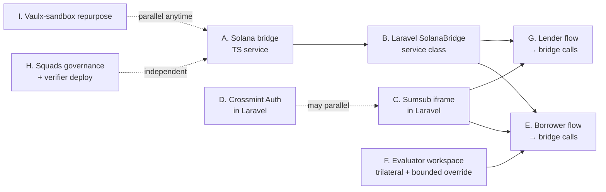

# Vaulx — Merge Execution Spec

**Date:** 2026-04-29
**Audience:** Edson + Marcelo + their Claude Code
**Purpose:** Functionality-level specification of what needs to exist by May 10 to merge the three Vaulx codebases into one product. **Not prescriptive on HOW to build it.** Edson + Claude figure out the path.

**Reads after this:** Each functional area below has a Definition-of-Done. Hit the DoDs in any order; respect the dependency graph in §10. Cross-reference [`composable-blocks.md`](../architecture/2026-04-29-vaulx-composable-blocks.md) for architecture, [`unified-architecture-design.md`](2026-04-29-vaulx-unified-architecture-design.md) for the strategic shape, [`user-journeys-current-vs-ideal.md`](2026-04-29-vaulx-user-journeys-current-vs-ideal.md) for persona context.

---

## 1. The goal

By **May 10**, a judge or partner clicks **`vaulx.fi`**, signs up (Crossmint smart wallet OR email), KYC's via Sumsub iframe, registers an asset, gets a loan, sees the loan disbursed on-chain via 4 Anchor programs running on Devnet, makes an installment payment. If asked to demonstrate the multisig governance, founders open `governance.vaulx.fi` (multisig-verifier) and approve a default through Squads multisig.

`vaulx.vercel.app` (vaulx-sandbox Next.js) runs as a public developer playground showing the on-chain mechanics directly.

`Vaulxfi/program` is archived with one pattern adopted into vaulx-sandbox vault program (atomic confirm-and-disburse).

---

## 2. The three codebases — disposition summary

| Repo | Role going forward | Net change |
|---|---|---|
| **`epohren/vaulx-site`** (Laravel · vaulx.fi) | **Canonical user product.** All user-facing flows live here. | ADD: bridge integration · Sumsub iframe · Crossmint Auth · trilateral evaluator + bounded override · EXIF + case-code · webhook receivers |
| **`Vaulxfi/vaulx-sandbox`** (Next.js · vaulx.vercel.app) | **Developer playground.** Hosts the 4 Anchor programs, the `@vaulx/anchor-client` package, all on-chain demos. | DROP: user-facing routes (move to playground namespace) · KEEP: Anchor programs · ADD: Solana bridge service (new TS app) |
| **`Vaulxfi/program`** (Anchor monolith · Devnet) | **Archived prototype.** One pattern adopted into vaulx-sandbox. | ADOPT: atomic confirm-and-disburse pattern into `vault::confirm_custody` · ARCHIVE the rest (kept for traceability) |

---

## 3. Functional areas (8) — what needs to exist

Each area carries: **What** · **Where** · **Integration shape** · **Definition of done**. Order is reading order, not execution order. See §10 for dependency graph.

### Area A — Solana bridge (TypeScript HTTP service)

**What:** a small TypeScript HTTP service that wraps `@vaulx/anchor-client` and exposes endpoints per Anchor instruction. Stateless. Operator-key signing for protocol-side ixs. HMAC-protected from Laravel.

**Where:** new TypeScript app inside `Vaulxfi/vaulx-sandbox` repo (e.g., `apps/bridge/`) OR separate repo. Hosting: Vercel separate project OR co-located with vaulx.fi VPS — open call.

**Integration shape:**

```
Laravel  --HTTP+HMAC-->  Bridge  --RPC-->  Solana programs

Endpoints (~12):
  POST /chain/vault/deposit                — lender deposit
  POST /chain/vault/withdraw                — lender withdraw
  POST /chain/loan/create-ccb              — borrower opens loan + cNFT mint
  POST /chain/loan/confirm-custody          — atomic gate-and-disburse (per Edson's pattern)
  POST /chain/loan/pay-installment          — per-installment payment
  POST /chain/loan/renew                    — re-loan
  POST /chain/loan/repay                    — full repayment
  POST /chain/sas/issue                     — Sumsub-GREEN → KycAttestation PDA mint
  POST /chain/auction/bid                   — auction bid
  POST /chain/auction/execute-default       — Squads-protected; constructs proposal
  GET  /chain/account/:pda                  — read on-chain state
  GET  /chain/health                        — service health

Auth: HMAC-SHA256 over (timestamp + method + path + body). Shared secret in env.
Operator key: env var (server-side only). Never in client code.
```

**Webhook listener (separate process or same service):** subscribes to program logs via `connection.onLogs()`, decodes events, POSTs to Laravel `POST /api/onchain-events/*` with HMAC signature. Updates Laravel `OnchainEvent` model.

**Definition of done:**
- Service deployed; health check returns 200
- Each endpoint successfully signs an Anchor ix and submits to Devnet
- HMAC verification rejects unauthorized requests (test: 401 on bad signature)
- Webhook listener fires Laravel updates within 5s of on-chain event
- README documents env vars + auth model + endpoint contracts

---

### Area B — Laravel SolanaBridge service class

**What:** a PHP service class that wraps the bridge. Each Laravel controller method that does on-chain work calls into this service.

**Where:** `vaulx-site/app/Services/SolanaBridge.php` (new file).

**Integration shape:**

```php
class SolanaBridge {
  public function depositToVault(Loan $loan, BigInt $amountAtoms): array;
  public function confirmCustodyAndDisburse(Loan $loan): array;
  public function payInstallment(LoanPayment $payment): array;
  public function renew(Loan $loan): array;
  public function repay(Loan $loan): array;
  public function issueSAS(User $user, string $jwtHash): array;
  public function executeDefault(Loan $loan): array;  // Squads proposal
  public function readVaultState(string $pda): array;
}
```

Each method returns a normalized response: `{ ok: bool, txSignature?: string, error?: string, data?: array }`. Network failures retry once with exponential backoff before throwing.

**Definition of done:**
- Service class instantiable via Laravel DI
- HMAC signing on every outbound request
- Unit tests for each method (mock bridge HTTP); ≥1 happy + 1 error path per method
- Integration test: at least one method fires a real Devnet tx end-to-end through the live bridge

---

### Area C — Sumsub iframe in Laravel onboarding

**What:** Sumsub WebSDK iframe embedded in vaulx-site onboarding flow. Lazy KYC gate fires at first money-touching action.

**Where:** Laravel routes `/api/sumsub/{init-token,webhook,applicant-status}`; Blade views in `resources/views/borrower/onboard/*`; middleware `auth.kyc-gate`.

**Reference implementation:** `Vaulxfi/vaulx-sandbox/apps/web/src/lib/sumsub/{client,webhook,attestation}.ts` and `apps/web/src/app/api/sumsub/*` are the canonical patterns to port. Same HMAC scheme. Same webhook event handling. Same SAS attestation mint.

**Integration shape:**

```
borrower clicks money-touching CTA
  → auth.kyc-gate middleware checks SAS PDA (via SolanaBridge::readVaultState)
  → if missing: redirect to /onboarding/kyc
  → /onboarding/kyc Blade view embeds Sumsub iframe (token from /api/sumsub/init-token)
  → Sumsub completes → webhook to /api/sumsub/webhook → SolanaBridge::issueSAS()
  → after SAS minted, original action resumes (queued in session)
```

**Definition of done:**
- Sumsub iframe loads on `/onboarding/kyc` for any logged-in user
- HMAC-verified webhook receiver mints SAS PDA on Devnet
- `auth.kyc-gate` middleware redirects unverified users; passes verified users through
- All money-touching CTAs are protected by the middleware (deposit · disburse · register-asset · request-loan · pay-installment)
- Sandbox-only for HACK; production tier is Phase 1

---

### Area D — Crossmint Auth as third sign-in option

**What:** Crossmint smart-wallet sign-in alongside email/password and SIWS. Three auth surfaces, one user account.

**Where:** Laravel sign-in views (`resources/views/auth/login.blade.php` and `register.blade.php`) get a Crossmint button. New controller methods to handle Crossmint OAuth callback.

**Reference implementation:** `Vaulxfi/vaulx-sandbox/apps/web/src/components/providers/crossmint-wallet-adapter.tsx` and `apps/web/src/app/demo/_components/crossmint-wallet.tsx`.

**Integration shape:**

- Crossmint button → opens Crossmint Auth modal (Google / Apple / email / SMS)
- On success: Crossmint provisions a Solana smart-wallet pubkey + returns user identity
- Laravel: link the Crossmint pubkey to a User record (existing `link-solana` flow already supports this, just add Crossmint as a source)
- Sessions: same Laravel session whether the user came via email/password, SIWS, or Crossmint
- All three auth methods produce a logged-in User with an associated Solana pubkey (where applicable)

**Definition of done:**
- Crossmint button on login + register pages
- New user via Crossmint creates a User row with smart-wallet pubkey linked
- Existing user can ALSO link a Crossmint smart wallet from `/profile`
- Sandbox tier for HACK; production tier is Phase 1

---

### Area E — Borrower flow → bridge calls

**What:** existing vaulx-site borrower flow gets wired to the bridge. Asset registration triggers cNFT mint. Custody confirmation triggers atomic disburse. Installments call `pay_installment`. Re-loan calls `renew_ccb`. Repay calls `repay_ccb`.

**Where:** existing controllers in vaulx-site (`BorrowerController`, etc.). Replace mock state changes with `SolanaBridge` calls.

**Integration shape per step:**

| Borrower step | Existing route | Bridge call |
|---|---|---|
| Register asset | `POST /dashboard/asset` | `SolanaBridge::createCcb($asset, $loanRequest)` |
| Custody confirmed (webhook from custodian) | `POST /api/onchain-events/custody-confirmed` | `SolanaBridge::confirmCustodyAndDisburse($loan)` (atomic) |
| Pay installment | `POST /dashboard/installment/{payment}/pay` | `SolanaBridge::payInstallment($payment)` |
| Renew loan | `POST /dashboard/asset/{asset}/reloan` | `SolanaBridge::renew($loan)` |
| Repay full | `POST /dashboard/loan/{loan}/repay` | `SolanaBridge::repay($loan)` |

**Two-stage borrower flow** (per journey doc §2.1):
- Indicative terms shown post-asset-register (online API anchor only)
- Final terms shown post-Risk-Officer-review (post §F)
- Decline → asset return path

**Definition of done:**
- Asset registration mints TRDC cNFT on Devnet (verifiable in explorer)
- Custody-confirmed webhook causes atomic disburse on Devnet (one transaction, both gate and disburse)
- Installment payment updates Laravel `LoanPayment.status` AND the on-chain Loan PDA
- Re-loan extends the Loan PDA on-chain
- Full repay transitions TRDC to REPAID and triggers asset-release notification
- Two-stage flow lives correctly: indicative pre-custody, final post-Risk-Officer-review

---

### Area F — Evaluator workspace upgrades (trilateral + bounded override)

**What:** vaulx-site evaluator workspace upgrades to support the trilateral pattern (online + offline + Risk Officer) with case-code blinding, EXIF-stripped photos, and bounded override server-enforcement.

**Where:** existing `EvaluatorController` + `Evaluation`/`EvaluatorReport`/`EvaluatorScore` models. Add fields if not isomorphic to journey-doc trilateral schema. New evaluator role-gated views.

**Reference implementation (concepts to port):**
- Case-code generator — canon §0.3 invariant #1; sandbox γ-plan Phase A.2
- EXIF stripper — sandbox γ-plan Phase A.3 (port `lib/photos/exif-strip.ts` to PHP using e.g. `intervention/image` or shell-out)
- Bounded override slider — sandbox γ-plan Phase C.2 (server-enforced: prudent value ∈ [min, max] of 3 evals)
- Blinding architecture — journey doc §0.3

**Integration shape:**

```
appraisal_case (DB)
  ├── case_code (VX-XXXX, stable identifier shown to appraisers)
  ├── borrower_pubkey (NEVER returned to appraisers)
  ├── api_anchor_value_usd_cents (auto)
  ├── online_eval_value_usd_cents (online appraiser submits)
  ├── offline_eval_value_usd_cents (offline appraiser submits)
  ├── prudent_value_usd_cents (Risk Officer assigns; bounded)
  └── state machine (online_in_progress → offline_in_progress → risk_review → decided)

Online appraiser sees: case_code + asset_brand + asset_model + serial_4 + EXIF-stripped photos. NEVER borrower identity, never offline appraiser identity, never offline submission.

Offline appraiser sees: same as online + own photos/videos + defect flags. Never online submission.

Risk Officer sees: all 3 evals + appraiser identities + borrower pubkey. Server-enforced bounded override.
```

**Architecture invariants (canon §2.7):**
1. Appraisers see case codes only.
2. Online and offline appraisers never see each other's submissions.
3. Photos served to appraisers are EXIF/GPS/device-id stripped.
4. Risk Officer is the only persona with full trilateral visibility.
5. Bounded override is enforced server-side.

**Definition of done:**
- Case-code generator + DB schema migrations applied
- Online appraiser endpoints reject queries for cases not assigned to them (test: 403)
- Offline appraiser endpoints reject queries for online submissions (test: 403)
- Photo upload strips EXIF before storage; photo serve route returns EXIF-free bytes
- Risk Officer review screen shows all 3 evals; submit fails server-side if `prudent_value` is outside `[min, max]` of the three (test: 422)
- Decision triggers: → final terms generated → borrower notified → borrower lands on accept/decline screen

---

### Area G — Lender flow → bridge calls

**What:** lender vault deposit/withdraw, vault index, auction bid all call the bridge.

**Where:** existing vaulx-site lender views (likely `OwnerController` or similar). Auction views: new or existing.

**Integration shape:**

| Lender step | Bridge call |
|---|---|
| Browse vaults | `SolanaBridge::readVaultState($pda)` (read-only) |
| Deposit | `SolanaBridge::depositToVault($vault, $amountAtoms)` |
| Withdraw | `SolanaBridge::withdrawFromVault($vault, $shareAtoms)` |
| Bid in auction | `SolanaBridge::bid($auction, $amountAtoms)` |

**Vault simplification (canon §6.3 #9):** 4 fixture rows → 2 (USDC + Local). Aligns vaulx-site lender index with the simplified model.

**KYC gate fires** on first deposit (lazy gate same pattern as borrower side).

**Definition of done:**
- Lender index shows 2 vaults (USDC + Local)
- Deposit triggers Sumsub gate if SAS missing; otherwise on-chain deposit
- Vault NAV updates after borrower repay events (via webhook → Laravel update)

---

### Area H — Squads multisig governance

**What:** Squads-verifier deployed at `governance.vaulx.fi`. `execute_af_default` migrated to require Squads PDA signature. CLI documented for ops.

**Where:**
- `multisig-verifier` self-hosted at subdomain (zero-backend browser app; just static deploy)
- `vault::execute_af_default` ix (or wherever it lives — verify in `programs/loan/src/lib.rs`) updated to enforce Squads PDA as signer
- `multisig-cli` documented in main repo README

**Reference:** Squads V4 docs · multisig-verifier README · existing operator-key flow that we're replacing.

**Integration shape:**

```
Borrower stops paying → grace period → marked overdue
  → Operator constructs Squads proposal (via SolanaBridge::executeDefault())
  → Founder 1 opens governance.vaulx.fi → reviews decoded ix → signs
  → Founder 2 opens governance.vaulx.fi → reviews → signs
  → 2-of-3 threshold reached → proposal executes on-chain
  → loan transitions to DEFAULTED → auction created
```

**What stays operator-signed (NOT multisig):**
- Per-loan custody confirms (frequent, automated)
- KYC PDA mints (auto after Sumsub GREEN)
- Oracle price publishes (cron)

**Definition of done:**
- `governance.vaulx.fi` resolves; multisig-verifier loads; team's Squads multisig is auditable
- `execute_af_default` reverts when called with operator key alone (test: on-chain rejection)
- `execute_af_default` succeeds when constructed as Squads proposal + 2-of-3 founder approval (live demo)
- README documents `multisig-cli` workflow for founders' local ops

---

### Area I — Vaulx-sandbox repurpose

**What:** the Next.js app at vaulx.vercel.app stops being user-facing and becomes a public developer playground. Anchor programs stay; demo cockpit stays; user-facing borrower/lender routes deprecate.

**Where:** `Vaulxfi/vaulx-sandbox/apps/web/src/app/`.

**Integration shape:**

| Today (user-facing) | Tomorrow (playground) |
|---|---|
| `/demo/borrow/*` | move to `/playground/borrow/*` OR redirect to vaulx.fi |
| `/demo/lend/*` | move to `/playground/lend/*` OR redirect to vaulx.fi |
| `/demo/auction/*` | move to `/playground/auction/*` |
| `/admin/demo` | KEEP (devnet ops cockpit; gate behind basic-auth) |
| `/admin/tests` | KEEP (live SSE Anchor test runner) |
| `/api/sumsub/*` | KEEP as reference impl; vaulx.fi has its own port |

Updated landing page makes it clear: *"Developer playground · users go to vaulx.fi"*.

**Definition of done:**
- Landing page updated with new positioning
- User-facing routes either moved to `/playground/*` or redirected to vaulx.fi
- `/admin/*` cockpit accessible behind basic-auth
- README updated: "developer playground; not user-facing"

---

## 4. Cross-cutting requirements

These apply across every functional area. Not optional.

### 4.1 Architecture invariants (canon §2.7)

**Non-negotiable. If any regress, the trilateral architecture is compromised:**

1. Appraisers see case codes only — no borrower wallet/email/name/location/loan terms/other appraiser identity.
2. Online and offline appraisers never see each other's submissions (server-side enforcement).
3. Photos served to appraisers are EXIF/GPS/device-id stripped.
4. Risk Officer is the only persona with full trilateral visibility.
5. Bounded override is enforced **server-side**, not client-only.
6. G2 (custody confirm) must precede disbursement. No exceptions.
7. G4 (default trigger) must follow legal recovery initiation. No exceptions.
8. Operator and Risk Officer keys are server-only. Never in client code.
9. Authorization is server-side. `NEXT_PUBLIC_*` (or Laravel-side public env) values are never carriers of authorization decisions. Use server-only env: `VAULX_ADMIN_PUBKEYS`, `VAULX_RISK_OFFICER_PUBKEYS`, `VAULX_APPRAISER_SESSION_SECRET`, `BRIDGE_SHARED_SECRET`, etc.

### 4.2 Money-unit convention

- **UI layer:** USD (or local fiat for retail Local vault). Never expose "atoms".
- **DB layer:** integer minor units, e.g. `*_value_usd_cents`.
- **On-chain layer:** USDC atoms (1 USDC = 1,000,000 atoms). Conversion at the Anchor RPC boundary, not in user input forms.
- **Conversion helper:** `usdCentsToUsdcAtoms(cents) = cents * 10_000`.

### 4.3 No-501-stub policy

A user-facing page must not commit with its primary API dependency returning HTTP 501. Two acceptable alternatives:
- Wire it through (preferred when foundational).
- Explicit fixture mode behind `APP_DEMO_FIXTURES=true` env. The PR description must say so.

### 4.4 Auth gating per route

Three distinct auth surfaces in vaulx-site, all server-side:
- **Admin** (operator-cockpit-style routes) — `VAULX_ADMIN_PUBKEYS` allowlist
- **Risk Officer** — `VAULX_RISK_OFFICER_PUBKEYS` allowlist (stronger gate; sees PII)
- **Appraiser** (online OR offline) — session token signed with `VAULX_APPRAISER_SESSION_SECRET`; server-side role-isolation (online ≠ offline)

Each new API route includes auth-acceptance tests:
- Unauthenticated request returns 401
- Wrong-role request returns 403
- Appraiser endpoints: online cannot read offline submissions; vice versa
- Risk Officer endpoints: only Risk Officer sees full trilateral

---

## 5. Verification gates (per area)

Each area is "done" when ALL of these pass:

| Gate | What |
|---|---|
| **Build** | Laravel + bridge + Anchor all build green |
| **Tests** | Touched areas have tests; existing tests don't regress |
| **Auth check** | New routes pass auth-acceptance tests (401 / 403 / role-isolation) |
| **Non-negotiables** | EXIF stripped · case-code blinding · bounded override server-side (where applicable) |
| **No 501 stubs** | No primary-API endpoint returns 501 outside fixture mode |
| **On-chain proof** | At least one Devnet transaction signature documented per area (where on-chain) |

---

## 6. Definition of done — overall (May 10)

A judge or partner can do this end-to-end on `vaulx.fi`:

1. Land on home page · click "Get a loan"
2. Sign up via Crossmint (or email)
3. Complete Sumsub KYC in iframe
4. Register a Rolex Submariner (sample asset · upload 3 photos)
5. See indicative loan terms (online API anchor: ~$15,000 → ~70% LTV → ~$10,500 indicative)
6. Click "ship to vault" · receive shipping label
7. (Demo: operator clicks "custody arrived" via admin cockpit OR custodian webhook fires)
8. Offline appraiser submits valuation in `/evaluator/offline/{caseCode}` (~$12,500 with defect flags)
9. Risk Officer opens `/admin/evaluations/{id}` · reviews trilateral · accepts $11,000 prudent value (within bounds)
10. Borrower sees final terms ($11,000 → ~$7,700 loan principal) · clicks Accept
11. Disburse fires on-chain · USDC arrives in borrower wallet (verifiable in explorer)
12. Make 1 installment payment · see schedule update
13. (Optional) Founders open `governance.vaulx.fi` · approve a forced default · see auction created on-chain

`vaulx.vercel.app` is alive as the developer playground.

`Vaulxfi/program` README has an archive note: "early prototype; superseded; atomic confirm-and-disburse pattern adopted into vaulx-sandbox `vault::confirm_custody`."

---

## 7. Where to find more detail

| Question | Doc |
|---|---|
| What's the architecture? | [`composable-blocks.md`](../architecture/2026-04-29-vaulx-composable-blocks.md) (canon · 41 blocks · 4 gates · 9 invariants) |
| Strategic shape of the merge? | [`unified-architecture-design.md`](2026-04-29-vaulx-unified-architecture-design.md) (3-layer model · phase plan · risks) |
| What's where in each repo? | [`three-way-comparison.md`](../architecture/2026-04-29-vaulx-three-way-comparison.md) (75-row side-by-side · scope tags) |
| Who experiences what flow? | [`user-journeys-current-vs-ideal.md`](2026-04-29-vaulx-user-journeys-current-vs-ideal.md) (per-persona walks · gaps · non-negotiables) |
| What's NOT in scope (post-hackathon)? | [`roadmap.md`](2026-04-29-vaulx-roadmap.md) (Phase 1 / 2 / 3+) |
| Per-partner action items? | [`PARTNERSHIPS.md`](../PARTNERSHIPS.md) |
| Original sandbox-side γ plan (pre-pivot, superseded) | [`gamma-scope-implementation-plan.md`](2026-04-29-vaulx-gamma-scope-implementation-plan.md) — useful for porting the EXIF stripper, case-code generator, bounded-override slider patterns to PHP |

---

## 8. Open calls (need answers from team)

These don't block starting; pick them up when you hit them.

1. **Bridge hosting:** Vercel separate project, OR same VPS as vaulx.fi? (Latency vs blast radius tradeoff.)
2. **Bridge repo:** new repo `Vaulxfi/bridge` OR `apps/bridge/` inside vaulx-sandbox? (Coupling vs separation.)
3. **Crossmint Auth in Laravel:** vanilla JS island OR Inertia/Livewire integration? (UX consistency.)
4. **Webhook retries:** if Laravel is down, does the bridge buffer + retry, or fire-and-forget? (Idempotency model.)
5. **`governance.vaulx.fi`:** static hosting (Cloudflare Pages / Vercel) OR same nginx as vaulx.fi? (Deployment simplicity.)
6. **Re-eval-on-decline policy** (canon §7 #3): if borrower declines final terms, can they re-request without re-appraising? (Affects Risk Officer state machine.)

---

## 9. Cross-cutting risks + mitigations

| Risk | Mitigation |
|---|---|
| Bridge becomes a critical SPOF | Health check + circuit breaker · operator-key rotation runbook · monitoring on every endpoint |
| Sumsub iframe behavior in Blade | Reference the working sandbox impl; same SDK works server-rendered · iframe-friendly |
| Crossmint Auth in Laravel: SDK is React-first | Mount as JS island in a Blade view; same pattern as Phantom wallet adapter integration |
| Squads `execute_af_default` migration brick-walls existing flows | Keep operator-key fallback for emergencies; runbook documents how |
| 7-day timeline assumes parallelism | Areas A, B, C, D are largely independent. F (evaluator) blocks E (borrower flow's final-terms screen). G + H are independent. |

---

## 10. Dependency graph (rough)



**Reading the graph:** A unblocks B unblocks E + G. F has its own track (depends on bridge for SAS reads but otherwise self-contained). C unblocks the lazy-KYC gate that E + G use. H is independent. I is independent and can be done last.

---

**End.** This doc + the canon + the unified architecture design = enough for Edson + Claude to plan the actual task list. They'll figure out HOW; this doc is WHAT.
