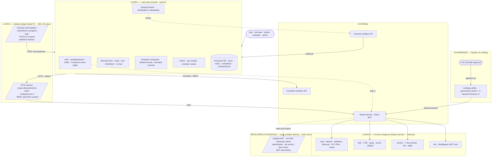

# Vaulx — Unified Architecture Design

**Date:** 2026-04-29 (evening) · **Audience:** team (George + Edson + Marcelo) · **Status:** APPROVED IN PRINCIPLE — pending team alignment on the call

**Supersedes:** the standalone γ plan ([`2026-04-29-vaulx-gamma-scope-implementation-plan.md`](2026-04-29-vaulx-gamma-scope-implementation-plan.md)) which targeted only our Next.js codebase. **This doc retargets the engineering plan onto `vaulx-site` Laravel as the canonical user product.**

**Reads after this:** the new implementation plan (produced by `superpowers:writing-plans` after this design is approved) replaces the old γ plan task list with a task list that builds against the unified architecture.

---

## 1. The merge — what we're doing

Three real pieces of Vaulx have been built across the team. Each one is pulling weight. Each was the right call when it was made.

- **`epohren/vaulx-site`** (Edson + Marcelo) — the **user-facing product**. Multi-user auth (email/password + Sign-in With Solana), borrower dashboard, asset registration, loan flow with installment payment, re-loan one-click, evaluator workspace, persistent DB. Laravel · deployed at `vaulx.fi`.
- **`Vaulxfi/vaulx-sandbox`** (George + Claude) — the **chain layer + KYC integrations**. 4 Anchor programs on Devnet covering the full lifecycle (vault · loan · auction · trdc, 16+ instructions, 69 tests). Sumsub WebSDK + webhook + on-chain attestation. Crossmint smart-wallet. The architectural canon (41-block model, BR adapter, critical-path 5).
- **`Vaulxfi/program`** (Edson, original) — the **on-chain prototype**. 5 instructions, atomic confirm-and-disburse, full lifecycle test, 6 documented Devnet transactions.

The strongest Vaulx is the union — every piece finds its home in the unified stack:

- **`vaulx-site` becomes the canonical user product** at `vaulx.fi`. It is the demo URL on May 10 and the production base going forward.
- **The 4 Anchor programs become the chain layer underneath**. They cover everything `vaulx-site` needs end-to-end: deposit, custody confirmation, disbursement, repayment, renewal, default, auction — plus the production-mandatory KYC layer.
- **The atomic confirm-and-disburse pattern from `Vaulxfi/program` is pulled forward into the `vault` program**. It's the cleanest expression of the custody gate in the codebase — one tx, one `require!`.
- **A small Node bridge wires the two layers cleanly**. Laravel speaks HTTP to a tiny TypeScript service; the service speaks Anchor IDL to Solana, reusing the `@vaulx/anchor-client` package. PHP doesn't need to learn Solana; TypeScript doesn't need to learn Laravel.
- **Sumsub iframe + Crossmint Auth integrate into the existing `vaulx-site` auth flow**. Email/password + SIWS + Sumsub KYC + Crossmint smart wallet — all under one user account.
- **Squads multisig governance** for the high-stakes admin paths (default execution + protocol upgrades). Self-hosted multisig-verifier UI at `governance.vaulx.fi`.
- **`vaulx-sandbox` becomes the public developer playground** at `vaulx.vercel.app`. All on-chain mechanics demoable directly. Complementary to `vaulx.fi`, not in competition.

**One product. One demo URL. One team. One direction.** No parallel codebases. No work thrown away. Every piece finds its place.

---

## 2. The unified 3-layer architecture



**Reading this in 60 seconds:**

- Users hit `vaulx.fi`. Always. One URL.
- Laravel handles all UI, auth, persistence, and orchestration.
- When Laravel needs the chain (a deposit, a custody confirm, a repay), it calls the Node bridge over HTTP with an HMAC-signed payload.
- The bridge wraps the existing `@vaulx/anchor-client` and signs with the operator key.
- A second bridge process subscribes to on-chain logs and POSTs back to Laravel webhook endpoints to update DB state.
- Squads multisig protects the rare high-stakes ix (default, upgrades). Founders approve via `multisig-verifier`.
- `vaulx-sandbox` Next.js stays alive as a public playground but is not user-facing.

---

## 3. Component disposition by repo

### 3.1 `epohren/vaulx-site` (Laravel) — the user product

**Status:** canonical going forward.

**KEEP as-is** (already production-quality):

- Auth: email/password + SIWS + password reset + 2FA-ready
- Borrower routes (`/dashboard`, `/dashboard/asset/*`, `/dashboard/loan/*`, `/dashboard/installment/*`, `/dashboard/asset/{id}/reloan`)
- Evaluator unified dashboard + role-gated forms
- Owner / admin / super-admin views
- Persistent DB schema (Asset · Loan · LoanPayment · Evaluation · EvaluatorReport · EvaluatorScore · OnchainEvent · MarketSnapshot · CronRun · BrzPriceReading · MarketConfig · User)
- nginx + production deployment at `vaulx.fi`

**ADD:**

- `App\Services\SolanaBridge` service class — HTTP client to the Node bridge, HMAC auth
- Sumsub iframe in onboarding view — embed `@sumsub/websdk` JavaScript SDK
- Sumsub `init-token` + `webhook` controllers (port from our `apps/web/src/app/api/sumsub/*`)
- Crossmint Auth as third auth surface alongside email/SIWS (FE iframe + `crossmint-side-by-side` integration)
- Webhook receivers for `OnchainEvent` model (already exists in DB; needs controller)
- `appraisal_case` table extension if their `Evaluation` model isn't already isomorphic (verify on call)
- Bounded-override slider in evaluator review UI (port from γ plan §C.2)
- EXIF-stripping logic + photo-serving controller (port from γ plan §A.3)
- Case-code blinding utility (port from γ plan §A.2)

**ADJUST:**

- LTV cap: their default is 50%; canonical is 75% (configurable per vault). Make it env-driven.
- Evaluator workflow: extend to support trilateral (online + offline + Risk Officer) per γ design. Their current `EvaluatorReport` + `EvaluatorScore` likely supports this; verify.

### 3.2 `Vaulxfi/vaulx-sandbox` (Next.js) — repurpose as developer playground

**KEEP:**

- All 4 Anchor programs in `programs/` — these become the chain layer for vaulx-site
- `@vaulx/anchor-client` package — the Node bridge reuses it directly
- `lib/sumsub/*` server code — the Laravel port references this as the canonical pattern
- `lib/photos/exif-strip.ts` — port to PHP equivalent OR have Laravel call it via the Node bridge
- All architectural docs (canon · journey · this design)
- Tests (69 Anchor + 52 vitest)
- `/admin/demo` cockpit — keeps demo controls accessible to founders during dev
- `/admin/tests` SSE Anchor test runner — visible during pitch

**REPURPOSE:**

- Drop the 16 legacy routes already scheduled for deletion
- Repurpose `/demo/*` paths into `/playground/*` — show on-chain mechanics directly without product UI overhead
- Update README + landing page to make it clear: *"Developer playground · not user-facing · users go to vaulx.fi"*
- Vercel project keeps its current setup (Pro tier, auto-deploy linked to Vaulxfi/vaulx-sandbox)

**DROP:**

- All borrower / lender user-facing routes (those move to vaulx-site)
- Crossmint sign-in surface (vaulx-site owns auth now)
- Sumsub iframe surface (vaulx-site owns onboarding now)

### 3.3 `Vaulxfi/program` (single-instruction Anchor program) — adopt one pattern, archive the rest

**ADOPT:**

- The **atomic confirm-and-disburse pattern** from `Vaulxfi/program::confirm_custody`. Pull it into `Vaulxfi/vaulx-sandbox::vault::confirm_custody` so the custody gate fires the disburse in the same transaction. Cleaner audit story; saves a tx; matches the load-bearing `require!(trdc.status == Active)` design intent.

**ARCHIVE:**

- The rest of `Vaulxfi/program` (5 ix monolith) is superseded by the 4-program split. Move to `Vaulxfi/vaulx-sandbox/docs/archive/derived-programs/` for traceability. Add an `ARCHIVED.md` with explorer links to the original Devnet transactions for the historical record.

---

## 4. The Solana bridge — concrete spec

### 4.1 Architecture

A tiny TypeScript HTTP service. Stateless. ~200 lines of glue code wrapping the existing `@vaulx/anchor-client` package.

**Hosting:** Vercel as a separate project (`vaulx-bridge`) OR same VPS as `vaulx.fi`. Open question for the call (§8 #3).

**Auth:** HMAC-SHA256 shared secret between Laravel and the bridge. Laravel signs each request body with `BRIDGE_SHARED_SECRET`; bridge verifies before processing. No public exposure.

**Operator key:** loaded server-side via `OPERATOR_KEYPAIR_JSON` env var (same pattern we use today). Signs everything except the multisig-protected ixs (which the bridge constructs as Squads proposals instead — see §7 Phase H).

**Endpoints:**

| Endpoint | Purpose | Signs with |
|---|---|---|
| `POST /chain/vault/deposit` | Lender deposit | lender's wallet (passes through; bridge constructs tx) |
| `POST /chain/vault/withdraw` | Lender withdraw | lender's wallet |
| `POST /chain/loan/create-ccb` | Borrower opens loan + mints TRDC cNFT | borrower's wallet |
| `POST /chain/loan/confirm-custody` | Custodian webhook → confirm + atomic disburse | operator key (eventually custodian's signing key) |
| `POST /chain/loan/pay-installment` | Per-installment payment | borrower's wallet |
| `POST /chain/loan/renew` | One-click re-loan | borrower's wallet |
| `POST /chain/loan/repay` | Full repayment | borrower's wallet |
| `POST /chain/sas/issue` | After Sumsub GREEN webhook → mint KycAttestation | operator key |
| `POST /chain/auction/bid` | Auction bid | bidder's wallet |
| `POST /chain/auction/execute-default` | **Multisig-protected** — constructs Squads proposal, founders approve via verifier | Squads PDA (after 2-of-3 approval) |
| `GET /chain/account/:pda` | Read on-chain state | (read-only, no signing) |

**Webhook listener:** subscribes to program logs via `connection.onLogs()`, decodes events, POSTs to Laravel `/api/onchain-events/*` controllers. Updates `OnchainEvent` model + downstream Laravel state.

### 4.2 Laravel integration

**New service class** at `vaulx-site/app/Services/SolanaBridge.php`:

```php
class SolanaBridge
{
    public function __construct(
        private string $bridgeUrl,
        private string $sharedSecret,
    ) {}

    public function depositToVault(Loan $loan, int $amountAtoms): array { /* HTTP call */ }
    public function confirmCustodyAndDisburse(Loan $loan): array { /* atomic */ }
    public function payInstallment(LoanPayment $payment): array { /* */ }
    public function renew(Loan $loan): array { /* */ }
    public function repay(Loan $loan): array { /* */ }
    public function issueSAS(User $user, string $jwtHash): array { /* */ }
    public function executeDefault(Loan $loan): array { /* creates Squads proposal */ }
    public function readVaultState(string $pda): array { /* */ }
    // …
}
```

Each Laravel controller method that previously did mock state changes now calls the appropriate `SolanaBridge` method.

**Webhook receivers:** new controller `App\Http\Controllers\OnchainEventController` with methods per event type (`custodyConfirmed`, `disbursed`, `repaid`, `defaulted`, `auctionSettled`). Updates the matching DB rows.

### 4.3 Sumsub integration into Laravel

**Existing Vaulx-side code** at `apps/web/src/lib/sumsub/{client,webhook,attestation}.ts` is the canonical pattern. Port to Laravel:

- `SumsubClient` PHP class — HMAC-signed REST calls to `api.sumsub.com`
- `/api/sumsub/init-token` Laravel controller — returns iframe access token to a borrower's session
- `/api/sumsub/webhook` Laravel controller — HMAC-verified, on GREEN calls `SolanaBridge::issueSAS()`
- `/api/sumsub/applicant-status` Laravel controller — reads on-chain SAS PDA, returns kyc=verified|missing
- Onboarding Blade view embeds `@sumsub/websdk` JavaScript SDK in iframe

**Lazy KYC gate** pattern from `useKycGate` becomes a Laravel middleware: `auth.kyc-gate` middleware checks SAS attestation; if missing, redirects to `/onboarding/kyc` with the original action queued in session.

### 4.4 Crossmint integration into Laravel

**Three auth surfaces** under one user account:

1. **Email/password** (vaulx-site already has)
2. **SIWS** (vaulx-site already has)
3. **Crossmint smart wallet** (NEW — port from `apps/web/src/components/providers/crossmint-wallet-adapter.tsx`)

Crossmint integration in Laravel Blade:

- Sign-in page renders three buttons: Email · SIWS · Crossmint
- Crossmint button mounts `@crossmint/client-sdk-react-ui` via Vite/inertia OR via plain JavaScript
- Crossmint smart-wallet pubkey gets linked to the Laravel User model (existing `link-solana` flow already supports this)

---

## 5. What ships May 10 — phased build plan

Each phase is a parallelizable batch. Estimates assume one engineer per phase.

### Phase A — Foundations (~1 day · parallel)

- **A.1** Solana bridge skeleton — TypeScript HTTP service deployed (Vercel separate project)
- **A.2** `App\Services\SolanaBridge` PHP class in vaulx-site (wrapper)
- **A.3** Sumsub init-token + webhook + applicant-status routes in Laravel (port from vaulx-sandbox)
- **A.4** Crossmint Auth integration scaffold in Laravel sign-in page
- **A.5** Self-host `multisig-verifier` at `governance.vaulx.fi`

### Phase B — Borrower flow integration (~2 days)

- **B.1** Asset registration form → `SolanaBridge::createCcb()` → on-chain
- **B.2** Custody confirmation flow (custodian webhook → bridge → atomic confirm-and-disburse)
- **B.3** Installment payment UI → `SolanaBridge::payInstallment()` → on-chain
- **B.4** Renew flow → `SolanaBridge::renew()` → on-chain (their existing reloan UI + bridge call)
- **B.5** Repay flow → `SolanaBridge::repay()` → on-chain

### Phase C — Evaluator + Risk Officer (~1.5 days)

- **C.1** Verify their `Evaluation` + `EvaluatorReport` + `EvaluatorScore` schema supports trilateral. Add fields if missing (online_eval_value_usd_cents, offline_eval_value_usd_cents, prudent_value_usd_cents, etc.)
- **C.2** Bounded-override slider in evaluator review UI (port `<BoundedOverrideSlider>` to Blade + Alpine.js or Vue)
- **C.3** EXIF-stripping middleware on photo upload + `/api/photos/{caseCode}/{idx}` serve route
- **C.4** Case-code generator + blinding logic

### Phase D — Lender flow integration (~1 day)

- **D.1** Lender vault index page in vaulx-site (port from vaulx-sandbox concept; their `owner` view may already cover this)
- **D.2** Vault deposit form → `SolanaBridge::depositToVault()` → on-chain
- **D.3** Auction list + bid screen integration

### Phase E — Sumsub + Crossmint UI polish (~1 day)

- **E.1** Sumsub iframe embedded in onboarding Blade view; lazy-fires on first money-touching CTA
- **E.2** Crossmint Auth surface live on sign-in page
- **E.3** Three auth surfaces unified into single user account

### Phase F — Cleanup (~0.5 day)

- **F.1** Vaulx-sandbox: drop user-facing demo routes, keep only `/playground/*` + `/admin/*`
- **F.2** Vaulx-sandbox README updated as "developer playground"
- **F.3** Vaulxfi/program: archive note + adoption record (atomic confirm-and-disburse pattern pulled into vault program)
- **F.4** Old γ plan marked SUPERSEDED with pointer to this design + new implementation plan
- **F.5** Vaulx-site landing page updated with the unified architecture story

### Phase G — Custodian webhook contract (~0.5 day, may slip post-hackathon)

- **G.1** Document the HMAC-signed webhook contract in `docs/architecture/2026-04-29-vaulx-custodian-webhook-spec.md` (already in scope)
- **G.2** Per-custodian signing-key whitelist (post-hackathon OK)

### Phase H — Governance & multisig (~0.5 day · in HACK scope per team decision)

- **H.1** Self-host `multisig-verifier` at `governance.vaulx.fi` (zero-backend browser UI; covered in Phase A.5)
- **H.2** Migrate `loan::execute_af_default` to require Squads PDA signature instead of operator key. Founders approve via verifier UI.
- **H.3** Document `multisig-cli` workflow in repo README for internal ops + audit trail

**Total: ~7 working days.** Parallelizable across George + Claude + Edson + Marcelo.

---

## 6. What changes vs the current γ plan

The γ plan ([`2026-04-29-vaulx-gamma-scope-implementation-plan.md`](2026-04-29-vaulx-gamma-scope-implementation-plan.md)) targeted the Next.js codebase. **It is now SUPERSEDED.** Most of its 25 tasks are obsolete or relocate to a different stack:

| Old γ phase | Old target | New disposition |
|---|---|---|
| **A — Foundations** | Next.js | REWRITTEN. Some apply (case-code, EXIF, photo serve) but to vaulx-site PHP, not Next.js. New: Solana bridge + Laravel SolanaBridge service. |
| **B — Appraiser workspaces** | New routes in Next.js | RELOCATED into vaulx-site evaluator. Most of the UI exists; we add trilateral fields + bounded override + EXIF strip. |
| **C — Risk Officer review** | New routes in Next.js | RELOCATED into vaulx-site evaluator. Half exists. We add bounded override slider + server-side enforcement. |
| **D — Borrower flow rewrite** | New routes in Next.js | RELOCATED into vaulx-site borrower. Most UI exists. We add bridge calls + flow timing fixes. |
| **E — Vault simplification** | Collapse 4 fixtures to 2 in Next.js | RELOCATED into vaulx-site lender views. Their model is already simpler. |
| **F — Cleanup** | Delete 16 Next.js legacy routes | KEEPS — but in vaulx-sandbox, alongside repurposing as playground. |
| **G — Custodian webhook** | Documentation-only in old plan | SAME — applies to Laravel `OnchainEventController`. |
| **H — Governance** | (not in old plan) | NEW. Squads-verifier deployment + execute_af_default migration. |

The new implementation plan (produced by `superpowers:writing-plans` after this design is approved) replaces the old γ task list with a Laravel + bridge + Anchor task list.

---

## 7. What stays canon (no changes)

- **`composable-blocks.md`** — UNCHANGED. The 41-block model is independent of which frontend renders it. One status update on the **S1 Squads V4** row to reflect the verifier UI + execute_af_default migration coming into HACK scope.
- **`user-journeys-current-vs-ideal.md`** — UNCHANGED in design intent. The persona walks (borrower, evaluator, lender, etc.) map to the new stack without semantic change.
- **9 architecture invariants** in canon §2.7 — UNCHANGED. EXIF stripping, blinding, bounded override server-side, server-only keys, etc. all still hold; they get implemented in PHP instead of TypeScript.
- **4 gates G1–G4** — UNCHANGED.
- **Critical-path 5 partnerships** (SCD · Custodian · Appraisers · Digital signature · On/off rails) — UNCHANGED.

---

## 8. Open questions for the team call

1. **On-chain winner: confirm 4-program suite (ours) over single-program (Edson's monolith)?** Recommendation: yes; ours has KYC + auction + renewal + default that his lacks.
2. **Adopt atomic confirm-and-disburse** from `Vaulxfi/program::confirm_custody` into our `vault` program? Recommendation: yes; cleanest expression of the custody gate.
3. **Solana bridge hosting:** Vercel separate project, OR same VPS as vaulx.fi? Trade-off: Vercel = isolated + zero-ops, but cross-region latency. VPS = co-located + lower latency, but operator key on the same VPS as Laravel (slightly broader blast radius).
4. **`multisig-verifier` subdomain:** `governance.vaulx.fi` vs alternatives.
5. **vaulx.fi 500-error fix priority** — Edson's last commit was an auth fix; is it green now? Ship-blocker before May 10.
6. **Crossmint Auth in vaulx-site** — does Laravel/Inertia tolerate the React-based Crossmint SDK, or do we mount it as a vanilla JS island? Engineering call.

---

## 9. Decision log (filled after the call)

> _(empty — to be filled after the team conversation, then committed in a follow-up commit)_

---

## 10. Risks & mitigations

| Risk | Mitigation |
|---|---|
| **7-day timeline assumes parallel execution across 4 contributors** | Phase A foundations are independent and run in parallel. Phases B–D are also parallelizable. Coordination overhead absorbed via daily 10-min sync. |
| **vaulx.fi must be unbroken on May 10** | Phase H.5 includes verifying the auth fix. If still 500-erroring on day 1, raise to ship-blocker priority. |
| **Solana bridge security — operator key on TypeScript service** | Standard ops; key in env var; HMAC-protected endpoint; no public exposure. Documented in runbook. |
| **`execute_af_default` Squads migration is the demo's most fragile new piece** | Practice the multisig-verifier approval flow at least 3 times before May 10. Have a fallback runbook (operator-key signing) for emergencies. |
| **PHP-Solana integration friction** | Sidestepped entirely by the Node bridge. Laravel never touches Solana directly. |
| **Sumsub iframe + Crossmint Auth UX in Blade** | These are well-documented vendor SDKs; no novel integration. Existing TypeScript impl serves as the reference. |

---

## 11. Definition of done for May 10

A judge or partner clicks `vaulx.fi`, signs up with Crossmint (or email), KYC's via Sumsub iframe, registers an asset, gets a loan, sees the loan disbursed on-chain, makes an installment payment, all powered by our 4 Anchor programs underneath, with the team able to multisig-approve a default via `governance.vaulx.fi` if asked to demonstrate.

The `vaulx-sandbox` Next.js stays alive at `vaulx.vercel.app` as a developer playground showing the on-chain mechanics directly.

The `Vaulxfi/program` repo is archived with a note explaining which pattern was adopted into the unified architecture.

---

**End of design.** Approval triggers transition to `superpowers:writing-plans` for the task-by-task implementation plan.
