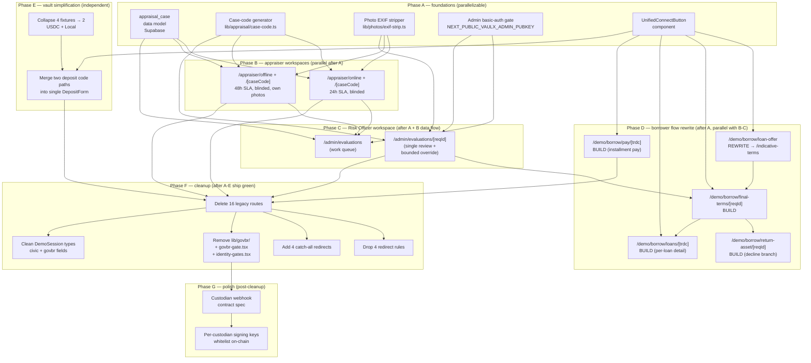

# Vaulx User Journeys — Current Demo vs. Ideal Production

**Date:** 2026-04-29
**Version:** v2 (revised after user directional input)
**Status:** ANALYSIS DOCUMENT — NO CODE CHANGES YET
**Purpose:** Catalogue every persona's journey, surface every gap, decide every route's fate before deletion. Output two hard artifacts: a route-coverage matrix and a Cut List + Build List.

---

## v2 changelog (deltas from v1)

| What | Where it changes |
|---|---|
| Two-stage evaluation flow (online indicative → offline-anchored FINAL terms) | §0, §2.1 |
| Offline appraiser is a distinct persona with extra information surface (own photos/videos, can find hidden defects) | §2.6b |
| Online + offline appraisers are FULLY BLINDED via case codes (anti-collusion) | §2.6a, §2.6b, §4 |
| **Evaluation Risk Officer** added as production sub-persona — reviews trilateral, assigns prudent value | §2.10b |
| Institutional direct lending demoted — no Vaulx UI in v1; routes via Kamino/Plume | §2.3 |
| Retail FIDC merged with general Lender persona | §2.3 (was §2.4) |
| Lender simplification proposal: 2 vaults (USDC + Local) instead of 4 fixtures | §2.3, §3, §7 |
| Per-loan installment-payment UI elevated to pre-hackathon must-have | §2.2, §3 |
| Per-loan dashboard detail (LTV, schedule, next payment) elevated | §2.2 |
| Crossmint sign-in surface unified across all personas via `<UnifiedConnectButton>` | §4, §8 |
| Admin gating via basic-auth (`NEXT_PUBLIC_VAULX_ADMIN_PUBKEY`) | §2.9, §3 |
| `/demo/dev/bezel` confirmed DELETE | §3 |
| Custodian fallback UI confirmed KEEP_DEMO + adds webhook contract spec | §2.5 |
| 8 NEW pre-hackathon routes added to BUILD column | §3, §8 |
| §8 Pre-Hackathon Build List added (12 items, with dependency order) | §8 |
| Open questions: most resolved; only SCD persona surface + 2-vault simplification remain | §7 |

---

## 0. Executive summary

Vaulx today is **two products colliding under one Next.js app**: a live hackathon demo (the `/demo/*` tree) and a half-shed legacy Next.js prototype (the `/borrow/*`, `/lend/*`, `/custodian/*` trees). The redesign work shipped today (Civic Auth dropped, Sumsub WebSDK added, lazy KYC gate) was a clean cut on the demo side, but the legacy tree was left in place.

After this v2 review, the picture is much sharper:

- **The borrower flow has a missing structural stage.** Today: register → online appraisal → loan offer → custody → disburse. **Reality**: register → INDICATIVE online value → custody → offline physical evaluation → 3-eval Risk Officer review → FINAL terms (which can differ from indicative) → borrower accept-or-decline → disburse OR asset return. The current `/demo/borrow/loan-offer/[reqId]` runs at the wrong moment in the flow.
- **The trilateral appraisal is human-in-the-loop, not auto-converged.** Three valuations land on a Risk Officer's work list. The Risk Officer reviews convergence and assigns the prudent value within bounded override constraints. **No UI for this exists today.** It is pre-hackathon must-have.
- **Online and offline appraisers are different personas, fully blinded.** Each gets a case code, never sees the other's identity or eval. Anti-collusion is a load-bearing design intent, not a UX nicety.
- **Two of the original 13 personas don't have Vaulx UI at all in v1.** Institutional Lender (routes via Kamino/Plume) and SCD (legal partner, ideally API-only). Per-installment payment UI was deferred but is now must-have pre-hackathon.

**Pre-hackathon build list (12 items, see §8 for ordered dependencies)**:

1. Two-stage evaluation flow in borrower side
2. Final-terms accept/decline + asset-return branch
3. Per-loan installment payment UI (`/demo/borrow/pay/[trdc]`)
4. Per-loan dashboard detail screens
5. Online Appraiser workspace (`/appraiser/online/*`)
6. Offline Appraiser workspace (`/appraiser/offline/*`)
7. Evaluation Risk Officer workspace (`/admin/evaluations/*`)
8. Crossmint unified sign-in across all personas
9. Admin basic-auth gating
10. `/demo/dev/bezel` deletion
11. Custodian webhook contract (real custodians feed Vaulx via webhook; Vaulx UI is fallback)
12. Lender simplification → 2 vaults (USDC + Local) [PENDING USER VERDICT]

**Top deletion hypotheses for §5 Cut List**:

- Delete every `/borrow/*`, `/lend/*` legacy route source file. Replace with redirects in `next.config.mjs`.
- Delete the entire `verify-id` quad-tree (8 routes) — Sumsub replaced gov.br.
- Delete `/demo/dev/bezel`.
- Demote `/admin/*` to basic-auth tier; keep, don't remove.
- KEEP `/custodian/*` legacy as fallback portal; gate behind basic-auth.

---

## 0.1 Scope decision — γ (full pre-hackathon build)

After multi-model council review (2026-04-29 afternoon), three scope paths were considered:

- **α — BRD-strict demo**: ship existing `/demo/*` with cleanup only; narrate the evolved design verbally
- **β — Highest-leverage 4 builds**: pick 4 most-impactful new routes that fit conservative dev-day estimates
- **γ — Full pre-hackathon scope**: build all 11 new routes + foundations + cleanup before May 10

**Decision: γ.** AI-agent-driven parallel execution makes the human-team dev-day math obsolete. We build the design correctly, in full, before the demo deadline. No scope cuts. No "narrate it verbally" hand-waves. No half-shipped flows.

This forces an implementation plan with strict dependency ordering (see §8 build graph) and a Phase F cleanup gate that runs only after Phase A-D ship green.

---

## 0.2 Spec evolution from BRD (this doc is post-BRD)

This document captures **deliberate product evolutions** beyond the canonical Vaulx BRDs. These are not inventions — they are agreed product progressions captured in working sessions on 2026-04-29:

| BRD position (current) | Journey-doc evolution | Why |
|---|---|---|
| Single Appraiser role with auto-converged convergence (M1-M6 metrics, system alerts) | Two distinct appraiser personas (Online + Offline) with **human Risk Officer review** of trilateral | Auto-converge gets gamed when sources collude or one source dominates; human-in-the-loop with bounded override is the anti-fraud architecture |
| Information separation (appraisers don't see market anchors) | + **Inter-appraiser blinding via case codes** | Explicit anti-collusion: prevents online + offline from coordinating |
| Single appraisal screen (`/borrow/new/appraisal/[reqId]`) | Online + Offline workspaces (`/appraiser/online/*` and `/appraiser/offline/*`) + Risk Officer (`/admin/evaluations/*`) | Each persona has different SLA (24h vs 48h), different information surface (offline takes own photos, finds hidden defects), different decision rights |
| Loan-offer / CCB sign at `/demo/borrow/loan-offer/[reqId]` (pre-custody) | Two-stage: indicative pre-custody → final post-Risk-Officer (with accept/decline + asset-return branch) | Offline eval can revise valuation materially; borrower must retain right to decline final terms |
| Auto-converged median for prudent value | **Bounded human override** — Risk Officer picks within `[min, max]` of 3 evals; outside the envelope → audit/decline | Removes fiat power; preserves auditability while enabling defensible human judgment |

The BRD should be updated to reflect these. Until then, this journey doc is the working source of truth for product design; the BRD remains the source of truth for hackathon-demo choreography only.

---

## 0.3 Non-Negotiables (load-bearing security & blinding constraints)

These are not features. They are **constraints the build must respect from day one**, because they are the foundation of the anti-fraud / anti-collusion claim. If any of these regress, the trilateral architecture is compromised.

| # | Non-negotiable | Where it applies | What breaks if violated |
|---|---|---|---|
| 1 | **EXIF / GPS / device-id stripping on every photo served to appraisers** | `/appraiser/online/[caseCode]`, `/appraiser/offline/[caseCode]` | Borrower geolocation leaks → blinding compromised → collusion possible |
| 2 | **Case codes are the ONLY identifier appraisers see** | All appraiser endpoints: case-fetch APIs return case_code + redacted asset metadata + EXIF-stripped photos. NEVER borrower wallet, email, name, location, or other appraiser's identity | Identity leak → coordinated valuation fraud |
| 3 | **Online and offline appraisers cannot see each other's submissions** | Server-side: appraiser-side endpoints reject any query attempting to enumerate by other appraiser. Risk Officer is the ONLY persona with cross-appraiser visibility | Inter-appraiser anchoring → collapse of trilateral independence |
| 4 | **Risk Officer auth is stronger than other admin** | `/admin/evaluations/*` requires admin pubkey check + ideally hardware-key for prod | Risk Officer override is the single point that can move money; weak auth = fraud vector |
| 5 | **Bounded override is enforced server-side, not just client-side** | `/admin/evaluations/[reqId]` decision endpoint validates `prudent_value ∈ [min, max] of 3 evals` before persisting; bypass = audit/decline | Bypass = fiat override, kills auditability |
| 6 | **Sumsub webhook HMAC verification before any on-chain action** | `/api/sumsub/webhook` (already implemented and tested in v1) | Forged GREEN webhook → fraudulent SAS mint → bypass of KYC gate |
| 7 | **Operator key never exposed to client** | `OPERATOR_KEYPAIR_JSON` is server-only env var; never imported into `apps/web/src/components/*` | Key leak = total compromise of admin-signed actions |

These constraints belong in a security review checklist that runs before each Phase D-G commit lands.

---

## 1. Persona taxonomy

| # | Persona | Production / Internal / Demo | Has Vaulx UI in v1? | Pre-hackathon priority |
|---|---|---|---|---|
| 1 | First-time Borrower | Production | ✅ `/demo/borrow/*` | **MUST** (rewrite flow) |
| 2 | Returning Borrower | Production | ⚠️ partial — `/demo/borrow/{renew,repay}` | **MUST** (add per-loan + installments) |
| 3 | **Lender (USDC + Local)** [merged 3+4] | Production | ✅ `/demo/lend/*` | **MUST** (simplify + Crossmint) |
| 4 | (merged into 3) | — | — | — |
| 5 | Custodian | Production | ⚠️ legacy only — `/custodian/*` (fallback) | KEEP_DEMO with webhook spec |
| 6a | **Online Appraiser** [split from 6] | Production | ❌ — must build `/appraiser/online/*` | **MUST** (BUILD NEW) |
| 6b | **Offline Appraiser** [split from 6] | Production | ❌ — must build `/appraiser/offline/*` | **MUST** (BUILD NEW) |
| 7 | SCD partner | Production | ❌ — likely API-only, no portal | DEFER (architecture decision needed) |
| 8 | Auction Bidder | Production | ✅ `/demo/auction/*` | KEEP (refine post-hackathon) |
| 9 | Operations Admin (devnet ops) | Internal | ✅ `/admin/demo` cockpit | KEEP_DEMO + basic-auth |
| 10a | KYC / AML Reviewer [split from 10] | Internal | ❌ no UI today | **DEFER** |
| 10b | **Evaluation Risk Officer** [split from 10] | Internal | ❌ — must build `/admin/evaluations/*` | **MUST** (BUILD NEW) |
| 11 | Treasury / Squads multisig | Internal | ❌ — uses Squads UI directly | DEFER |
| 12 | Visitor / Judge | Demo-only | ✅ `/`, `/demo`, `/demo/architecture` | KEEP |
| 13 | Demo Operator | Demo-only | ✅ `/admin/tests` | KEEP_DEMO + basic-auth |

**Production-facing with Vaulx UI**: 1, 2, 3, 5, 6a, 6b, 8 (7 personas)
**Production-facing without Vaulx UI**: 7, 11 (2 personas — handled via API or external tools)
**Internal**: 9, 10a, 10b (3 personas)
**Demo-only**: 12, 13 (2 personas)

---

## 2. Per-persona analysis

### 2.1 First-time Borrower

> *Maria owns a Submariner. She wants R$30 000 USDC for 90 days using the watch as collateral. She has never used Solana. She wants to know IF the loan will work and what TERMS she's accepting BEFORE she ships her R$50 000 watch into a vault.*

**User goal**: get USDC liquidity against a luxury watch. Critically: see indicative terms BEFORE shipping; commit only AFTER offline evaluation confirms a value she can accept; have a clean back-out path if final terms differ unfavorably.

**AS-IS routes** (in walk order):

```
/                                         marketing
  → /demo/borrow/onboard                  intro + "Continue to sign-in"
    → /demo/borrow/wallet                 Crossmint Auth (Google/email/Phantom)
      → /demo/borrow/register             asset form (brand/model/serial/photos)
        → /demo/borrow/appraisal/[reqId]  triangular appraisal screen
          → /demo/borrow/loan-offer/[reqId]  terms acceptance + CCB preview  ← WRONG MOMENT (see Issue 1)
            → /demo/borrow/custody        custodian booking
              → /demo/borrow/awaiting-custody/[trdc]  waiting state
                → /demo/borrow/disburse   disbursement → USDC arrives
                  → /demo/borrow/funds    spend hub (card / pix / wallet)
                    → /demo/borrow/dashboard  loan tracking
```

**Issue 1 (structural)**: today, terms are "accepted" at `loan-offer` BEFORE custody. This is wrong. The offline physical evaluation can produce a value materially below the online indicative, and the borrower should have the right to decline at that point and request asset return.

**AS-IS journey, step by step**:

1. Lands on `/demo/borrow/onboard`. Reads explainer. Clicks "Continue".
2. On `/demo/borrow/wallet`, picks Crossmint or Phantom. KYC NOT triggered.
3. On `/demo/borrow/register`, fills brand/model/serial/photos. Clicks Submit. **First KYC gate**: `useKycGate("Submit asset for evaluation")` runs Sumsub flow if no SAS attestation.
4. `/demo/borrow/appraisal/[reqId]` shows triangular convergence.
5. **`/demo/borrow/loan-offer/[reqId]` shows terms, user accepts, signs CCB.** ← Issue 1.
6. `/demo/borrow/custody` — book a slot. State `PENDING_CUSTODY`.
7. `/demo/borrow/awaiting-custody/[trdc]` — wait state.
8. `/demo/borrow/disburse` — second KYC gate (`useKycGate("Disburse")`) + actual disburse on-chain.
9. `/demo/borrow/funds` and `/demo/borrow/dashboard` for ongoing UX.

**Real vs. mocked**:

| Step | Real | Mocked |
|---|---|---|
| Sign-in | Crossmint (sandbox) ✅, Phantom/Solflare ✅ | — |
| Asset form | `useDemoSession` localStorage | No persistent backend |
| KYC gate | Sumsub WebSDK + webhook + on-chain `KycAttestation` ✅ | Sandbox-only; reject paths untested |
| Appraisal (online API) | WatchCharts ✅, Apify Chrono24 ✅ | Offline specialist quote hardcoded |
| Online appraiser submission | n/a | Doesn't exist (no `/appraiser/online/*`) |
| Offline appraiser submission | n/a | Doesn't exist (no `/appraiser/offline/*`) |
| Risk Officer review | n/a | Doesn't exist (no `/admin/evaluations/*`) |
| Final terms acceptance | n/a (today's "loan-offer" is before custody) | Wrong moment |
| Asset return on decline | n/a | Doesn't exist — no route, no on-chain ix |
| CCB | `<CcbDocument>` renders copy | Not signed by SCD; no legal artifact |
| Custody booking | `useDemoSession` | Slots are fixtures |
| Custody confirm | `confirmCustody` ix via operator key ✅ | Real custodian hardware not integrated |
| Disburse | `useDeposit` → on-chain `Vault.deposit` ix ✅ | Devnet USDC |

**IDEAL production journey**:

```
0. Marketing  → /
1. Sign-in    → /demo/borrow/wallet (Crossmint or wallet)
2. Asset form → /demo/borrow/register
   → KYC gate (real Sumsub + Brazil Non-Doc CPF flow ~60s)
3. INDICATIVE evaluation:
   → API anchor (auto, instant)              ← eval 1 of 3
   → Borrower sees indicative value + indicative terms
   → /demo/borrow/indicative-terms/[reqId]   (NEW screen, optional combined with /register)
   → Borrower decides: ship to vault, or cancel
4. Custody booking
   → /demo/borrow/custody
   → SLOT BOOKED → triggers ONLINE appraiser kickoff (24h SLA)
   → Online appraiser (blinded, sees case code only) submits  ← eval 2 of 3
5. Asset arrives at vault
   → /demo/borrow/awaiting-custody/[trdc]
   → Custodian confirms intake (webhook → on-chain)
   → Triggers OFFLINE appraiser kickoff (48h SLA)
   → Offline appraiser (blinded, takes own photos/videos, finds hidden defects) submits  ← eval 3 of 3
6. Risk Officer review:
   → /admin/evaluations/[reqId] (NEW screen)
   → Reviewer sees all 3 evals + appraiser identities (only the reviewer)
   → Decides: converged? prudent value? accept/audit/decline
   → Bounded override: prudent value ∈ [min(3), max(3)] (strict α — see §7 Q-D)
7. FINAL terms generated based on prudent value
   → /demo/borrow/final-terms/[reqId] (NEW screen)
   → Borrower sees: indicative was $X, prudent eval is $Y, final terms reflect $Y
   → Two CTAs: "Accept and disburse" OR "Decline and request asset return"
8a. ACCEPT path: signs final CCB → disburse on-chain → /demo/borrow/funds
8b. DECLINE path: → /demo/borrow/return-asset/[reqId] (NEW screen)
   → Custodian receives release order → schedules return shipping
   → Borrower wallet receives any prepaid handling refund (if applicable)
   → State: TRDC closed (no loan); asset returned
```

**Gaps**

- **UX**:
  - No two-stage indicative-vs-final screens
  - No final-terms accept/decline UI
  - No asset-return flow UI
  - No dual-clock waiting UI (24h online + 48h offline + Risk Officer review)
  - Per-asset photo upload is a stub
- **Data/model**:
  - No persistent backend for asset records (currently localStorage)
  - No `appraisal_case` record carrying case code, blinded mappings, eval submissions, Risk Officer decision
  - CCB has no storage
- **On-chain**:
  - `KycAttestation` real but minted by Vaulx operator; SCD co-signing pattern not designed
  - No "asset return" instruction (analogous to repay-without-disburse)
  - Loan-offer hash is committed too early in the flow
- **Off-chain integrations**:
  - Sumsub mainnet not approved
  - Brazil Non-Doc CPF flow not enabled (sandbox limitation)
  - Pix integration absent
  - Vaulx Card BIN sponsor absent
  - Real custodian webhook absent
- **Compliance/legal**:
  - No ICP-Brasil signature flow
  - Final-CCB amendment template absent (currently single-CCB-at-loan-offer)
- **Security**:
  - Photo uploads have no virus-scan or PII redaction (EXIF, GPS leaks possible)
  - No EXIF stripping before serving photos to appraisers (blinding leak)

**Redundancy**

- `/borrow/new/asset`, `/borrow/new/appraisal/[reqId]`, `/borrow/new/terms/[reqId]`, `/borrow/new/awaiting-custody/[trdc]` are legacy duplicates of `/demo/borrow/*` counterparts.
- `/demo/borrow/verify-id*` quad-tree dead post-Sumsub.

**Decision**

- KEEP_PROD all `/demo/borrow/{onboard, wallet, register, custody, awaiting-custody, disburse, funds*, dashboard}`.
- **REWRITE** `/demo/borrow/loan-offer/[reqId]` semantics: rename to `/demo/borrow/indicative-terms/[reqId]` (or add `final-terms`), and split into two screens.
- **BUILD** `/demo/borrow/final-terms/[reqId]` (post-Risk-Officer-review).
- **BUILD** `/demo/borrow/return-asset/[reqId]` (decline-and-return path).
- DELETE the four `/demo/borrow/verify-id*` routes.
- DELETE the four `/borrow/new/*` legacy duplicates.

---

### 2.2 Returning Borrower

> *Maria's first 90-day loan ends in 3 days. She also has a previous Datejust loan with 4 installments paid and 2 to go. She wants a single dashboard showing both loans, with next-payment dates, LTV, and clean per-loan actions.*

**User goal**: see all assets and loans at a glance. Pay an installment. Renew a loan. Repay fully. With zero friction (no new appraisal, no new custody, no new KYC).

**AS-IS routes**:

```
/demo/borrow/dashboard      shows active loan(s) — thin
  → /demo/borrow/renew      single page; pay accrued interest, signs amendment
  → /demo/borrow/repay      single page; full payoff, asset release flow
```

**AS-IS journey**:

1. `/demo/borrow/dashboard` — thin index. Doesn't surface per-loan detail.
2. Click "Renew" → `/demo/borrow/renew` (single screen, mocked).
3. Click "Repay" → `/demo/borrow/repay` (single screen, partial real).

**Real vs. mocked**:

| Step | Real | Mocked |
|---|---|---|
| Loan listing | Reads on-chain Vault + Loan PDAs ✅ | — |
| Per-loan detail UI | n/a | Doesn't exist as a route |
| Installment payment | n/a | Doesn't exist on demo side |
| Renew | UI shell + amendment hash | No on-chain `extend_loan` ix |
| Repay | `repay` ix path exists | Asset-release leg is admin button, not custodian webhook |

**IDEAL production journey**:

1. **Dashboard index** (`/demo/borrow/dashboard`) shows table of:
   - Asset (brand, model, serial-redacted)
   - Loan amount
   - Disbursed / accrued interest / remaining
   - LTV (live based on current oracle price)
   - Days to maturity
   - Next payment date
   - Action button (Pay / Renew / Repay)
2. Click into asset → **per-loan detail** (`/demo/borrow/loans/[trdc]`):
   - Full amortization schedule
   - Payment history
   - CCB reference (with link)
   - Trilateral evaluation summary (anonymous: only the prudent value is shown to borrower)
   - Action buttons
3. **Pay installment** (`/demo/borrow/pay/[trdc]`):
   - Reads next-due amount
   - User signs USDC transfer to vault
   - On-chain `pay_installment` ix runs (does not exist today)
   - Schedule updates on success
4. **Renew** (`/demo/borrow/renew/[trdc]`):
   - Day-60 nudge logic (scheduled notifications)
   - Tier-priced rate (cycle 1 = 2.2%/mo, cycle 3+ = 2.0%)
   - One-click on-chain `extend_loan` (does not exist today)
   - CCB amendment signed off-chain
5. **Repay** (`/demo/borrow/repay/[trdc]`):
   - Full payoff
   - Triggers custodian release order
   - Asset-return logistics
   - TRDC state `ACTIVE → REPAID`

**Gaps**

- **UX**: per-loan detail screen missing. Per-installment pay screen missing. Day-60 nudge UI missing.
- **Data/model**: no notification queue (WhatsApp / email). No referral credit ledger. No tier rate calculator.
- **On-chain**: `extend_loan`, `pay_installment` ixs missing.
- **Off-chain**: WhatsApp/email transactional service absent.
- **Compliance/legal**: CCB amendment template absent.
- **Security**: none material at this layer.

**Redundancy**

- `/borrow/loans/[trdc]/{disburse, renew, repay, repaid}` are legacy duplicates of demo equivalents.
- `/borrow/loans/[trdc]/pay` is the per-installment legacy — **MIGRATE to `/demo/borrow/pay/[trdc]`** (no demo equivalent today, must-have pre-hackathon).

**Decision**

- KEEP_PROD `/demo/borrow/{dashboard, renew, repay}`.
- **BUILD** `/demo/borrow/loans/[trdc]` (per-loan detail).
- **BUILD** `/demo/borrow/pay/[trdc]` (installment payment).
- DELETE all legacy `/borrow/loans/[trdc]/{disburse, renew, repay, repaid}`.
- MIGRATE `/borrow/loans/[trdc]/pay` semantics into the new `/demo/borrow/pay/[trdc]`.

---

### 2.3 Lender (USDC + Local) [merged from former 2.3 + 2.4]

> *A São Paulo retail investor has R$10K USDC and wants Brazilian luxury-watch-credit yield. A São Paulo investor with BRL wants the same but in BRL. Both go through the same flow with the same UX.*

**User goal**: deposit into a vault (USDC or Local), earn yield, withdraw.

**AS-IS routes**:

```
/demo/lend                    vault index, currently 4 fixture rows (institutional/retail × USDC/BRL)
  → /demo/lend/vaults/[id]    detail page, deposit form (mocked deposit)
  → /demo/lend/onboard        accredited LP application (form-only)
  → /demo/lend/liquidity      liquidity strategy explainer
```

**Issue (open question)**: should the 4 fixture rows simplify to 2 (USDC + Local)? The app does not support KYB/business accounts; "institutional" rows are messaging only. **Awaiting user verdict in §7.**

**AS-IS journey** (assuming 2-vault simplified):

1. Lands on `/demo/lend`. Sees 2 vault cards: USDC and Local (BRL).
2. Clicks USDC → `/demo/lend/vaults/usdc`. Reads APY, TVL, sparkline.
3. Types deposit amount. Clicks "Deposit USDC". **KYC gate** fires.
4. Connects wallet. Today: only Phantom/Solflare via `<WalletMultiButton>`. **Build target**: `<UnifiedConnectButton>` showing Crossmint + wallet-adapter together.
5. On-chain `Vault.deposit` runs.

**Real vs. mocked**:

| Step | Real | Mocked |
|---|---|---|
| Vault listing | Fixtures (`vault-tranches.ts`) | Should read from on-chain `VaultConfig` |
| Deposit (`/demo/lend/page.tsx` via `<LendDepositPanel>`) | On-chain ✅ | — |
| Deposit (`/demo/lend/vaults/[id]/page.tsx`) | `setTimeout` toast | MOCKED — different code path from `/demo/lend` |
| KYC | Real Sumsub + on-chain SAS ✅ | Sandbox only |
| Wallet connect | Phantom/Solflare via wallet-adapter ✅ | Crossmint not exposed here |

**IDEAL production journey** (simplified, retail-focused):

1. Connects wallet via unified Crossmint + wallet-adapter button.
2. KYC at first deposit (lazy gate via `useKycGate`).
3. Reads + accepts vault terms (regulamento, taxa de administração, public auditor for FIDC if Local vault is Brazil-FIDC-wrapped).
4. Stablecoin deposited via on-chain `Vault.deposit`.
5. For Local vault (FIDC): stablecoin routed to FIDC intake address, fund admin issues quota token (post-legal-readiness; deferred).
6. Yield distributed; withdrawal via `Vault.withdraw` subject to utilization cap.

**Production-facing without UI** (for completeness — see §1):

- **Institutional direct lending**: routes via Kamino / Plume integrations. NOT a Vaulx UI flow in v1. Real institutionals have their own custody (Fireblocks, Anchorage) and access Vaulx vaults via DeFi aggregators, not via Vaulx's web app.

**Gaps**

- **UX**:
  - 4 fixture rows should reduce to 2 (USDC + Local) for clarity
  - Crossmint not exposed in lender top-bar
  - Two parallel deposit code paths (`<LendDepositPanel>` real vs `/demo/lend/vaults/[id]` mocked)
- **Data/model**:
  - Vault config + APY are fixtures, not on-chain reads
- **On-chain**:
  - Withdrawal queue, utilization cap, waterfall logic absent
- **Off-chain integrations**:
  - FIDC integration absent (deferred)
- **Compliance/legal**:
  - FIDC vehicle absent (3-6 month legal project, deferred)
- **Security**:
  - LP-side multisig support not documented

**Redundancy**

- `<LendDepositPanel>` (real) vs `/demo/lend/vaults/[id]` (mocked) — MERGE into single `<DepositForm>` parameterized by env.
- `/lend/vaults/[id]` legacy renders error for canonical fixtures — DELETE.
- `/lend/auctions/[id]` legacy same — DELETE.

**Decision**

- KEEP_PROD `/demo/lend`, `/demo/lend/vaults/[id]`, `/demo/lend/onboard`, `/demo/lend/liquidity`.
- **MERGE** the two deposit code paths.
- **BUILD** `<UnifiedConnectButton>` and replace `<WalletMultiButton>` calls.
- DECIDE (§7): collapse 4 fixture rows to 2.
- DELETE `/lend/vaults/[id]`, `/lend/auctions/[id]` source files; keep parent redirects.

---

### 2.4 (merged into 2.3 — Retail FIDC)

This persona is now part of 2.3 as the "Local" vault. FIDC integration is deferred to legal-readiness phase.

---

### 2.5 Custodian

> *Cofre Brasil's vault operator in São Paulo receives a TRDC-confirmed Rolex shipment. Confirms intake on-chain so the borrower's online appraiser SLA can begin and (later) the loan can disburse.*

**User goal**: physically receive the asset, verify identity & condition, confirm on-chain custody.

**AS-IS routes**:

```
/custodian/intake/[trdc]                      legacy intake page (fallback)
/custodian/done/[trdc]                        legacy success page (fallback)
/demo/borrow/custody                          borrower-side custody booking
/api/admin/demo/confirm-custody               admin shortcut (operator key)
/api/onchain-events/custody-confirmed         webhook receiver
```

**Verdict (user verdict §7 Q1 resolved)**: real custodians use their own systems and feed Vaulx via API/webhook. Vaulx UI is fallback only.

**AS-IS journey**: borrower books via `/demo/borrow/custody`. Operator admin clicks "Confirm Custody" in `/admin/demo`. Legacy `/custodian/intake/[trdc]` is not in the live demo.

**Real vs. mocked**: webhook receiver exists ✅; no real custodian system POSTs to it today.

**IDEAL production journey**:

1. Asset arrives at Cofre Brasil vault. Operator scans QR on packaging (TRDC mint ref).
2. Operator does physical verification: serial match, condition, photos.
3. Operator's vault inventory system fires webhook → `/api/onchain-events/custody-confirmed` → `confirm_custody` ix runs with operator's signing key (NOT Vaulx's).
4. Custody confirmation **triggers offline appraiser SLA kickoff** (48h timer starts).

**Webhook contract spec** (Phase 1 must be defined):

```
POST /api/onchain-events/custody-confirmed
Headers:
  X-Vaulx-Signature: HMAC-SHA256(body, custodian_secret), hex
  X-Vaulx-Custodian-Id: cofre-sp-001
  Content-Type: application/json
Body:
  {
    "trdcMint": "<base58 pubkey>",
    "scannedAt": "2026-04-29T14:30:00Z",
    "conditionScore": 4.5,
    "photos": ["<presigned URL>", ...],
    "operator": "operator-id-internal-to-custodian",
    "notes": "..."
  }

Server:
  1. Verify HMAC against custodian_secret stored per custodian
  2. Idempotent on (trdcMint): if already confirmed, return 200 + already=true
  3. Call vault.confirm_custody ix with custodian signing key
  4. On success: trigger offline-appraiser job creation (48h SLA timer)
  5. Return 200 with on-chain tx signature
```

**Gaps**

- Real custodians have no Vaulx UI today — the webhook must be defined, signed contracts negotiated.
- Per-custodian signing keys not provisioned.
- QR generation pipeline tying TRDC mint → physical packaging absent.
- `confirm_custody` ix takes Vaulx operator signature today; should accept any whitelisted custodian signer.

**Redundancy**

- `/custodian/intake/[trdc]` and `/custodian/done/[trdc]` are legacy fallback. Ugly chrome (legacy `<SiteHeader>`), but harmless.

**Decision** (user verdict §7 Q1):

- KEEP_DEMO `/custodian/intake/[trdc]`, `/custodian/done/[trdc]` — gate behind basic-auth before mainnet (same gate as `/admin/*`).
- **BUILD** webhook contract + per-custodian signer whitelist (Phase 1, post-hackathon OK).
- KEEP_DEMO `/api/admin/demo/confirm-custody` — operator-key shortcut for live demo.

---

### 2.6a Online Appraiser

> *A Geneva-based watch specialist receives blinded appraisal jobs at her desk. She's never told who the customer is, never told who the offline appraiser is. She has 24 hours to submit a USD valuation with confidence range.*

**User goal**: receive blinded jobs, submit desk valuations with photo evidence, get paid per submission.

**AS-IS routes**: **NONE.** No Online Appraiser workspace exists.

**AS-IS journey**: doesn't exist in the codebase.

**Real vs. mocked**: 0% built.

**IDEAL production journey**:

1. Online Appraiser logs into `/appraiser/online` (BUILD).
   - Auth: separate workspace, basic-auth or per-appraiser invite link with token.
2. Job queue shows blinded cases:
   ```
   Case VX-7A2F · Rolex Submariner 116610LN · borrower-redacted · ≤24h SLA · 18h remaining
   Case VX-91C3 · Patek Philippe Nautilus 5711 · borrower-redacted · ≤24h SLA · 22h remaining
   ```
3. Click into case → submission form:
   - Brand, model, ref number, serial (last 4 redacted)
   - Photos uploaded by borrower (EXIF-stripped server-side)
   - Inputs: valuation USD, confidence low/high, notes
   - Submit
4. After submit → job leaves queue → eval lands on Risk Officer work list.
5. History view: past submissions, payouts (off-chain ACH or stablecoin payroll).

**Trigger semantics** (per user verdict §7 Q3): online appraiser kickoff = **custody slot reserved + scheduled**. Specifically: when the borrower books a slot in `/demo/borrow/custody`, the system creates an `appraisal_case` row, generates a case code, assigns to an online appraiser from the pool, and starts the 24h SLA timer.

**Blinding architecture** (load-bearing):

- Appraiser sees: `case_code`, brand/model/serial-redacted, EXIF-stripped photos, urgency.
- Appraiser DOES NOT see: borrower wallet, borrower email, borrower name, location, the OTHER appraiser's identity or eval, the existing API anchor value.
- DB: `appraisal_case` table with `case_code` as the appraiser-facing identifier; `appraiser_id` foreign key for internal accounting only.
- Server: case-fetch APIs return ONLY non-identifying fields. Appraiser-side endpoints reject any query attempting to enumerate by borrower or by other appraiser.
- Photos: served via signed CDN URLs, EXIF-stripped on upload, no GPS / device id leakage.

**Gaps** (everything is missing today):

- UX: full `/appraiser/online/*` workspace.
- Data/model: `appraisal_case`, `case_code`, `appraiser_submission` records.
- On-chain: optional anchoring of submissions (hash of valuation + case-code-hash) — design choice.
- Off-chain: payout rails (USD ACH or stablecoin payroll).
- Compliance/legal: appraiser NDA template.
- Security: blinding scheme rigour.

**Decision**: **BUILD pre-hackathon** — full workspace at `/appraiser/online` and `/appraiser/online/[caseCode]`.

---

### 2.6b Offline Appraiser

> *A São Paulo watchmaker working at the Cofre Brasil vault. Asset arrives, he gets a 48h slot to physically inspect. Takes his own photos and videos. Looks for hidden defects the borrower didn't disclose. Submits a USD valuation with full notes.*

**User goal**: same as 2.6a, but with physical access and the additional responsibility of finding hidden defects.

**AS-IS routes**: **NONE.**

**AS-IS journey**: doesn't exist.

**IDEAL production journey**:

1. Offline Appraiser logs into `/appraiser/offline` (BUILD).
2. Job queue shows ONLY cases where asset has physically arrived at his vault (custody confirmed):
   ```
   Case VX-7A2F · Rolex Submariner 116610LN · in vault since Tue 09:00 · ≤48h SLA · 36h remaining
   ```
3. Click into case → enhanced submission form:
   - Same blinded fields as 2.6a (case code, brand/model/serial-redacted)
   - **PLUS** ability to take and upload OWN photos and videos (with EXIF/GPS auto-stripped server-side)
   - **PLUS** defect checklist: case condition, movement integrity, dial flaws, bracelet condition, water-resistance signs, etc.
   - **PLUS** flags for: undisclosed damage, suspected counterfeit, suspected stolen (triggers escalation), service history mismatch
   - Inputs: valuation USD, confidence low/high, defect notes, hidden-defect notes (separate field), authenticity verdict
   - Submit
4. After submit → joins online appraiser submission and API anchor on Risk Officer work list.

**Trigger semantics**: offline appraiser kickoff = custody confirmed (asset has physically arrived at vault). 48h SLA timer starts then.

**Blinding architecture**: identical to 2.6a. Critically, **offline appraiser cannot see online appraiser's submission**, even though they're working on the same case_code. (The Risk Officer is the only persona that sees both.)

**Photo handling clarification** (per user verdict §7 Q1 photo): offline appraiser sees the borrower's submitted photos AS WELL AS his own newly-captured photos/videos. Risk Officer sees everything. Online appraiser never sees offline-appraiser's photos.

**Gaps**: same as 2.6a, plus:

- Photo/video capture pipeline integrated with vault hardware (cameras, scanners)
- Defect checklist UX (custom for watch category — different for art, real estate, etc. in future)
- Authenticity verification escalation flow

**Decision**: **BUILD pre-hackathon** — full workspace at `/appraiser/offline` and `/appraiser/offline/[caseCode]`.

---

### 2.7 SCD partner / Licensed Lending Partner

> *A Brazilian SCD (sociedade de crédito direto) is the legal creditor of record on each CCB. Vaulx originates, the SCD issues. Most modern SCDs expose REST APIs for digital CCB issuance.*

**User goal**: receive each new CCB request, sign digitally, return signed CCB reference. Hold legal counterparty role for default workflows.

**AS-IS**: zero — no UI, no API integration. `<CcbDocument>` renders CCB copy on `/demo/borrow/loan-offer/[reqId]`.

**Architecture decision** (open question in v1, refined in v2):

Many Brazilian SCDs (Cooperforte, FidoCred, etc.) expose REST APIs for digital CCB issuance. **If Vaulx integrates via API**, the SCD never sees a Vaulx UI:

- Vaulx sends JSON `{borrower, asset, terms}` to SCD endpoint.
- SCD returns signed CCB reference.
- Stored on Vaulx side + SCD side.
- For default: SCD initiates extrajudicial recovery via DL 911/69; Vaulx triggers the on-chain auction.

This collapses Persona 7 from "needs a portal" to "no UI surface needed; API client".

**Decision**: **UNRESOLVED — architectural call open.**

- Two viable architectures, no final pick yet:
  - **API-only** (recommended by this doc): SCD never sees a Vaulx UI; receives JSON CCB requests via REST, returns signed references. Engineering cost: ~2-week integration once partner agreed. UX cost: zero (invisible to all users).
  - **Portal**: full SCD-facing dashboard at `/scd/*`. Engineering cost: 3-month UI build. UX cost: SCD has its own surface to manage state. Better legal-trail visibility for regulator audits.
- User position (2026-04-29): "tough question, not sure". No verdict yet.
- **For γ-scope build**: defer the SCD UI / API decision; render `<DemoBadge partner="SCD">` on `/demo/borrow/loan-offer/[reqId]` and `/demo/borrow/final-terms/[reqId]` so demo viewers know the legal layer is mocked. This keeps both architectural paths open until partner conversations clarify.

---

### 2.8 Auction Bidder / Recovery Buyer

> *A whitelisted luxury-watch reseller enters Vaulx auctions when borrowers default. Buys at 15-20% below market.*

**User goal**: bid on defaulted collateral, win, receive asset + cleared title.

**AS-IS routes**:

```
/demo/auction              auction list
/demo/auction/[trdc]       per-auction page (bidding UI)
/api/auctions              backend
/api/auctions/[id]/bids    backend
/api/admin/demo/default-and-auction   admin trigger
/lend/auctions             redirects to /demo/auction
/lend/auctions/[id]        legacy (renders error)
```

**AS-IS journey**: operator forces default in `/admin/demo` → auction created → bidder lands on `/demo/auction`, sees countdown, bids.

**Real vs. mocked**:

| Step | Real | Mocked |
|---|---|---|
| Auction list | API + fixtures | Mostly fixtures |
| Default trigger | Admin button → on-chain ✅ | Bypasses 7-day notice |
| Bidding UI | API endpoint exists | Demo timer 60s instead of 7d |
| Settlement | TBD | — |
| Whitelist | Not enforced | Should be enforced |

**IDEAL production journey**:

1. SCD initiates extrajudicial recovery under DL 911/69 (off-chain).
2. Squads multisig calls `execute_default` on-chain.
3. 7-day privileged auction window opens. Whitelisted bidders only: existing lenders of that vault + 20 pre-approved watch resellers.
4. Bids clear at 15-20% below M3 median.
5. Winning bidder receives asset; remaining proceeds (if any) return to borrower.

**Gaps**

- Whitelist UI absent. 7-day timer is 60s for demo. Squads multisig integration absent. DL 911/69 paperwork generation absent.

**Redundancy**: `/lend/auctions/[id]` legacy → DELETE.

**Decision**: KEEP_PROD `/demo/auction*`. DELETE `/lend/auctions/[id]` source. Migrate timer + whitelist + multisig to prod-grade post-hackathon.

---

### 2.9 Operations Admin (devnet ops)

> *Vaulx operator running the live demo. Drives state changes through the cockpit.*

**AS-IS routes**:

```
/admin/demo                  cockpit
/api/admin/demo/{disburse, confirm-custody, seed-pool, mint-trdc, repay, default-and-auction, reset}
/api/admin/tests/stream      live SSE Anchor test runner
```

**AS-IS journey**: operator opens cockpit, clicks one of 7 buttons.

**Real vs. mocked**: 100% real on-chain on Devnet ✅.

**Production**: this persona is **devnet-only**. In prod, replaced by:

- automated cron for `mark_overdue`
- webhooks for custody-confirmed
- Squads multisig for default/auction

**Gap**: no basic-auth on `/admin/demo` today. **Anyone with the URL can fire ops endpoints. Security gap.**

**Decision** (user verdict §7 Q3): KEEP_DEMO `/admin/demo` and `/admin/tests`. **BUILD** basic-auth gating using `NEXT_PUBLIC_VAULX_ADMIN_PUBKEY` cookie pattern. Document as devnet-only.

---

### 2.10a KYC / AML Reviewer (DEFERRED)

> *Compliance officer who reviews flagged Sumsub applicants and AML alerts.*

**AS-IS**: no UI.

**IDEAL**: `/risk` workspace (does not exist) showing YELLOW Sumsub queue, account-freeze actions, AML alerts.

**Decision**: DEFER to Phase 1.

---

### 2.10b Evaluation Risk Officer (BUILD NOW)

> *Vaulx compliance/risk officer. Sees the trilateral landed in queue, reviews convergence, assigns prudent value within bounded override.*

**User goal**: prevent fraud, prevent collusion, ensure prudent loan-to-value.

**AS-IS**: **NONE.** No UI, no work queue, no convergence logic.

**IDEAL production journey**:

1. Login at `/admin/evaluations` (BUILD). Auth: gated like other admin routes (basic-auth or wallet-pubkey check).
2. Work queue shows pending cases:
   ```
   Case VX-7A2F · Rolex Submariner 116610LN
     API anchor   : $14 800 (WatchCharts)
     Online       : $13 500 (submitted by appraiser X, 6h ago) — case anonymity respected, but Risk Officer DOES see appraiser ID for audit
     Offline      : $5 200 (submitted by appraiser Y, 2h ago) — flagged: hidden defects in dial
     SPREAD       : 65% — DIVERGENT — needs review
     [Open case →]
   ```
3. Click case → review screen:
   - All 3 evals side-by-side with full notes
   - Photos from borrower + offline appraiser's photos/videos
   - Defect flags from offline
   - Bounded override slider:
     ```
     Prudent value:    $5 200    [|________________]    $14 800
                       MIN              ↑               MAX
                                        $5 500 (override)
     ```
   - Risk Officer enters prudent value → must be within `[min, max]` of the 3 evals (strict α — see §7 Q-D).
   - Decision buttons:
     - **Accept** → final terms generated using prudent value → notification fires to borrower
     - **Audit** → manual audit workflow (does not trigger 4th eval — per user verdict §7 Q-D); flags case for further investigation
     - **Decline** → loan declined; asset return triggered for borrower
4. After accept: state transitions; borrower sees `/demo/borrow/final-terms/[reqId]`.

**Bounded override formula** (user verdict: stay within bounds, no 4th eval):

- `prudent_value ∈ [min(API, online, offline), max(API, online, offline)]` (strict α — recommended).
- If Risk Officer wants to go below floor or above ceiling: must "Audit" or "Decline", not "Accept with override".

**Blinding visibility rules**:

- Risk Officer is the ONLY persona that sees:
  - All 3 evaluations side-by-side
  - Both appraiser identities
  - Borrower identity
  - Borrower-uploaded photos + offline-captured photos
- Risk Officer's actions (accept/audit/decline) are logged with their identity for audit trail.

**Workflow**:

```
1. API anchor created on borrower commit (auto)            ← eval 1
2. Custody booking → online appraiser job created → 24h SLA starts
3. Online appraiser submits                                 ← eval 2
4. Custody confirmed → offline appraiser job created → 48h SLA starts
5. Offline appraiser submits (with own photos + defect flags)  ← eval 3
6. Case appears on /admin/evaluations queue
7. Risk Officer reviews, decides accept/audit/decline
8. If accept: prudent value committed → final terms generated → borrower notified
```

**Gaps** (everything missing today):

- UX: full `/admin/evaluations/*` workspace.
- Data/model: case work queue, decision audit log, override-bound enforcement.
- On-chain: optional commit of prudent value as on-chain attestation by Risk Officer's key.
- Off-chain: borrower notification (email/WhatsApp) on decision.
- Security: Risk Officer auth must be stronger than other admin (sees borrower PII + appraiser identities).

**Decision**: **BUILD pre-hackathon** — full workspace at `/admin/evaluations` and `/admin/evaluations/[reqId]`.

---

### 2.11 Treasury / Squads multisig

> *Founders + Marcelo + Edson form a 2-of-3 Squads multisig owning program upgrade authority + parameter changes + default execution.*

**AS-IS**: no Vaulx UI. Uses Squads UI directly. Program upgrade authority is ALREADY the Squads V4 vault PDA per commit `5e90d81`.

**Decision**: DEFER. Add a small "Admin → Squads" link in `/admin/demo` for navigation continuity post-hackathon.

---

### 2.12 Visitor / Judge

> *Colosseum judge or potential investor. Has 90 seconds.*

**AS-IS routes**: `/`, `/demo`, `/demo/architecture`.

**Decision**: KEEP. Marketing pages stay.

---

### 2.13 Demo Operator (live walkthrough host)

> *Vaulx founder running the demo on stage.*

**AS-IS routes**: `/admin/tests`, `/demo/dev/bezel`.

**Decision** (user verdict §7 Q4): KEEP_DEMO `/admin/tests`. **DELETE** `/demo/dev/bezel`.

---

## 3. Route coverage matrix

51 page routes in `apps/web/src/app/**/page.tsx` as of `8ecfae1`. Each gets a verdict.

Legend (refined v2):
- **KEEP_PROD** — required for production
- **KEEP_DEMO** — hackathon/demo only; gate behind basic-auth in prod
- **MERGE** — duplicates another route; consolidate
- **DEFER** — real future need; build post-hackathon
- **DELETE** — no clear user, no journey, no legal need
- **BUILD** — must build pre-hackathon (new route)
- **MIGRATE** — legacy, but value should move to a new demo route
- **UNKNOWN_BLOCKED** — needs user verdict

### 3.1 Marketing / entry (3 routes)

| Route | Persona | Verdict | Reason |
|---|---|---|---|
| `/` | Visitor | KEEP_PROD | Marketing front door |
| `/demo` | Visitor | KEEP_DEMO | Demo-only entry |
| `/demo/architecture` | Visitor | KEEP_DEMO | Pitch slide |

### 3.2 Borrower demo path — current routes (16)

| Route | Persona | Verdict | Reason |
|---|---|---|---|
| `/demo/borrow/onboard` | First-time Borrower | KEEP_PROD | Step 1 intro |
| `/demo/borrow/wallet` | First-time Borrower | KEEP_PROD | Sign-in surface |
| `/demo/borrow/register` | First-time Borrower | KEEP_PROD | Asset form + KYC gate |
| `/demo/borrow/appraisal/[reqId]` | First-time Borrower | KEEP_PROD | API anchor display + indicative |
| `/demo/borrow/loan-offer/[reqId]` | First-time Borrower | **REWRITE** | Repurpose as `/demo/borrow/indicative-terms/[reqId]` (pre-custody) — NOT final terms |
| `/demo/borrow/custody` | First-time Borrower | KEEP_PROD | Booking — triggers online appraiser kickoff |
| `/demo/borrow/awaiting-custody/[trdc]` | First-time Borrower | KEEP_PROD | Wait state with dual SLA clocks |
| `/demo/borrow/disburse` | First-time Borrower | KEEP_PROD | Money-touching CTA |
| `/demo/borrow/funds` | First-time Borrower | KEEP_PROD | Spend hub |
| `/demo/borrow/funds/card` | First-time Borrower | KEEP_DEMO | No real BIN sponsor yet |
| `/demo/borrow/funds/pix` | First-time Borrower | KEEP_DEMO | No Pix integration yet |
| `/demo/borrow/funds/wallet` | First-time Borrower | KEEP_PROD | Real wallet send |
| `/demo/borrow/dashboard` | Returning Borrower | KEEP_PROD + EXTEND | Add per-loan detail link |
| `/demo/borrow/renew` | Returning Borrower | KEEP_PROD | Renewal flow |
| `/demo/borrow/repay` | Returning Borrower | KEEP_PROD | Repayment flow |
| `/demo/borrow/verify-id*` (4 routes) | (none — dead) | DELETE | Civic/gov.br dropped |

### 3.3 Borrower demo path — NEW routes to BUILD (5)

| Route | Persona | Verdict | Reason |
|---|---|---|---|
| `/demo/borrow/final-terms/[reqId]` | First-time Borrower | **BUILD** | Post-Risk-Officer accept/decline |
| `/demo/borrow/return-asset/[reqId]` | First-time Borrower | **BUILD** | Decline → asset return path |
| `/demo/borrow/loans/[trdc]` | Returning Borrower | **BUILD** | Per-loan detail (LTV, schedule, next payment) |
| `/demo/borrow/pay/[trdc]` | Returning Borrower | **BUILD** | Installment payment |
| `/demo/borrow/loans/[trdc]/details` (or merge into `/demo/borrow/loans/[trdc]`) | Returning Borrower | optional | Could be one route — design call |

### 3.4 Lender demo path (4 + simplification decision)

| Route | Persona | Verdict | Reason |
|---|---|---|---|
| `/demo/lend` | Lender | KEEP_PROD | Index |
| `/demo/lend/vaults/[id]` | Lender | KEEP_PROD + MERGE | Detail + merge deposit code path with `<LendDepositPanel>` |
| `/demo/lend/onboard` | Lender | KEEP_PROD | Onboarding |
| `/demo/lend/liquidity` | Lender | KEEP_PROD | Strategy explainer |
| Vault fixture rows | — | UNKNOWN_BLOCKED (§7 Q11) | Collapse 4 → 2 (USDC + Local)? |

### 3.5 Auction demo path (2)

| Route | Persona | Verdict | Reason |
|---|---|---|---|
| `/demo/auction` | Auction Bidder | KEEP_PROD | Index |
| `/demo/auction/[trdc]` | Auction Bidder | KEEP_PROD | Bidding |

### 3.6 NEW: Appraiser workspace (4 routes — BUILD)

| Route | Persona | Verdict | Reason |
|---|---|---|---|
| `/appraiser/online` | Online Appraiser | **BUILD** | Job queue, 24h SLA visible |
| `/appraiser/online/[caseCode]` | Online Appraiser | **BUILD** | Submission form, blinded |
| `/appraiser/offline` | Offline Appraiser | **BUILD** | Job queue, 48h SLA visible |
| `/appraiser/offline/[caseCode]` | Offline Appraiser | **BUILD** | Submission form + own photos + defect flags |

### 3.7 NEW: Risk Officer workspace (2 routes — BUILD)

| Route | Persona | Verdict | Reason |
|---|---|---|---|
| `/admin/evaluations` | Evaluation Risk Officer | **BUILD** | Trilateral work queue |
| `/admin/evaluations/[reqId]` | Evaluation Risk Officer | **BUILD** | Single review with bounded override |

### 3.8 Demo internal / sandbox (1)

| Route | Verdict | Reason |
|---|---|---|
| `/demo/dev/bezel` | DELETE (user verdict §7 Q4) | "Hello bezel" stub |

### 3.9 Admin (2)

| Route | Persona | Verdict | Reason |
|---|---|---|---|
| `/admin/demo` | Operations Admin | KEEP_DEMO + basic-auth | User verdict §7 Q3 |
| `/admin/tests` | Demo Operator | KEEP_DEMO + basic-auth | Live SSE test runner |

### 3.10 Custodian (2)

| Route | Persona | Verdict | Reason |
|---|---|---|---|
| `/custodian/intake/[trdc]` | Custodian | KEEP_DEMO + basic-auth | Fallback only (user verdict §7 Q1) |
| `/custodian/done/[trdc]` | Custodian | KEEP_DEMO + basic-auth | Fallback only |

### 3.11 Legacy `/borrow/*` tree (10)

| Route | Verdict | Reason |
|---|---|---|
| `/borrow/new/asset` | DELETE source, keep redirect | Already redirects to `/demo/borrow/onboard` |
| `/borrow/new/appraisal/[reqId]` | DELETE | Superseded |
| `/borrow/new/terms/[reqId]` | DELETE | Superseded by both `indicative-terms` and `final-terms` |
| `/borrow/new/awaiting-custody/[trdc]` | DELETE | Superseded |
| `/borrow/loans/[trdc]/disburse` | DELETE | Superseded |
| `/borrow/loans/[trdc]/pay` | **MIGRATE** to `/demo/borrow/pay/[trdc]` | Per-installment payment — must-have pre-hackathon |
| `/borrow/loans/[trdc]/renew` | DELETE | Superseded |
| `/borrow/loans/[trdc]/repaid` | DELETE | Superseded by demo's in-page success state |
| `/borrow/loans/[trdc]/repay` | DELETE | Superseded |
| `/borrow/verify-id*` (4 routes) | DELETE redirects + targets | Civic/gov.br dropped |

### 3.12 Legacy `/lend/*` tree (5)

| Route | Verdict | Reason |
|---|---|---|
| `/lend` | KEEP redirect, DELETE source | Source dead; redirect cheap |
| `/lend/vaults` | KEEP redirect, DELETE source | Same |
| `/lend/vaults/[id]` | DELETE | "INVALID VAULT" for canonical fixtures |
| `/lend/auctions` | KEEP redirect, DELETE source | Same |
| `/lend/auctions/[id]` | DELETE | "INVALID AUCTION" |

### Route count summary (v2)

| Verdict | Count |
|---|---|
| KEEP_PROD | 18 |
| KEEP_DEMO | 8 |
| KEEP redirect / DELETE source | 3 |
| **DELETE** | **16** |
| **BUILD** (new pre-hackathon routes) | **11** (5 borrower + 4 appraiser + 2 risk officer) |
| MERGE | 1 |
| MIGRATE | 1 |
| REWRITE | 1 (`/demo/borrow/loan-offer/[reqId]` → `/demo/borrow/indicative-terms/[reqId]`) |
| UNKNOWN_BLOCKED | 1 (4-vault → 2-vault simplification) |

---

## 4. Component / domain redundancy matrix

| Concept | Used in | Duplicates what | Canonical owner | Action |
|---|---|---|---|---|
| Deposit form | `<LendDepositPanel>` (real on-chain) + `/demo/lend/vaults/[id]` (mocked setTimeout) | Each other | New `<DepositForm>` parameterized by env | MERGE |
| Wallet connect button | `<WalletMultiButton>` (Phantom/Solflare) on `/demo/lend*` + `<CrossmintWallet>` only on `/demo/borrow/wallet` | Inconsistent surfaces | New `<UnifiedConnectButton>` showing both | **BUILD** pre-hackathon |
| KYC gate copy | `useKycGate("Deposit USDC")`, `useKycGate("Disburse")`, `useKycGate("Submit asset for evaluation")` | Each other | `<KycRequiredModal>` | KEEP — fix lowercase `usdc` cosmetic bug |
| `useDemoSession` shape | `_lib/use-demo-session.ts` | Carries dead `civic` and `govbr` fields | `_lib/types.ts` | DELETE dead fields; migrate tests |
| `<CivicAuthGate>`, `<CivicAuthRoot>` | (deleted today) | Sumsub via `useKycGate` | `useKycGate` | DONE (commit `adf3212`) |
| gov.br mock storage | `lib/govbr/*` | Sumsub | Sumsub | DELETE entire dir |
| `<IdentityGates>` (legacy) | `/borrow/new/{asset,terms}*` | `useKycGate` | `useKycGate` | DELETE with legacy tree |
| `SiteHeader` (legacy chrome) | `/borrow/*`, `/lend/*`, `/custodian/*` legacy + `/`, `/admin/*` | `<DemoShell>` | `<DemoShell>` | KEEP `SiteHeader` for marketing + admin only; remove from non-demo routes after legacy delete |
| Vault tranche fixtures | `_fixtures/vault-tranches.ts` | Should be on-chain `VaultConfig` reads | `VaultConfig` | DEFER |
| Auction fixtures | `_fixtures/auction-{floor,bids}.ts` | Should be on-chain Auction PDAs | Auction program | DEFER |
| Custodian slot fixtures | `_fixtures/custodian-slots.ts` | Should be real custodian calendar | Custodian system | DEFER |
| **Case-code blinding utilities** | None (yet) | — | New `lib/appraisal/case-code.ts` | **BUILD** — case-code generator, blinding-aware fetchers |
| **Photo EXIF stripper** | None (yet) | — | New `lib/photos/exif-strip.ts` | **BUILD** — server-side EXIF/GPS removal before serving to appraisers |
| **Bounded override slider** | None (yet) | — | New `<BoundedOverrideSlider>` | **BUILD** — used in `/admin/evaluations/[reqId]` |

---

## 5. Cut list

The single artifact to act on. Approved-for-deletion contingent on user sign-off.

### 5.1 DELETE NOW (16 routes + 4 redirect rules + lib/govbr)

**Page routes**:

```
apps/web/src/app/demo/borrow/verify-id/page.tsx
apps/web/src/app/demo/borrow/verify-id/callback/page.tsx
apps/web/src/app/demo/borrow/verify-id/govbr-login/page.tsx
apps/web/src/app/demo/borrow/verify-id/redirecting/page.tsx
apps/web/src/app/demo/dev/bezel/page.tsx
apps/web/src/app/borrow/new/asset/page.tsx
apps/web/src/app/borrow/new/appraisal/[reqId]/page.tsx
apps/web/src/app/borrow/new/terms/[reqId]/page.tsx
apps/web/src/app/borrow/new/awaiting-custody/[trdc]/page.tsx
apps/web/src/app/borrow/loans/[trdc]/disburse/page.tsx
apps/web/src/app/borrow/loans/[trdc]/renew/page.tsx
apps/web/src/app/borrow/loans/[trdc]/repaid/page.tsx
apps/web/src/app/borrow/loans/[trdc]/repay/page.tsx
apps/web/src/app/lend/page.tsx
apps/web/src/app/lend/vaults/page.tsx
apps/web/src/app/lend/vaults/[id]/page.tsx
apps/web/src/app/lend/auctions/page.tsx
apps/web/src/app/lend/auctions/[id]/page.tsx
```

**Redirect rules in `next.config.mjs`** to drop:

```
/borrow/verify-id          → /demo/borrow/verify-id      (drop)
/borrow/verify-id/callback → /demo/borrow/onboard        (drop)
/borrow/verify-id/govbr-login → /demo/borrow/verify-id   (drop)
/borrow/verify-id/redirecting → /demo/borrow/verify-id   (drop)
```

**Redirect rules in `next.config.mjs`** to ADD:

```
/lend/vaults/:id*           → /demo/lend/vaults/:id*
/lend/auctions/:id*         → /demo/auction/:id*
/borrow/loans/:trdc*/:rest* → /demo/borrow/dashboard
/borrow/new/:rest*          → /demo/borrow/onboard
```

**Lib code** to remove:

```
apps/web/src/lib/govbr/                            (entire directory)
apps/web/src/components/vaulx/govbr-gate.tsx       (entire file)
apps/web/src/components/vaulx/identity-gates.tsx   (entire file)
```

**Type / state cleanup**:

```
apps/web/src/app/demo/_lib/types.ts:
  Remove: civic: { jwtHash: string; verifiedAt: number | null }
  Remove: govbr: { name: string; cpf: string; verifiedAt: number | null }

apps/web/src/app/demo/_lib/use-demo-session.ts:
  Remove civic + govbr initial state
  Update tour-steps refs
```

### 5.2 MIGRATE (1)

```
/borrow/loans/[trdc]/pay   → /demo/borrow/pay/[trdc]   (per-installment payment, must-have pre-hackathon)
```

### 5.3 REWRITE (1)

```
/demo/borrow/loan-offer/[reqId]   → rename to /demo/borrow/indicative-terms/[reqId]
                                   semantics: pre-custody indicative-only; no CCB sign here
```

### 5.4 KEEP_DEMO + basic-auth (5)

```
/admin/demo              gate behind NEXT_PUBLIC_VAULX_ADMIN_PUBKEY
/admin/tests             same
/custodian/intake/[trdc] same — fallback for partners without webhook integration
/custodian/done/[trdc]   same
/demo                    keep for hackathon; remove from prod nav
```

### 5.5 BUILD pre-hackathon (11 new routes)

```
/demo/borrow/final-terms/[reqId]      Risk-Officer-anchored final-terms accept/decline
/demo/borrow/return-asset/[reqId]     decline path → asset return logistics
/demo/borrow/loans/[trdc]             per-loan detail (LTV, schedule, next pay)
/demo/borrow/pay/[trdc]               installment payment
/appraiser/online                     online appraiser job queue (24h SLA)
/appraiser/online/[caseCode]          online valuation submission (blinded)
/appraiser/offline                    offline appraiser job queue (48h SLA)
/appraiser/offline/[caseCode]         offline valuation submission (own photos + defects)
/admin/evaluations                    Risk Officer trilateral work queue
/admin/evaluations/[reqId]            single 3-eval review with bounded override
[unified-connect-button]              <UnifiedConnectButton> component (not a route)
```

### 5.6 DEFER (post-hackathon Phase 1)

- `/risk` KYC/AML reviewer workspace (Persona 10a)
- `/scd` portal — SCD partner integration via API; no UI surface
- `/treasury` Squads multisig view
- WhatsApp/email notification infrastructure
- Real custodian webhook integration (contract spec defined here in §2.5)
- FIDC quota token + fund admin onboarding
- ICP-Brasil signature integration
- Pix off-ramp (Dock/Celcoin)
- Vaulx Card BIN sponsor

---

## 6. Deletion safety checklist

Before any file is deleted, verify:

1. Route is not in the demo script. Walk lender + borrower + admin top-to-bottom.
2. Route is not in marketing copy or pitch deck. `grep -rn "{route}" docs/ *.md`.
3. Route is not referenced from a non-deleted page.
4. Route is not in any test file (`apps/web/e2e/`, `apps/web/src/**/__tests__/`).
5. Route is not behind a paid feature flag.
6. On-chain dependencies are removed.
7. `next.config.mjs` redirects updated.
8. Build green: `pnpm --filter @vaulx/web build`.
9. Tests green: vitest + Playwright (`pnpm exec playwright test`).
10. Vercel preview deploys cleanly before merging to main.

---

## 7. Open questions for the user

Status after v2 (most resolved). Still open:

| # | Question | Status |
|---|---|---|
| 1 | `/custodian/*` legacy → KEEP_DEMO fallback | RESOLVED — KEEP_DEMO, gate behind basic-auth, build webhook contract |
| 2 | `/borrow/loans/[trdc]/pay` → migrate or delete | RESOLVED — MIGRATE to `/demo/borrow/pay/[trdc]` (must-have pre-hackathon) |
| 3 | `/admin/*` gating | RESOLVED — basic-auth via `NEXT_PUBLIC_VAULX_ADMIN_PUBKEY` |
| 4 | `/demo/dev/bezel` deletion | RESOLVED — DELETE confirmed |
| 5 | Appraiser workspace | RESOLVED — BUILD now, two distinct personas (online + offline), fully blinded |
| 6 | SCD portal | UNRESOLVED — recommended API-client; user "tough question, not sure"; DEFER, document |
| 7 | Crossmint on lender side | RESOLVED — BUILD via `<UnifiedConnectButton>` |
| **Q-A** | Online appraiser SLA start | RESOLVED — at custody slot booking |
| **Q-B** | Online + offline same person? | RESOLVED — different people, fully blinded via case codes |
| **Q-C** | Risk Officer = who? | RESOLVED for v1 — Vaulx employee |
| **Q-D** | Override bounds | RESOLVED — strict α: `[min(3 evals), max(3 evals)]`, no 4th eval |
| **Q-Photo** | What photos do appraisers see? | RESOLVED — online sees borrower's; offline sees borrower's + takes own; Risk Officer sees all |
| **Q-Decline** | Re-eval on Risk Officer decline | UNRESOLVED — DEFER, must decide before prod |
| **Q-Vaults** | Collapse 4 fixtures to 2 (USDC + Local)? | UNRESOLVED — pending product call |

**Final still-open verdicts needed before cleanup PR**:

1. **Vault simplification**: collapse 4 → 2? My recommendation: yes, simplify. Two vaults (USDC, Local), no retail/institutional split.
2. **SCD architecture confirmation**: API-client vs portal? My recommendation: API-client, defer build.
3. **Re-eval-on-decline policy**: only matters post-hackathon; can stay open for now.

---

## 8. Pre-hackathon build list (ordered)

11 new routes + 1 unified component + 4 backend pieces, ordered by dependency. **γ scope** (full pre-hackathon build, no scope cuts).

### 8.0 Build dependency graph



**Reading the graph:**

- **Phase A** is foundation work that unblocks everything else. All 5 items can be built in parallel by different subagents.
- **Phase B + C + D** can run in parallel once Phase A is shipped. The only inter-phase dependency is **C2 → D2** (final-terms screen needs the Risk Officer decision endpoint to exist).
- **Phase E** is independent of A-D and can ship anytime in parallel.
- **Phase F (cleanup)** is a strict gate — runs only after A-E ship green. Deletion only happens after the new flows are verified working.
- **Phase G (polish)** is post-cleanup; can slip post-hackathon if needed without affecting demo readiness.

### Phase A — foundations (no UI dependencies)

1. **`<UnifiedConnectButton>`** (component) — replaces `<WalletMultiButton>` everywhere; integrates Crossmint Auth + wallet-adapter modal in one click. Affects every page that has a connect button.
2. **`appraisal_case` data model** — Postgres/Supabase table: `case_code`, `borrower_pubkey`, `asset_brand`, `asset_model`, `asset_serial_redacted`, `online_appraiser_id`, `offline_appraiser_id`, `online_eval`, `offline_eval`, `api_anchor`, `risk_officer_decision`, `prudent_value`, `decision_reason`, `created_at`, timestamps for SLA tracking.
3. **Case-code generator** (`lib/appraisal/case-code.ts`) — generates `VX-XXXX` codes; uniqueness check.
4. **Photo EXIF stripper** (`lib/photos/exif-strip.ts`) — server-side EXIF/GPS removal before serving to appraisers.
5. **Admin basic-auth gate** — wires `NEXT_PUBLIC_VAULX_ADMIN_PUBKEY` cookie to all `/admin/*` and `/custodian/*` routes.

### Phase B — appraiser workspaces

6. **`/appraiser/online`** + **`/appraiser/online/[caseCode]`** — job queue + submission form with 24h SLA visible. Blinded.
7. **`/appraiser/offline`** + **`/appraiser/offline/[caseCode]`** — same structure + own photo upload + defect checklist.

### Phase C — Risk Officer workspace

8. **`/admin/evaluations`** — work queue showing pending trilaterals.
9. **`/admin/evaluations/[reqId]`** — single review with bounded override slider. Decision actions: accept / audit / decline. **Strict α bound enforcement client AND server.**

### Phase D — borrower flow rewrite

10. **`/demo/borrow/loan-offer/[reqId]`** REWRITE → `/demo/borrow/indicative-terms/[reqId]` (pre-custody, indicative only).
11. **`/demo/borrow/final-terms/[reqId]`** BUILD — post-Risk-Officer-review, accept/decline.
12. **`/demo/borrow/return-asset/[reqId]`** BUILD — decline → return path.
13. **`/demo/borrow/loans/[trdc]`** BUILD — per-loan detail (LTV, schedule, next payment, action buttons).
14. **`/demo/borrow/pay/[trdc]`** BUILD — installment payment.

### Phase E — vault simplification (decided in §7)

15. If approved: collapse 4 fixture rows to 2 (`usdc`, `local`); update `_fixtures/vault-tranches.ts`; merge `<LendDepositPanel>` and `/demo/lend/vaults/[id]/page.tsx` deposit code paths.

### Phase F — cleanup

16. Execute the §5.1 DELETE NOW list (16 routes + redirect updates + lib/govbr removal + types cleanup).

### Phase G — polish

17. Custodian webhook contract documentation + per-custodian signing key provisioning (POST-hackathon OK if rushed).

---

## 9. What this document is NOT

- **Not** a build plan. After §7 verdicts, I produce a separate cleanup-and-build plan via `superpowers:writing-plans`.
- **Not** a marketing artifact. Internal consumption only.
- **Not** a final design for Phase 1 (post-hackathon prod). Phase 1 design is its own brainstorming session.

---

## 10. Document history

- **v1** (2026-04-29 morning): initial 13-persona analysis, 51-route matrix, cut list. Council review surfaced 9 issues + Risk Officer omission.
- **v2** (2026-04-29 afternoon): rewrites with two-stage evaluation flow, Risk Officer + Online/Offline Appraiser personas, blinding architecture, bounded override, pre-hackathon build list of 11 new routes. SCD reframed as API-client; Lender simplified.
- **v3** (2026-04-29 evening, post second-council): scope locked at γ (full pre-hackathon build, no cuts). Added §0.1 scope decision, §0.2 spec evolution from BRD (clarifies Risk Officer + appraiser split + two-stage commitment as deliberate evolutions, not inventions), §0.3 non-negotiables (EXIF stripping, blinding architecture, bounded-override server enforcement, operator-key isolation). §8 gains explicit Mermaid dependency graph showing parallel execution paths and Phase F cleanup gate. §7 SCD reverted to UNRESOLVED (architectural call open between API-only vs portal). Demo-only labels confirmed correct (Kimi misread `/demo/borrow/funds/{card,pix}` — they are KEEP_DEMO).

**End of v3 journey analysis.** Design locked. Next: `superpowers:writing-plans` to produce the γ-scope implementation plan.
